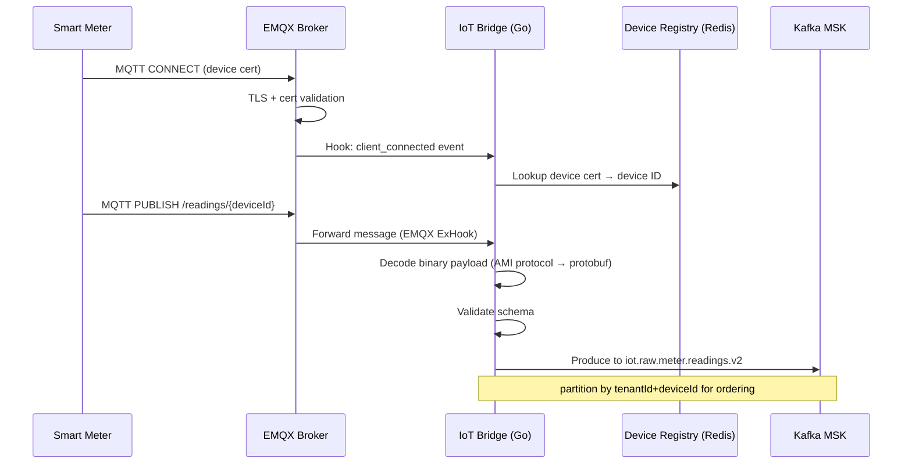

# Backend Architecture — Helios

> **Location:** Confluence → Helios Engineering Space → Architecture → Backend  
> **Owner:** Priya Nair (Staff Engineer, Platform) · @priya.nair  
> **Last Updated:** 2024-10-08  
> **Status:** Current — reflects v4.7 architecture  
> **Related:** [System Overview](/02-architecture/system-overview.md) · [Microservices Overview](/02-architecture/microservices-overview.md) · [API Standards](/05-engineering/api-standards.md) · [Event-Driven Architecture](/02-architecture/event-driven-architecture.md)

---

## Backend Philosophy

The Helios backend is composed of purpose-built services rather than a monolith, but we are not a microservice maximalists. We have been burned by over-decomposition in the past (the Dispatch service was briefly split into three services in v3.0 and was merged back into one in v3.4 — see [Project Timeline](/supplemental/project-timeline-history.md#2023-dispatch-remerge)). 

The guiding principle: **services should be decomposed at domain boundaries, not function boundaries.** The question "should this be a separate service?" should be answered with "does this domain have a fundamentally different operational profile (scaling, language, team ownership, deployment cadence)?" not "is this a separate concern?"

---

## Service Inventory by Technology

### Go Services (performance-critical hot paths)

| Service | Description | Team | Repo |
|---|---|---|---|
| `helios-grid-monitor` | Grid state management, alert evaluation, telemetry processing | Grid Intelligence | `helios-grid-monitor` |
| `helios-outage-detect` | Fault detection, topology traversal, outage isolation | Grid Intelligence | `helios-outage-detect` |
| `helios-iot-bridge` | MQTT → Kafka bridge, device authentication, payload normalization | IoT & Devices | `helios-iot-bridge` |
| `helios-gis` | GIS asset queries, geospatial processing, topology graph | GIS & Mapping | `helios-gis` |
| `helios-forecasting` (serving) | Model inference server, forecast API | Data & AI | `helios-forecasting` |

### Node.js Services (business logic, orchestration, third-party integration)

| Service | Description | Team | Repo |
|---|---|---|---|
| `helios-api-gateway` | GraphQL + REST gateway, auth enforcement, rate limiting | Platform | `helios-api-gateway` |
| `helios-dispatch` | Work order management, technician routing, mobile sync | Field Ops | `helios-dispatch` |
| `helios-notify` | Multi-channel notifications (email, SMS, push, in-app) | Platform | `helios-notify` |

### Python Services (ML training and batch processing)

| Service | Description | Team | Repo |
|---|---|---|---|
| `helios-forecasting` (training) | Model training pipelines, MLflow, feature engineering | Data & AI | `helios-model-ops` |
| `helios-data-pipeline` | Spark ETL, dbt, S3/Redshift ingestion | Data & AI | `helios-data-pipeline` |

---

## API Gateway (`helios-api-gateway`)

### Overview

The API gateway is the single entry point for all client-initiated traffic. It is a Node.js application using **Apollo Server 4** (GraphQL) with an Express middleware stack for REST endpoints.

**What it does:**
- GraphQL schema stitching (federates Grid Monitor, Dispatch, Forecasting, GIS, Customer sub-schemas)
- JWT validation and tenant extraction (via `@helios/auth` middleware)
- OPA policy enforcement for authorization
- Rate limiting (per-tenant, per-operation)
- Request logging and tracing (OpenTelemetry)
- REST endpoints for IoT device registration, regulatory reporting downloads, and legacy integrations

**What it does NOT do:**
- Business logic — it delegates to downstream services
- Data storage — it is stateless (except for rate limiting counters in Redis)
- Authentication — it validates tokens issued by Cognito but does not issue them

### GraphQL Schema Federation

We use **Apollo Federation v2** to compose the GraphQL schema from four sub-schemas:

```
Gateway Schema (composed)
├── Grid sub-schema (owned by helios-grid-monitor)
│   ├── type GridRegion
│   ├── type Substation
│   ├── type Alert
│   └── type MeterReading
├── Dispatch sub-schema (owned by helios-dispatch)
│   ├── type WorkOrder
│   ├── type Technician
│   └── type DispatchRoute
├── Forecast sub-schema (owned by helios-forecasting)
│   ├── type DemandForecast
│   ├── type ForecastInterval
│   └── type ForecastModel
└── GIS sub-schema (owned by helios-gis)
    ├── type GeoAsset
    ├── type GridTopology
    └── type ServiceTerritory
```

### Example GraphQL Query (Gateway perspective)

```graphql
# A single dashboard query that federates data from 3 services
query GridDashboard($regionId: ID!, $alertSeverity: [AlertSeverity!]) {
  gridRegion(id: $regionId) {         # → Grid Monitor sub-schema
    id
    name
    healthScore
    activeAlerts(severity: $alertSeverity) {
      id
      severity
      message
      createdAt
      affectedAsset {
        id
        name
        location {                    # → GIS sub-schema (via @key extension)
          lat
          lng
          address
        }
      }
    }
    currentDemandForecast {           # → Forecasting sub-schema (via @key)
      horizon24h {
        intervalStart
        forecastedMW
        confidenceLow
        confidenceHigh
      }
    }
  }
}
```

### REST API Endpoints (Gateway)

Some operations are better served by REST than GraphQL. The gateway exposes REST under `/api/v1/`:

```
POST   /api/v1/devices/register          IoT device registration
GET    /api/v1/reports/{reportType}      Download regulatory reports (returns file stream)
POST   /api/v1/webhook/billing-sync      Receive billing sync events from utility billing systems
GET    /api/v1/tenant/{id}/export        Bulk data export (triggers async job)
GET    /api/v1/health                    Gateway health check
GET    /api/v1/metrics                   Prometheus metrics endpoint
```

### Rate Limiting

Rate limits are enforced per tenant per operation using a sliding window counter in Redis:

```typescript
// lib/middleware/rateLimiter.ts (gateway)
const RATE_LIMITS: Record<string, { requests: number; windowMs: number }> = {
  'query.gridDashboard':       { requests: 60,   windowMs: 60_000 },  // 1/sec
  'query.meterReadings':       { requests: 10,   windowMs: 60_000 },  // batch queries
  'mutation.createWorkOrder':  { requests: 100,  windowMs: 60_000 },
  'query.*':                   { requests: 1000, windowMs: 60_000 },  // default
};
```

When a tenant exceeds their limit:
- Returns HTTP 429 with `Retry-After` header
- Logs the event (used for capacity planning)
- Does NOT trigger an alert (too noisy — it's normal for some integrations to burst)

---

## Grid Monitor Service (`helios-grid-monitor`, Go)

### Architecture

The Grid Monitor is the most performance-critical service in the platform. It is a Go service with four internal components, each running as a goroutine group:

```mermaid
graph LR
    K1[Kafka Consumer\niot.raw.meter.readings] --> V[Validator\n& Enricher]
    K2[Kafka Consumer\ngis.asset.updates] --> ST[State Manager]
    V --> K3[Kafka Producer\ngrid.events.enriched]
    V --> ST
    ST --> REDIS[Redis\nLive Grid State]
    ST --> PG[PostgreSQL\nEvents + Alerts]
    ST --> AP[Alert Processor]
    AP --> K4[Kafka Producer\ngrid.alerts.v2]
    AP --> REDIS_PS[Redis PubSub\nalerts:{tenantId}]
```

### State Management in Go

The state manager maintains an in-memory grid state (per tenant, per region) backed by Redis for persistence. This in-memory cache is the fastest path for reads.

```go
// internal/state/manager.go
package state

import (
    "context"
    "sync"
    "time"

    "github.com/lumina-energy/helios-grid-monitor/internal/types"
    "github.com/redis/go-redis/v9"
)

type Manager struct {
    mu    sync.RWMutex
    state map[string]*types.GridRegionState // key: "{tenantId}:{regionId}"
    redis *redis.ClusterClient
}

func (m *Manager) UpdateMeterReading(ctx context.Context, reading types.MeterReading) error {
    key := regionKey(reading.TenantID, reading.RegionID)

    m.mu.Lock()
    region := m.getOrCreateRegion(key)
    region.UpdateMeter(reading)
    region.LastUpdatedAt = time.Now()
    m.mu.Unlock()

    // Async write-through to Redis — don't block the processing pipeline
    go m.syncToRedis(ctx, key, region)

    return nil
}

func (m *Manager) GetRegionState(ctx context.Context, tenantID, regionID string) (*types.GridRegionState, error) {
    key := regionKey(tenantID, regionID)

    m.mu.RLock()
    if state, ok := m.state[key]; ok {
        m.mu.RUnlock()
        return state, nil
    }
    m.mu.RUnlock()

    // Cache miss — load from Redis
    return m.loadFromRedis(ctx, key)
}
```

### Alert Evaluation

Alert rules are tenant-configurable and stored in PostgreSQL, loaded into Redis at startup and refreshed every 30 seconds. The hot-path alert check runs entirely from memory:

```go
// internal/alert/evaluator.go
type Rule struct {
    ID         string
    TenantID   string
    MetricType string          // "voltage", "current", "frequency", "power_factor"
    Operator   string          // "gt", "lt", "eq", "outside_range"
    Threshold  float64
    Upper      float64         // for outside_range
    Lower      float64         // for outside_range
    Severity   string          // "CRITICAL", "HIGH", "MEDIUM", "LOW"
    CooldownMs int64           // prevent alert storms
}

func (e *Evaluator) Evaluate(reading types.MeterReading, rules []Rule) []types.Alert {
    var alerts []types.Alert
    for _, rule := range rules {
        if !e.matchesTenant(reading, rule) {
            continue
        }
        if e.inCooldown(reading.DeviceID, rule.ID) {
            continue
        }
        if e.ruleTripped(reading, rule) {
            alert := types.Alert{
                ID:           uuid.New().String(),
                TenantID:     reading.TenantID,
                DeviceID:     reading.DeviceID,
                RuleID:       rule.ID,
                Severity:     rule.Severity,
                MetricType:   rule.MetricType,
                ActualValue:  reading.Value,
                ThresholdMin: rule.Lower,
                ThresholdMax: rule.Upper,
                CreatedAt:    time.Now(),
            }
            e.setCooldown(reading.DeviceID, rule.ID, rule.CooldownMs)
            alerts = append(alerts, alert)
        }
    }
    return alerts
}
```

---

## IoT Bridge (`helios-iot-bridge`, Go)

### MQTT → Kafka Pipeline



### Payload Decoding

Different meter vendors use different protocols. The bridge has a codec registry:

```go
// internal/codec/registry.go
type Codec interface {
    Decode(payload []byte) (*types.MeterReading, error)
    VendorID() string
}

var codecs = map[string]Codec{
    "itron-centron":   &ItronCentronCodec{},
    "landis-gyr-e360": &LandisGyrE360Codec{},
    "honeywell-elster": &HoneywellElsterCodec{},
    "generic-dlms":    &DLMSCodec{},  // IEC 62056 DLMS/COSEM
}

func Decode(vendorID string, payload []byte) (*types.MeterReading, error) {
    codec, ok := codecs[vendorID]
    if !ok {
        return nil, fmt.Errorf("unknown vendor: %s", vendorID)
    }
    return codec.Decode(payload)
}
```

---

## Dispatch Service (`helios-dispatch`, Node.js)

### Work Order Lifecycle

```
CREATED → ASSIGNED → IN_PROGRESS → ON_SITE → RESOLVED → CLOSED
             ↓
          UNASSIGNED (if technician unavailable)
             ↓
          ESCALATED (if SLA breach approaching)
```

```typescript
// src/services/workOrderService.ts
import { db } from '../db';
import { notifyService } from './notifyService';
import type { WorkOrder, WorkOrderStatus } from '../types';

export async function transitionStatus(
  workOrderId: string,
  newStatus: WorkOrderStatus,
  userId: string,
  metadata?: Record<string, unknown>
): Promise<WorkOrder> {
  const wo = await db.workOrder.findUnique({ 
    where: { id: workOrderId },
    include: { assignedTechnician: true, affectedAsset: true }
  });

  if (!wo) throw new NotFoundError(`WorkOrder ${workOrderId} not found`);

  validateTransition(wo.status, newStatus);

  const updated = await db.$transaction(async (tx) => {
    const updated = await tx.workOrder.update({
      where: { id: workOrderId },
      data: {
        status: newStatus,
        [`${newStatus.toLowerCase()}At`]: new Date(),
        lastModifiedBy: userId,
        metadata: { ...wo.metadata, ...metadata },
      },
    });

    // Audit trail — every transition is logged
    await tx.workOrderEvent.create({
      data: {
        workOrderId,
        fromStatus: wo.status,
        toStatus: newStatus,
        changedBy: userId,
        timestamp: new Date(),
        metadata,
      },
    });

    return updated;
  });

  // Trigger downstream effects
  await handleTransitionSideEffects(updated, wo.status, newStatus);

  return updated;
}
```

---

## Notification Service (`helios-notify`, Node.js)

### Channel Routing

The notify service consumes from multiple Kafka topics and routes to the appropriate delivery channel:

```typescript
// src/consumers/alertConsumer.ts
import { KafkaConsumer } from '../kafka/consumer';
import { routeNotification } from '../routing/router';
import type { GridAlert } from '../types';

const consumer = new KafkaConsumer({
  topics: ['grid.alerts.v2', 'dispatch.events.v1', 'outage.events.v1'],
  groupId: 'helios-notify-alert-consumer',
});

consumer.on('message', async (topic: string, message: GridAlert) => {
  const rules = await getNotificationRules(message.tenantId, message.severity);
  
  for (const rule of rules) {
    const recipients = await resolveRecipients(rule, message);
    await routeNotification({
      channel: rule.channel,   // 'email' | 'sms' | 'push' | 'in-app'
      recipients,
      template: rule.templateId,
      data: buildTemplateData(message),
      priority: rule.priority,
    });
  }
});
```

---

## Internal Service Authentication

Service-to-service calls within the cluster do not use end-user JWTs. They use:

1. **Kubernetes service accounts** — for Kafka producers/consumers (MSK IAM authentication)
2. **mTLS** — for gRPC calls between services (Istio-free; handled by the gRPC Go library with x509 certs from Vault)
3. **Internal JWT** — for REST calls (signed by a shared internal key stored in Vault; 24hr expiry)

See [Authentication — Internal Service Auth](/05-engineering/authentication.md#internal-service-auth).

---

## Error Handling Standards

### Go services

```go
// Errors should be wrapped with context at every level
func (s *Service) ProcessReading(ctx context.Context, reading types.MeterReading) error {
    if err := s.validator.Validate(reading); err != nil {
        return fmt.Errorf("processReading: validation failed for device %s: %w", reading.DeviceID, err)
    }
    if err := s.state.Update(ctx, reading); err != nil {
        return fmt.Errorf("processReading: state update failed: %w", err)
    }
    return nil
}
```

### Node.js services

Use structured errors with HTTP status codes and error codes. Never let raw errors propagate to API responses.

```typescript
// lib/errors.ts
export class HeliosError extends Error {
  constructor(
    public readonly code: string,
    public readonly message: string,
    public readonly statusCode: number = 500,
    public readonly metadata?: Record<string, unknown>
  ) {
    super(message);
    this.name = 'HeliosError';
  }
}

export class NotFoundError extends HeliosError {
  constructor(message: string) {
    super('NOT_FOUND', message, 404);
  }
}

export class TenantMismatchError extends HeliosError {
  constructor(resourceId: string, requestedTenantId: string) {
    super('TENANT_MISMATCH', `Resource ${resourceId} does not belong to tenant ${requestedTenantId}`, 403);
  }
}
```

---

## Things Every New Engineer Should Know

1. **All Go service configs use YAML loaded at startup.** Environment variables are only used for secrets (pulled from Vault by the init container). Config is in `config/config.{env}.yaml`. Changes to config require a pod restart.

2. **The API gateway is the only service with public GraphQL introspection enabled in staging.** In production, introspection is disabled for security. If you need to explore the schema, use the staging gateway or the local federation dev server.

3. **Never share Kafka consumer group IDs across services.** Each service needs its own group ID. Shared consumer groups cause one service to "steal" messages from another, which is very hard to debug.

4. **The dispatch service is on Node.js 16 and has a known upgrade blocker.** Do not add dependencies that only support Node.js 18+. Check with @raj.patel before touching `package.json` in `helios-dispatch`.

5. **Service health endpoints are load balancer health checks.** They must return 200 within 2 seconds or the pod gets taken out of rotation. Never put slow operations in `/health` or `/healthz` handlers.

---

*Document maintained by @priya.nair*  
*Go service sections reviewed by @david.okafor and @lars.eriksson*  
*Node.js sections reviewed by @rosa.lindqvist and @raj.patel*  
*Related: [Microservices Overview](/02-architecture/microservices-overview.md) · [API Standards](/05-engineering/api-standards.md) · [Coding Standards](/05-engineering/coding-standards.md)*
