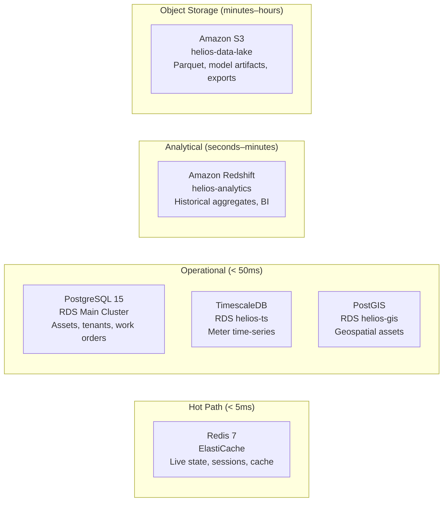

# Database Architecture — Helios

> **Location:** Confluence → Helios Engineering Space → Architecture → Database  
> **Owner:** Lin Chen (Staff Engineer, Data & AI) · @lin.chen  
> **Co-authored:** Priya Nair · @priya.nair  
> **Last Updated:** 2024-10-25  
> **Status:** Current — reflects v4.7 schema state  
> **Related:** [System Overview](/02-architecture/system-overview.md) · [Backend Architecture](/02-architecture/backend-architecture.md) · [Data Pipeline](/supplemental/data-pipeline.md) · [Performance Bottlenecks](/05-engineering/performance-bottlenecks.md)

---

> *This document covers the data storage architecture. For the event streaming layer, see [Event-Driven Architecture](/02-architecture/event-driven-architecture.md). For the analytics warehouse, see [Analytics Platform](/supplemental/analytics-platform.md).*

---

## Storage Landscape

Helios uses multiple storage systems, each chosen for specific access patterns. This is a deliberate polyglot persistence strategy, not a lack of decision-making:



---

## PostgreSQL — Main Cluster (`helios-main`)

### Cluster Configuration

| Property | Value |
|---|---|
| Engine | PostgreSQL 15.4 |
| Instance | `db.r6g.4xlarge` (primary) + 2x `db.r6g.2xlarge` (read replicas) |
| Storage | 2TB gp3, auto-scaling to 8TB |
| Multi-AZ | Yes |
| Read Replicas | 2 (used by reporting queries and analytics ETL) |
| Backup | Daily automated snapshot, 35-day retention |
| Maintenance Window | Sunday 02:00–04:00 UTC |

### Database Schema Overview

The main cluster runs a single database `helios_prod` with the following schemas (PostgreSQL schemas, not tables):

| Schema | Purpose | Owner |
|---|---|---|
| `public` | Core grid and tenant data | Platform |
| `dispatch` | Work order and technician management | Field Ops |
| `notify` | Notification rules and delivery log | Platform |
| `compliance` | Audit trails, regulatory reports | Compliance |
| `customer` | Customer accounts and preferences | Customer Experience |

### Key Tables

#### Tenant Management

```sql
-- public.tenants
CREATE TABLE public.tenants (
    id              UUID PRIMARY KEY DEFAULT gen_random_uuid(),
    tenant_code     VARCHAR(20)  NOT NULL UNIQUE,  -- e.g., 'CUST-MWG'
    name            VARCHAR(255) NOT NULL,           -- e.g., 'Midwest Grid Co.'
    status          VARCHAR(20)  NOT NULL DEFAULT 'ACTIVE',  -- ACTIVE | SUSPENDED | OFFBOARDING
    tier            VARCHAR(20)  NOT NULL,           -- ENTERPRISE | STANDARD | TRIAL
    modules         JSONB        NOT NULL DEFAULT '[]',  -- licensed module flags
    config          JSONB        NOT NULL DEFAULT '{}',  -- tenant-specific config
    billing_account VARCHAR(100),
    region          VARCHAR(50)  NOT NULL DEFAULT 'us-east-1',
    created_at      TIMESTAMPTZ  NOT NULL DEFAULT NOW(),
    updated_at      TIMESTAMPTZ  NOT NULL DEFAULT NOW()
);

-- Row-level security — services use per-tenant DB users
ALTER TABLE public.tenants ENABLE ROW LEVEL SECURITY;
CREATE POLICY tenant_isolation ON public.tenants
    USING (id = current_setting('app.current_tenant_id')::UUID);
```

#### Grid Assets

```sql
-- public.grid_assets
CREATE TABLE public.grid_assets (
    id              UUID PRIMARY KEY DEFAULT gen_random_uuid(),
    tenant_id       UUID         NOT NULL REFERENCES public.tenants(id),
    asset_type      VARCHAR(50)  NOT NULL,  -- SUBSTATION | FEEDER | TRANSFORMER | METER | BATTERY | GENERATOR
    external_id     VARCHAR(255) NOT NULL,  -- Utility company's own ID
    name            VARCHAR(255) NOT NULL,
    status          VARCHAR(50)  NOT NULL DEFAULT 'ACTIVE',
    capacity_kw     NUMERIC(12,3),
    voltage_class   VARCHAR(20),           -- HV | MV | LV
    parent_asset_id UUID         REFERENCES public.grid_assets(id),
    region_id       UUID         NOT NULL REFERENCES public.grid_regions(id),
    metadata        JSONB        NOT NULL DEFAULT '{}',
    last_sync_at    TIMESTAMPTZ,           -- from GIS/SCADA sync
    created_at      TIMESTAMPTZ  NOT NULL DEFAULT NOW(),
    updated_at      TIMESTAMPTZ  NOT NULL DEFAULT NOW(),
    UNIQUE(tenant_id, external_id)
);

CREATE INDEX idx_grid_assets_tenant_region ON public.grid_assets(tenant_id, region_id);
CREATE INDEX idx_grid_assets_parent ON public.grid_assets(parent_asset_id) WHERE parent_asset_id IS NOT NULL;
CREATE INDEX idx_grid_assets_type ON public.grid_assets(tenant_id, asset_type);
```

#### Alerts

```sql
-- public.grid_alerts
CREATE TABLE public.grid_alerts (
    id              UUID PRIMARY KEY DEFAULT gen_random_uuid(),
    tenant_id       UUID         NOT NULL REFERENCES public.tenants(id),
    device_id       VARCHAR(255) NOT NULL,  -- device_id from the reading (not FK — devices are in device registry)
    rule_id         UUID         NOT NULL REFERENCES public.alert_rules(id),
    severity        VARCHAR(20)  NOT NULL,  -- CRITICAL | HIGH | MEDIUM | LOW | INFO
    status          VARCHAR(20)  NOT NULL DEFAULT 'OPEN',  -- OPEN | ACKNOWLEDGED | RESOLVED | AUTO_RESOLVED
    metric_type     VARCHAR(50)  NOT NULL,
    actual_value    NUMERIC(15,6) NOT NULL,
    threshold_min   NUMERIC(15,6),
    threshold_max   NUMERIC(15,6),
    message         TEXT         NOT NULL,
    region_id       UUID         REFERENCES public.grid_regions(id),
    substation_id   UUID         REFERENCES public.grid_assets(id),
    acknowledged_by UUID         REFERENCES public.users(id),
    acknowledged_at TIMESTAMPTZ,
    resolved_at     TIMESTAMPTZ,
    created_at      TIMESTAMPTZ  NOT NULL DEFAULT NOW()
);

-- This table is append-heavy — partition by created_at month
CREATE INDEX idx_grid_alerts_tenant_status ON public.grid_alerts(tenant_id, status, created_at DESC);
CREATE INDEX idx_grid_alerts_severity ON public.grid_alerts(tenant_id, severity, created_at DESC) 
    WHERE status = 'OPEN';
```

#### Work Orders (dispatch schema)

```sql
-- dispatch.work_orders
CREATE TABLE dispatch.work_orders (
    id                  UUID PRIMARY KEY DEFAULT gen_random_uuid(),
    tenant_id           UUID         NOT NULL REFERENCES public.tenants(id),
    work_order_number   VARCHAR(50)  NOT NULL,  -- human-readable, e.g., WO-2024-108732
    status              VARCHAR(30)  NOT NULL DEFAULT 'CREATED',
    priority            VARCHAR(20)  NOT NULL DEFAULT 'NORMAL',  -- EMERGENCY | HIGH | NORMAL | LOW
    work_type           VARCHAR(50)  NOT NULL,  -- OUTAGE_RESTORE | PLANNED_MAINTENANCE | INSPECTION | etc.
    source              VARCHAR(50)  NOT NULL,  -- AUTO_OUTAGE | MANUAL | SCHEDULED | CUSTOMER_REQUEST
    source_incident_id  UUID,                   -- ref to outage or alert that triggered this
    asset_id            UUID         REFERENCES public.grid_assets(id),
    location_lat        NUMERIC(10,7),
    location_lng        NUMERIC(10,7),
    description         TEXT,
    assigned_tech_id    UUID         REFERENCES dispatch.technicians(id),
    assigned_at         TIMESTAMPTZ,
    created_by          UUID         REFERENCES public.users(id),
    created_at          TIMESTAMPTZ  NOT NULL DEFAULT NOW(),
    updated_at          TIMESTAMPTZ  NOT NULL DEFAULT NOW(),
    scheduled_for       TIMESTAMPTZ,
    completed_at        TIMESTAMPTZ,
    sla_due_at          TIMESTAMPTZ  NOT NULL,
    metadata            JSONB        NOT NULL DEFAULT '{}'
);

CREATE INDEX idx_wo_tenant_status ON dispatch.work_orders(tenant_id, status, created_at DESC);
CREATE INDEX idx_wo_tech_status ON dispatch.work_orders(assigned_tech_id, status) 
    WHERE assigned_tech_id IS NOT NULL;
CREATE INDEX idx_wo_sla ON dispatch.work_orders(tenant_id, sla_due_at) 
    WHERE status NOT IN ('RESOLVED', 'CLOSED', 'CANCELLED');
```

### Row-Level Security

We use PostgreSQL RLS as a defense-in-depth measure against tenant data mixing. Each service connects using a per-tenant database role:

```sql
-- Each tenant gets a dedicated DB role (created during onboarding)
CREATE ROLE helios_tenant_cust_mwg LOGIN PASSWORD '...' IN ROLE helios_tenant_base;

-- RLS policy (example for grid_assets)
CREATE POLICY tenant_isolation ON public.grid_assets
    FOR ALL
    USING (tenant_id = current_setting('app.current_tenant_id', TRUE)::UUID);

-- Services set this at session start:
-- SET LOCAL app.current_tenant_id = '...';
```

> **Note:** Application-level tenant filtering is the primary enforcement mechanism. RLS is a safety net. We have had one case (2022 staging environment) where a missing `tenant_id` filter in a new API endpoint was caught by RLS returning empty results instead of cross-tenant data. This validated the defense-in-depth approach.

### Migration Strategy

We use **Flyway** for schema migrations. Migrations are in `helios-api-gateway/db/migrations/` (for the main schema) and `helios-dispatch/db/migrations/` etc. per service.

**Rules:**
1. Migrations are always forward-only. No down migrations in production.
2. New columns must be `NULLABLE` or have a `DEFAULT` value (to allow zero-downtime deploys — the old code runs while the new column exists).
3. Adding an index on a large table requires `CREATE INDEX CONCURRENTLY` to avoid table locks.
4. Migrations that touch tables with > 10M rows require a Database Guild review (@priya.nair, @lin.chen, @wei.liu).
5. Never add a `NOT NULL` constraint to an existing column without a migration strategy (backfill first, then add constraint).

```sql
-- Example of a safe migration pattern for large tables
-- V128__add_meter_tariff_code.sql

-- Step 1: Add nullable column (deployed with code that writes but doesn't require the field)
ALTER TABLE public.grid_assets ADD COLUMN tariff_code VARCHAR(50);

-- Step 2: Backfill (separate migration, after step 1 is in production)
-- V129__backfill_meter_tariff_code.sql
UPDATE public.grid_assets SET tariff_code = 'DEFAULT' WHERE tariff_code IS NULL;

-- Step 3: Add NOT NULL constraint (separate migration, after backfill)
-- V130__notnull_meter_tariff_code.sql  
ALTER TABLE public.grid_assets ALTER COLUMN tariff_code SET NOT NULL;
ALTER TABLE public.grid_assets ALTER COLUMN tariff_code SET DEFAULT 'DEFAULT';
```

---

## TimescaleDB — Meter Time-Series (`helios-ts`)

### Why TimescaleDB?

TimescaleDB is a PostgreSQL extension that provides time-series optimized storage. Key benefits:
- **Automatic partitioning (hypertables):** Data is partitioned by time automatically. A query for "last 24 hours" touches only 1–2 partitions instead of a 7-year full table scan.
- **Compression:** TimescaleDB compresses chunks older than 7 days at ~10:1 ratio. Without compression, our 42M meters × 7 years of readings would be ~40TB uncompressed. With compression, it is ~4TB.
- **Continuous aggregates:** We maintain pre-computed hourly and daily aggregates that power the customer usage dashboard without hitting raw data.
- **PostgreSQL compatibility:** Same tooling, same SQL, same team skills.

The decision is documented in [ADR-007](/05-engineering/adrs.md#adr-007).

### Meter Readings Hypertable

```sql
-- CREATE TABLE is standard SQL; TimescaleDB converts it to a hypertable
CREATE TABLE public.meter_readings (
    reading_id      UUID         NOT NULL,
    device_id       VARCHAR(255) NOT NULL,
    tenant_id       UUID         NOT NULL,
    reading_time    TIMESTAMPTZ  NOT NULL,  -- partition dimension
    ingested_at     TIMESTAMPTZ  NOT NULL,
    voltage         NUMERIC(8,3),
    current_amps    NUMERIC(8,3),
    active_energy_kwh NUMERIC(12,6),
    reactive_power  NUMERIC(10,3),
    power_factor_pct NUMERIC(5,2),
    frequency       NUMERIC(6,3),
    quality         VARCHAR(20)  NOT NULL DEFAULT 'GOOD',
    PRIMARY KEY (reading_id, reading_time)  -- reading_time in PK required for TimescaleDB
);

-- Convert to hypertable — partitions by 1-day chunks
SELECT create_hypertable('meter_readings', 'reading_time', chunk_time_interval => INTERVAL '1 day');

-- Compression policy: compress chunks older than 7 days
ALTER TABLE meter_readings SET (
    timescaledb.compress,
    timescaledb.compress_segmentby = 'tenant_id, device_id',
    timescaledb.compress_orderby = 'reading_time DESC'
);
SELECT add_compression_policy('meter_readings', INTERVAL '7 days');

-- Retention policy: drop chunks older than 7 years
SELECT add_retention_policy('meter_readings', INTERVAL '7 years');
```

### Continuous Aggregates

```sql
-- Hourly aggregate — powers customer portal usage charts
CREATE MATERIALIZED VIEW meter_readings_hourly
WITH (timescaledb.continuous) AS
SELECT
    time_bucket('1 hour', reading_time)  AS hour,
    tenant_id,
    device_id,
    AVG(voltage)                          AS avg_voltage,
    MAX(voltage)                          AS max_voltage,
    MIN(voltage)                          AS min_voltage,
    SUM(active_energy_kwh)                AS total_kwh,
    AVG(power_factor_pct)                 AS avg_power_factor,
    COUNT(*)                              AS reading_count
FROM meter_readings
GROUP BY 1, 2, 3
WITH NO DATA;

-- Refresh policy: update hourly aggregate every 15 minutes
SELECT add_continuous_aggregate_policy('meter_readings_hourly',
    start_offset => INTERVAL '1 hour',
    end_offset   => INTERVAL '15 minutes',
    schedule_interval => INTERVAL '15 minutes'
);
```

### Known Issue: Partition Growth

As of Q4 2024, the `helios-ts` cluster has ~38,000 active chunks (daily partitions, post-compression). Query planning time on queries that span more than 30 days has increased. Investigation and mitigation plan documented in [Performance Bottlenecks — TimescaleDB](/05-engineering/performance-bottlenecks.md#timescale-partitions).

---

## Redis — Cache and Live State (`helios-elasticache`)

### Cluster Configuration

| Property | Value |
|---|---|
| Engine | Redis 7.0 |
| Mode | Cluster mode (3 shards, 1 primary + 1 replica per shard) |
| Instance | `cache.r6g.xlarge` per node |
| Eviction | `allkeys-lru` |
| Max Memory | 25GB per node |
| Persistence | AOF disabled (cache data is rebuildable; we do not use Redis as durable storage) |

### Key Namespace Convention

All keys are prefixed to avoid collisions across services and tenants:

```
t:{tenantId}:grid:state:{regionId}         Live grid region state (JSON blob, 5min TTL)
t:{tenantId}:grid:state:meter:{deviceId}   Per-device last reading (2min TTL)
t:{tenantId}:alerts:active                 Active alert set (sorted set by createdAt)
t:{tenantId}:alert:rules                   Alert rules (hash, refreshed every 30s)
t:{tenantId}:forecast:{feederId}:{horizonH} Forecast result cache (15min TTL)
session:{sessionId}                         User session (JWT + tenant context, 15min TTL)
rl:{tenantId}:{operation}:{windowStart}    Rate limit counter (sliding window)
device:registry:{deviceId}                 Device metadata cache (1hr TTL)
t:{tenantId}:notify:dedup:{alertId}        Notification deduplication flag (5min TTL)
```

### Pub/Sub for Real-Time Portal

```
Channel: alerts:{tenantId}       → new alerts published by grid-monitor
Channel: state:{tenantId}        → grid state updates published by grid-monitor
Channel: dispatch:{tenantId}     → dispatch events published by dispatch service
```

The API gateway subscribes to these channels and forwards messages to connected browser clients via WebSocket (Socket.IO). This is the mechanism that gives the grid ops portal its near-real-time alert feed without polling.

### What Is NOT in Redis

- **Metering data** — even last readings > 2 minutes old. TimescaleDB for historical, grid-monitor memory for hot reads.
- **Work orders** — PostgreSQL only. Work order state is not latency-sensitive enough to warrant a cache.
- **User credentials or tokens** — tokens are validated against Cognito's public key. Session objects in Redis are only the decoded, already-validated claims.

---

## PostGIS — Geospatial Assets (`helios-gis-rds`)

### Overview

PostGIS is a PostgreSQL extension for geospatial data. We use it exclusively for the GIS service's asset database. It runs as a separate RDS instance (`helios-gis-rds`) to isolate the spatial query workload from the main operational database.

```sql
-- gis.assets (PostGIS enabled table)
CREATE TABLE gis.assets (
    id              UUID PRIMARY KEY DEFAULT gen_random_uuid(),
    tenant_id       UUID         NOT NULL,
    asset_id        UUID         NOT NULL,  -- references public.grid_assets in main cluster (cross-DB)
    asset_type      VARCHAR(50)  NOT NULL,
    location        GEOGRAPHY(POINT, 4326),     -- lat/lng in WGS84
    service_area    GEOGRAPHY(POLYGON, 4326),   -- service territory boundary (for substations)
    elevation_m     NUMERIC(7,1),
    address         TEXT,
    last_synced_at  TIMESTAMPTZ,
    UNIQUE(tenant_id, asset_id)
);

-- Spatial index (GIST) for nearest-neighbor and polygon queries
CREATE INDEX idx_gis_assets_location ON gis.assets USING GIST(location);
CREATE INDEX idx_gis_assets_service_area ON gis.assets USING GIST(service_area);

-- Technician routing query example:
-- "Find the 5 nearest available technicians to a given location"
SELECT
    t.id,
    t.name,
    ST_Distance(t.current_location, ST_MakePoint(-91.6656, 41.5868)::GEOGRAPHY) AS distance_m
FROM gis.technician_locations t
JOIN dispatch.technicians dt ON dt.id = t.technician_id
WHERE dt.status = 'AVAILABLE'
  AND dt.tenant_id = $1
ORDER BY t.current_location <-> ST_MakePoint(-91.6656, 41.5868)::GEOGRAPHY
LIMIT 5;
```

---

## S3 Data Lake

Structure: `s3://helios-data-lake/{tenantId}/{dataType}/{year}/{month}/{day}/`

```
helios-data-lake/
├── CUST-MWG/
│   ├── meter-readings/
│   │   └── 2024/11/01/
│   │       ├── part-00000.parquet   (hourly batches)
│   │       └── part-00001.parquet
│   ├── grid-events/
│   ├── alerts/
│   ├── work-orders/
│   └── forecasts/
└── _schemas/                        Avro schemas (mirrored from Schema Registry)
```

Parquet files are produced by the `helios-data-pipeline` Spark jobs. They are the source for Redshift COPY commands and for ad-hoc analysis. See [Data Pipeline](/supplemental/data-pipeline.md).

---

## Backup and Recovery

| Store | Backup Method | RTO | RPO | Recovery Location |
|---|---|---|---|---|
| PostgreSQL Main | RDS automated snapshots (daily) + PITR (continuous WAL) | 30 min | 5 min | Same region (AZ failure) / DR region (region failure) |
| TimescaleDB | Same as above | 1 hr | 5 min | Same region |
| Redis | No persistent backup (cache only — rebuilt from Kafka on restart) | 5 min (repopulate from Kafka) | N/A — data is ephemeral | — |
| S3 | Cross-region replication to `eu-west-1` | Immediate | Near-zero | eu-west-1 |
| Redshift | Automated snapshots (daily) | 4 hr | 24 hr | Restore from snapshot |

See [Disaster Recovery Plan](/06-operations/disaster-recovery-plan.md) for full failover procedures.

---

## Things Every New Engineer Should Know

1. **`tenant_id` in every write. Always.** If you write to PostgreSQL, Redis, or S3 without a `tenant_id`, you are creating a compliance and correctness bug. The RLS policies in PostgreSQL will enforce this but Redis and S3 have no such protection — it's on you.

2. **Never run migrations directly against production.** Flyway migrations run as part of the CI/CD pipeline. If you need to run a migration in an emergency, follow the [Deployment Guide — Emergency Migration](/supplemental/deployment-guide.md#emergency-migration) procedure and get @lin.chen or @priya.nair online.

3. **TimescaleDB and regular PostgreSQL are not the same.** Query plans are different. Compression affects what you can and can't do with compressed chunks (you cannot UPDATE compressed rows — only insert new ones). Read the TimescaleDB docs before writing any migration or query for `helios-ts`.

4. **Redis data is not durable.** Never use Redis as a primary data store. It is a cache. Data that matters lives in PostgreSQL. Redis data should be reconstructible from PostgreSQL or Kafka at any time.

5. **Large queries against the main cluster use read replicas.** The `helios-api-gateway` database pool is configured with `read_replica: true` for non-mutating queries. If your query is causing slow-down on the primary, first check if it should be routing to the read replica.

---

*Document maintained by @lin.chen and @priya.nair*  
*Migration reviews by Database Guild: @wei.liu, @preethi.subramaniam, @lin.chen*  
*Related: [Data Pipeline](/supplemental/data-pipeline.md) · [Performance Bottlenecks](/05-engineering/performance-bottlenecks.md) · [Event-Driven Architecture](/02-architecture/event-driven-architecture.md)*
