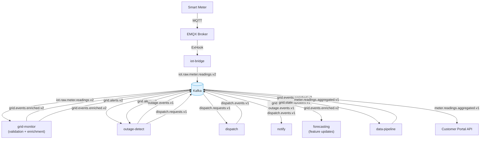

# Event-Driven Architecture — Helios

> **Location:** Confluence → Helios Engineering Space → Architecture → Event-Driven Architecture  
> **Owner:** David Okafor (Principal Engineer) · @david.okafor  
> **Last Updated:** 2024-10-18  
> **Status:** Current — reflects v4.7 Kafka topology  
> **Related:** [System Overview](/02-architecture/system-overview.md) · [Backend Architecture](/02-architecture/backend-architecture.md) · [ADR-003](/05-engineering/adrs.md#adr-003) · [Database Architecture](/02-architecture/database-architecture.md)

---

## Why Event-Driven?

This section exists because "event-driven" is an overused term that means different things to different people. Here is what it means for Helios and why we chose it.

The core problem: 42 million smart meters produce telemetry that must be consumed by at least six different downstream systems (grid monitoring, outage detection, demand forecasting, the data lake, the customer portal, the notification service). Those systems have different latency requirements, different scaling characteristics, and are owned by different teams.

If we built this with synchronous REST APIs, the IoT bridge would need to call each downstream service directly. Any slow downstream service would create backpressure and slow down ingestion. Adding a new consumer would require changing the producer. A downstream service outage would block all others.

Kafka solves this with a durable, ordered, replayable log. Producers write to topics. Consumers read at their own pace. Producers don't know about consumers. Consumers can fall behind and catch up. Dead consumers don't block live consumers. New consumers can be added without touching producers. And — critically for us — Kafka retains messages for 7 days (configured: `retention.ms = 604800000`) so we can reprocess historical data when we fix a bug in a consumer.

See [ADR-003](/05-engineering/adrs.md#adr-003) for the full decision context.

---

## Kafka Cluster

**Technology:** Apache Kafka 3.5 via AWS MSK  
**Cluster name:** `helios-msk-prod`  
**Brokers:** 12 brokers across 3 Availability Zones (4 per AZ)  
**Broker instance type:** `kafka.m5.4xlarge`  
**Replication factor:** 3 (all topics)  
**Min in-sync replicas:** 2  

**Retention defaults:**
- IoT raw topics: 3 days (high volume, downstream immediately processed)
- Enriched event topics: 7 days (used for reprocessing and debugging)
- Alert topics: 14 days (referenced in post-mortems)
- State update topics: 1 day (ephemeral, stateful consumers)

**Schema Registry:** AWS Glue Schema Registry (Avro schemas)  
**Schema governance:** All topics require a registered schema. Schema changes must be backward-compatible (add optional fields, do not remove or change types).

---

## Topic Inventory

### IoT Ingestion Topics

| Topic | Partitions | Producer | Consumers | Schema | Retention |
|---|---|---|---|---|---|
| `iot.raw.meter.readings.v2` | 120 | `helios-iot-bridge` | `helios-grid-monitor` | `MeterReading.avsc` | 3 days |
| `iot.raw.meter.readings.dlq` | 12 | `helios-iot-bridge` | Ops monitoring | `RawMeterReadingDLQ.avsc` | 7 days |
| `iot.device.events.v1` | 12 | `helios-iot-bridge` | `helios-gis`, `helios-grid-monitor` | `DeviceEvent.avsc` | 7 days |
| `iot.scada.raw.v1` | 24 | SCADA adapters | `helios-iot-bridge` | `ScadaReading.avsc` | 3 days |

### Grid Intelligence Topics

| Topic | Partitions | Producer | Consumers | Schema | Retention |
|---|---|---|---|---|---|
| `grid.events.enriched.v2` | 60 | `helios-grid-monitor` | `helios-outage-detect`, `helios-forecasting`, `helios-data-pipeline` | `GridEvent.avsc` | 7 days |
| `grid.alerts.v2` | 24 | `helios-grid-monitor` | `helios-notify`, `helios-outage-detect`, portal via API gateway | `GridAlert.avsc` | 14 days |
| `grid.state.updates.v1` | 24 | `helios-grid-monitor` | `helios-data-pipeline` | `GridStateUpdate.avsc` | 1 day |

### Outage Topics

| Topic | Partitions | Producer | Consumers | Schema | Retention |
|---|---|---|---|---|---|
| `outage.events.v1` | 12 | `helios-outage-detect` | `helios-notify`, `helios-dispatch`, `helios-data-pipeline` | `OutageEvent.avsc` | 14 days |
| `dispatch.requests.v1` | 12 | `helios-outage-detect`, API gateway | `helios-dispatch` | `DispatchRequest.avsc` | 7 days |
| `dispatch.events.v1` | 12 | `helios-dispatch` | `helios-notify`, `helios-data-pipeline` | `DispatchEvent.avsc` | 7 days |

### Analytics and Reporting Topics

| Topic | Partitions | Producer | Consumers | Schema | Retention |
|---|---|---|---|---|---|
| `meter.readings.aggregated.v1` | 24 | `helios-data-pipeline` | Customer Portal API, `helios-forecasting` | `AggregatedReading.avsc` | 7 days |
| `demand.response.events.v1` | 12 | API gateway | `helios-notify`, `helios-data-pipeline` | `DemandResponseEvent.avsc` | 14 days |

### GIS Topics

| Topic | Partitions | Producer | Consumers | Schema | Retention |
|---|---|---|---|---|---|
| `gis.asset.updates.v1` | 12 | `helios-gis` | `helios-grid-monitor` | `GisAssetUpdate.avsc` | 7 days |

---

## Avro Schema Examples

### `MeterReading.avsc`

```json
{
  "type": "record",
  "name": "MeterReading",
  "namespace": "com.luminaenergy.helios.iot",
  "doc": "Normalized smart meter reading from IoT bridge",
  "fields": [
    { "name": "readingId",    "type": "string",  "doc": "UUID, generated by IoT bridge" },
    { "name": "deviceId",     "type": "string",  "doc": "Canonical device ID (helios internal)" },
    { "name": "tenantId",     "type": "string",  "doc": "Utility company tenant ID" },
    { "name": "vendorId",     "type": "string",  "doc": "Meter vendor: itron-centron | landis-gyr-e360 | ..." },
    { "name": "timestampMs",  "type": "long",    "doc": "Unix epoch milliseconds (meter clock)" },
    { "name": "ingestedAtMs", "type": "long",    "doc": "Unix epoch milliseconds (bridge ingestion time)" },
    { "name": "readings",     "type": {
      "type": "record",
      "name": "MeterValues",
      "fields": [
        { "name": "voltage",        "type": ["null", "double"], "default": null },
        { "name": "currentAmps",    "type": ["null", "double"], "default": null },
        { "name": "powerFactorPct", "type": ["null", "double"], "default": null },
        { "name": "activeEnergyKwh","type": ["null", "double"], "default": null },
        { "name": "reactivePower",  "type": ["null", "double"], "default": null },
        { "name": "frequency",      "type": ["null", "double"], "default": null }
      ]
    }},
    { "name": "quality",      "type": { "type": "enum", "name": "ReadingQuality", "symbols": ["GOOD", "ESTIMATED", "SUSPECT", "INVALID"] }},
    { "name": "rawPayload",   "type": ["null", "bytes"], "default": null, "doc": "Original binary payload, kept for debugging" }
  ]
}
```

### `GridAlert.avsc`

```json
{
  "type": "record",
  "name": "GridAlert",
  "namespace": "com.luminaenergy.helios.grid",
  "fields": [
    { "name": "alertId",      "type": "string" },
    { "name": "tenantId",     "type": "string" },
    { "name": "deviceId",     "type": "string" },
    { "name": "ruleId",       "type": "string" },
    { "name": "severity",     "type": { "type": "enum", "name": "Severity", "symbols": ["CRITICAL","HIGH","MEDIUM","LOW","INFO"] }},
    { "name": "metricType",   "type": "string" },
    { "name": "actualValue",  "type": "double" },
    { "name": "thresholdMin", "type": ["null", "double"], "default": null },
    { "name": "thresholdMax", "type": ["null", "double"], "default": null },
    { "name": "message",      "type": "string" },
    { "name": "createdAtMs",  "type": "long" },
    { "name": "regionId",     "type": "string" },
    { "name": "substationId", "type": ["null", "string"], "default": null },
    { "name": "feederId",     "type": ["null", "string"], "default": null }
  ]
}
```

---

## Partition Strategy

Partition key selection is critical for performance and ordering guarantees.

| Topic | Partition Key | Rationale |
|---|---|---|
| `iot.raw.meter.readings.v2` | `tenantId + deviceId` | Ordering per device; tenant isolation |
| `grid.events.enriched.v2` | `tenantId + regionId` | All events for a region processed in order |
| `grid.alerts.v2` | `tenantId` | Alert processing is per-tenant |
| `outage.events.v1` | `tenantId + outageId` | All outage state updates ordered |
| `dispatch.requests.v1` | `tenantId` | Simple tenant isolation |

**Partition count decisions:**
- `iot.raw.meter.readings.v2` has 120 partitions: this is our highest-throughput topic (~380K messages/sec peak). Each partition is processed by one grid-monitor replica. 120 partitions supports 120 concurrent consumers (we scale to 12 replicas max per deployment, each handling 10 partitions).
- Topic partition counts cannot be reduced. Increasing them is possible but requires consumer group rebalancing (coordinate with @david.okafor before doing this in production).

---

## Consumer Groups

| Consumer Group ID | Topic(s) | Service | Lag SLO |
|---|---|---|---|
| `grid-monitor-readings` | `iot.raw.meter.readings.v2` | `helios-grid-monitor` | < 500ms P95 |
| `outage-detect-enriched` | `grid.events.enriched.v2` | `helios-outage-detect` | < 2s P95 |
| `outage-detect-alerts` | `grid.alerts.v2` | `helios-outage-detect` | < 1s P95 |
| `forecasting-enriched` | `grid.events.enriched.v2` | `helios-forecasting` | < 30s P95 (feature store) |
| `notify-alerts` | `grid.alerts.v2`, `outage.events.v1`, `dispatch.events.v1` | `helios-notify` | < 15s P95 |
| `dispatch-requests` | `dispatch.requests.v1` | `helios-dispatch` | < 5s P95 |
| `data-pipeline-enriched` | `grid.events.enriched.v2` | `helios-data-pipeline` | < 5min P95 (batch) |

Kafka consumer lag is monitored in Grafana: `https://grafana.internal.luminaenergy.com/d/kafka-consumer-lag`

**Alert:** Consumer lag > 2x SLO triggers a PagerDuty alert to the owning team's on-call. See [Alerting Strategy — Kafka Lag](/04-platform/alerting-strategy.md#kafka-lag).

---

## Tenant Isolation in Kafka

Tenant isolation in Kafka is enforced at the application level (not Kafka ACL level, which was considered and rejected due to operational complexity — see [ADR-003](/05-engineering/adrs.md#adr-003)).

**Rules:**
1. Every Kafka message MUST contain a `tenantId` field in the Avro schema.
2. Consumers MUST filter by `tenantId` when processing messages (even though they receive all messages on a topic).
3. Producers MUST use `tenantId + primary key` as the partition key for all topics that carry tenant data.
4. A consumer that writes to PostgreSQL or Redis MUST include the `tenantId` in the write (checked by the `@helios/kafka` library's schema validator).

The `@helios/kafka` Go library (internal) enforces these rules at compile time via interface constraints. The Node.js `@helios/kafka-client` library enforces them at runtime with schema validation.

**What happens if a bug causes tenant data mixing?** The `tenantId` field in every record enables forensic analysis. In a production data mixing incident, we would:
1. Identify the time window and affected partition(s) via Kafka logs
2. Replay the affected time window from the raw topic
3. Identify which records have incorrect `tenantId`
4. Issue corrections downstream

This has never happened in production. It happened once in staging in 2022, which is why we have this procedure documented.

---

## Dead Letter Queue (DLQ) Pattern

Every consumer that can fail processing (e.g., schema validation error, enrichment lookup failure, downstream unavailable) writes failed messages to a corresponding DLQ topic.

```
iot.raw.meter.readings.v2  (source topic)
    ↓ (on processing failure)
iot.raw.meter.readings.dlq (dead letter queue)
```

**DLQ policy:**
- DLQ topics have 7-day retention (vs. 3 days for the source)
- All DLQ messages include: original message bytes, `errorCode`, `errorMessage`, `failedAtMs`, `consumerGroupId`
- DLQ alerting: if DLQ write rate > 0.1% of source topic rate, PagerDuty alert fires
- DLQ remediation: ops team reviews DLQ contents, fixes the root cause, and replays using the `helios-kafka-replayer` tool

**DLQ replay:**
```bash
# Replay DLQ messages back to source topic (after fixing the consumer bug)
helios-kafka-replayer \
  --source-topic iot.raw.meter.readings.dlq \
  --dest-topic iot.raw.meter.readings.v2 \
  --tenant-id CUST-MWG \
  --from "2024-11-01T10:00:00Z" \
  --to "2024-11-01T11:00:00Z" \
  --dry-run  # always dry-run first
```

---

## Event Flow Diagram



---

## Common Mistakes

1. **Publishing to a topic without a schema registration.** The Schema Registry will reject the message and it will land in the DLQ silently from the producer's perspective. Always register your schema in Glue Schema Registry before deploying a new producer. The `@helios/kafka` library will throw at startup if the schema is not registered.

2. **Using the same consumer group ID across services.** Two services using `grid-monitor-readings` as their group ID will each get half the messages. This is silent data loss and very hard to debug. Use unique group IDs per service per topic.

3. **Not handling rebalances.** Kafka consumer groups rebalance during rolling deploys. If your consumer holds state (e.g., an in-memory batch buffer), you must flush the buffer and commit offsets on `onPartitionsRevoked`. The `@helios/kafka` library provides a hook for this.

4. **Seeking consumer lag on the wrong metric.** The Kafka dashboard shows *committed* lag. A consumer that never commits (or commits infrequently) will show a misleadingly large lag even if it is processing fast. Always check *committed offset* vs. *latest offset*, not just the lag counter.

5. **Changing a field type in an Avro schema.** This breaks the backward-compatibility guarantee. The Schema Registry will reject the new schema version. To change a field type, you must create a new field with the new type and deprecate the old one (keeping it as optional). Coordinate with @david.okafor.

---

## Things Every New Engineer Should Know

1. **If you break an Avro schema, you break all consumers of that topic.** Schema changes require a backward-compatible migration plan and coordination with consumer team owners.

2. **The Kafka cluster is not a queue — it's a log.** Messages are not deleted when consumed. They are retained for the configured retention period. This means you can always replay history. It also means you should never store secrets or PII in Kafka topics.

3. **Partition counts cannot be decreased.** Think carefully about initial partition counts. For new topics, the rule of thumb: start with 12, scale to `expected_peak_throughput_messages_per_sec / 10_000` rounded to the nearest 12.

4. **Consumer lag monitoring is your responsibility.** If your service consumes from Kafka, set up a Grafana alert for consumer lag > 2x your SLO. See the consumer lag dashboard for examples.

5. **DLQ messages always indicate a bug.** A non-zero DLQ write rate is an alert condition. It means either the producer is sending malformed data or the consumer has a processing bug. Do not ignore DLQ metrics.

---

*Document maintained by @david.okafor*  
*Kafka cluster configuration questions → @marcus.webb (SRE)*  
*Schema Registry questions → @david.okafor or @lin.chen*  
*Related: [Backend Architecture](/02-architecture/backend-architecture.md) · [Database Architecture](/02-architecture/database-architecture.md) · [ADR-003](/05-engineering/adrs.md#adr-003)*
