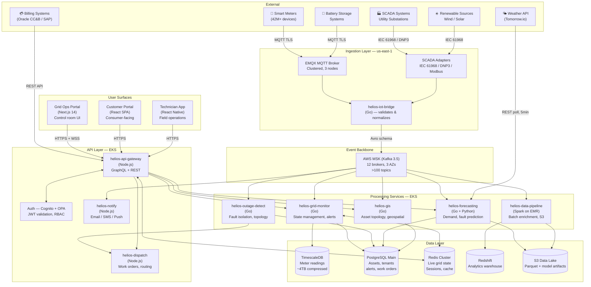
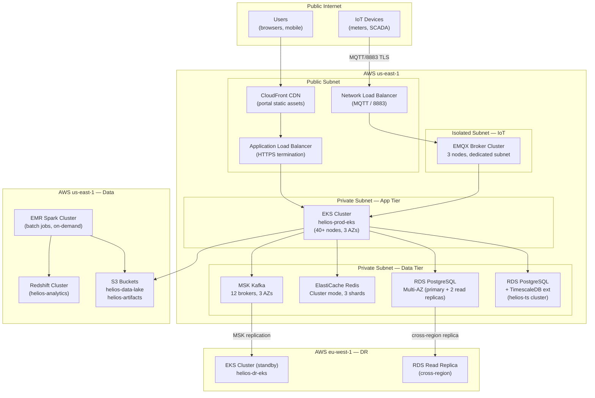
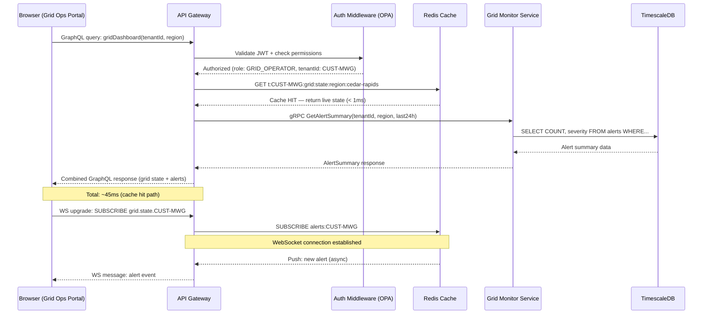
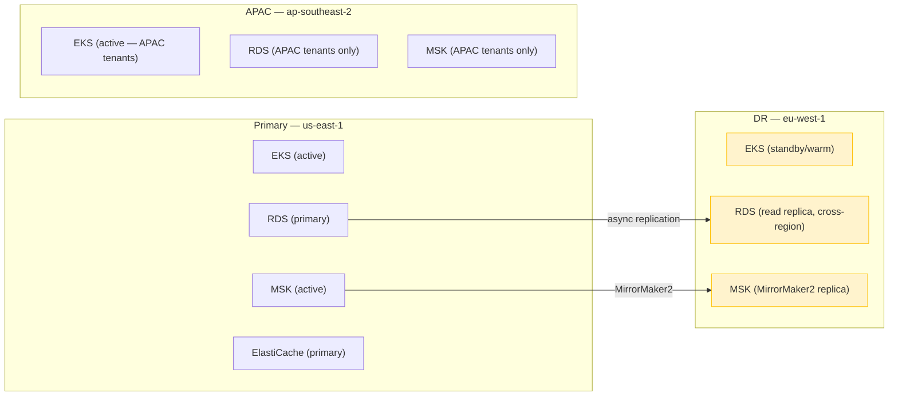
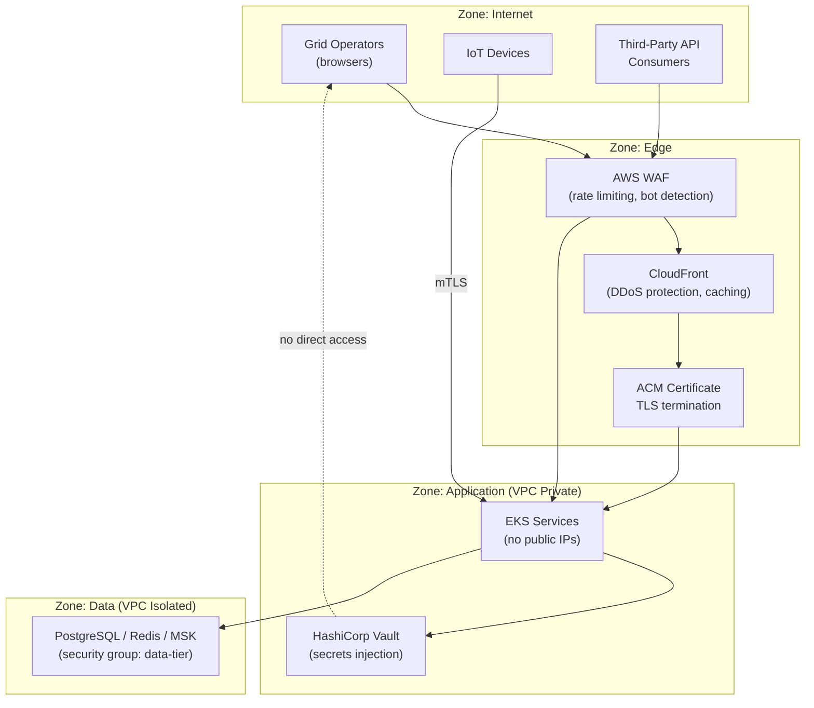

# High-Level Architecture — Helios

> **Location:** Confluence → Helios Engineering Space → Architecture → High-Level Architecture  
> **Owner:** Priya Nair (Staff Engineer, Platform) · @priya.nair  
> **Last Updated:** 2024-10-22  
> **Status:** Current — reflects v4.7 architecture  
> **Related:** [System Overview](/02-architecture/system-overview.md) · [Microservices Overview](/02-architecture/microservices-overview.md) · [AWS Architecture](/04-platform/aws-architecture.md) · [Kubernetes Guide](/04-platform/kubernetes-guide.md)

---

> *This document is diagram-heavy by design. Architecture diagrams should be the fastest way to orient yourself. The narrative lives in [System Overview](/02-architecture/system-overview.md). Read both.*

---

## Platform Architecture Overview

The following diagram represents the full Helios platform architecture at the component level. It shows external actors, the ingestion layer, the event streaming backbone, the processing and API layers, the data layer, and the three user-facing surfaces.



---

## Network and Zone Architecture



---

## Service Communication Patterns

Helios uses three distinct communication patterns, chosen based on the characteristics of each interaction:

### 1. Event Streaming (Kafka) — Async, Durable
**Used for:** IoT telemetry, grid events, alert propagation, state changes  
**When to choose:** When the producer does not need to know whether the consumer processed the message. When messages need to be replayable. When there are multiple consumers of the same data.

```
Producer → Kafka Topic → Consumer Group A (grid-monitor)
                       → Consumer Group B (forecasting)
                       → Consumer Group C (notification)
                       → Consumer Group D (data-pipeline)
```

### 2. REST/GraphQL via API Gateway — Sync, Request/Response
**Used for:** User-initiated actions (loading the portal, submitting work orders), client-to-server queries  
**When to choose:** When the client needs an immediate response. When the operation is transactional (create/update/delete).

```
Portal → HTTPS → API Gateway (GraphQL) → Service → Response
Mobile → HTTPS → API Gateway (REST)    → Service → Response
```

### 3. gRPC — Sync, Service-to-Service
**Used for:** Internal service-to-service calls where latency is critical and the payload schema is stable  
**Currently used for:** Forecasting engine ↔ Grid Monitor (model inference results), GIS Service ↔ Grid Monitor (topology queries)

```
Grid Monitor → gRPC → Forecasting Engine (get current 72hr forecast for feeder X)
Grid Monitor → gRPC → GIS Service (get downstream topology from node Y)
```

### 4. Redis Pub/Sub — Real-time Portal Push
**Used for:** Streaming live grid state changes to connected portal clients  
**How it works:** Grid Monitor writes to Redis channel `alerts:{tenant_id}` and `state:{tenant_id}`. The API Gateway subscribes to these channels and pushes updates to connected browser clients over WebSocket.

```
Grid Monitor → Redis PubSub → API Gateway → WebSocket → Browser
```

---

## Request Lifecycle: Grid Operations Portal

A complete trace of loading the main grid dashboard:



---

## Multi-Region Architecture



> **Note on DR:** The EU DR cluster (`eu-west-1`) is a warm standby. It has the EKS cluster configured and the RDS read replica running, but the application services are not actively processing. Failover requires approximately 15–25 minutes of manual steps. This is inadequate for our 99.99% SLA commitment to Midwest Grid Co. The full DR automation plan is in [Disaster Recovery Plan](/06-operations/disaster-recovery-plan.md). Automated failover is a Q2 2025 infrastructure investment.

---

## Security Perimeter



---

## Key Architecture Decisions (Summary)

| Decision | Choice | Rationale | ADR |
|---|---|---|---|
| Primary API style | GraphQL (client) + REST (internal/IoT) | Client flexibility + IoT simplicity | [ADR-002](/05-engineering/adrs.md#adr-002) |
| Event backbone | Apache Kafka (MSK) | Durability, replay, fan-out | [ADR-003](/05-engineering/adrs.md#adr-003) |
| GIS mapping library | MapLibre GL JS | License cost, self-hosting | [ADR-004](/05-engineering/adrs.md#adr-004) |
| IoT broker | EMQX | Scale, clustering, Kafka integration | [ADR-005](/05-engineering/adrs.md#adr-005) |
| Frontend state | Zustand (replaced Redux) | Bundle size, simplicity | [ADR-006](/05-engineering/adrs.md#adr-006) |
| Time-series storage | TimescaleDB | PostgreSQL compatibility + compression | [ADR-007](/05-engineering/adrs.md#adr-007) |
| Service mesh | None (currently) | Complexity vs. benefit trade-off | [ADR-008](/05-engineering/adrs.md#adr-008) |
| IoT multi-region | Deferred | Cost vs. current risk profile | [ADR-009](/05-engineering/adrs.md#adr-009) |
| Direct grid control | Declined | Safety, liability | [ADR-010](/05-engineering/adrs.md#adr-010) |

---

## Component Port Reference

Quick reference for service-to-service communication:

| Service | Internal Port | Protocol | Health Check |
|---|---|---|---|
| `helios-api-gateway` | 4000 | HTTP/GraphQL | `GET /health` |
| `helios-grid-monitor` | 8080 (gRPC) | gRPC | gRPC health protocol |
| `helios-outage-detect` | 8081 | gRPC | gRPC health protocol |
| `helios-forecasting` | 9000 | gRPC | gRPC health protocol |
| `helios-iot-bridge` | 8883 (MQTT) / 9090 (internal) | MQTT / HTTP | `GET /healthz` |
| `helios-dispatch` | 3001 | HTTP/REST | `GET /health` |
| `helios-notify` | 3002 | HTTP/REST | `GET /health` |
| `helios-gis` | 8082 | gRPC + REST | `GET /healthz` |
| EMQX | 8883 (MQTT), 18083 (dashboard) | MQTT | EMQX health API |

---

## Things Every New Engineer Should Know

1. **The Kafka topics are documented in [`/02-architecture/event-driven-architecture.md`](/02-architecture/event-driven-architecture.md).** Do not produce to a topic without checking its Avro schema. The Schema Registry will reject malformed messages and your events will drop silently to the DLQ.

2. **The API Gateway is the only public ingress for application traffic.** Do not add `LoadBalancer` type Services to EKS for application services. Everything goes through the gateway. See [Kubernetes Guide — Ingress](/04-platform/kubernetes-guide.md#ingress).

3. **Live grid state reads from Redis, not from Postgres.** If your feature needs "current" grid state, read from Redis using the `t:{tenant_id}:grid:state:*` key pattern, not from a database query. The database is for history and reporting.

4. **CloudFront caches the portal static assets.** After a deployment, cache invalidation runs automatically in the CI/CD pipeline (`aws cloudfront create-invalidation`). If you're seeing stale portal assets in production, check the deployment logs first before assuming a bug.

5. **The APAC cluster is NOT a full replica of us-east-1.** It runs the core services but not the full analytics pipeline. Features that depend on Redshift are unavailable to APAC tenants (TasNetworks). This is documented in [AWS Architecture — APAC Cluster](/04-platform/aws-architecture.md#apac-cluster).

---

*Document maintained by @priya.nair*  
*Architecture diagrams updated by @kenji.watanabe and @tom.reeves when infrastructure changes*  
*Related: [System Overview](/02-architecture/system-overview.md) · [AWS Architecture](/04-platform/aws-architecture.md) · [ADRs](/05-engineering/adrs.md)*
