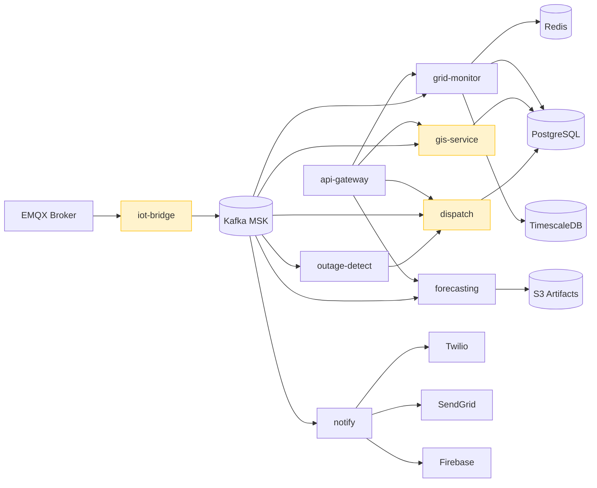

# Microservices Overview — Helios

> **Location:** Confluence → Helios Engineering Space → Architecture → Microservices Overview  
> **Owner:** David Okafor (Principal Engineer) · @david.okafor  
> **Last Updated:** 2024-11-05  
> **Status:** Current — service catalog as of v4.7.1  
> **Related:** [Backend Architecture](/02-architecture/backend-architecture.md) · [System Overview](/02-architecture/system-overview.md) · [Ownership Matrix](/07-onboarding/ownership-matrix.md) · [Kubernetes Guide](/04-platform/kubernetes-guide.md)

---

> *This is the authoritative service catalog for Helios. Every production service is listed here with its owner, port, dependencies, and operational notes. If you are adding a new service, you MUST add it here before the service goes to staging. If you are on-call and dealing with an unfamiliar service, this is the first place to look.*

---

## Service Catalog

### Legend

| Symbol | Meaning |
|---|---|
| 🟢 | Healthy — meeting SLOs |
| 🟡 | Degraded — known issues, not SLO-breaking |
| 🔴 | Critical — active issues or known severe debt |
| ⚠️ | Technical debt note — see linked doc |

---

### `helios-api-gateway`

| Field | Value |
|---|---|
| **Status** | 🟢 Healthy |
| **Language** | Node.js 20 LTS |
| **Team** | Platform |
| **Primary Owner** | @priya.nair |
| **Repo** | `lumina-energy/helios-api-gateway` |
| **Internal Port** | 4000 (HTTP) |
| **Protocol** | GraphQL (Apollo Federation) + REST |
| **K8s Namespace** | `helios-prod` |
| **K8s Deployment** | `api-gateway` |
| **Health Endpoint** | `GET /health` |
| **Metrics** | `GET /metrics` (Prometheus) |
| **SLO** | P99 < 150ms, uptime 99.95% |
| **Current P99** | 94ms |

**Description:** Single entry point for all client-originated API traffic. Federates the GraphQL sub-schemas from grid-monitor, forecasting, dispatch, and gis. Enforces JWT authentication and OPA-based authorization. Rate limits per tenant per operation via Redis sliding window.

**Key Dependencies:**
- Redis (rate limiting, session cache)
- AWS Cognito (JWT validation public keys)
- OPA (policy evaluation)
- `helios-grid-monitor` (gRPC, port 8080)
- `helios-forecasting` (gRPC, port 9000)
- `helios-dispatch` (HTTP, port 3001)
- `helios-gis` (gRPC + REST, port 8082)

**Configuration:** `config/config.{env}.yaml` — key settings: `RATE_LIMIT_ENABLED`, `OPA_URL`, `GRAPHQL_INTROSPECTION` (disabled in prod)

**Runbook:** [API Gateway Runbook](/06-operations/incident-response-runbook.md#api-gateway)

---

### `helios-grid-monitor`

| Field | Value |
|---|---|
| **Status** | 🟢 Healthy |
| **Language** | Go 1.22 |
| **Team** | Grid Intelligence |
| **Primary Owner** | @david.okafor |
| **Secondary Owner** | @rosa.lindqvist |
| **Repo** | `lumina-energy/helios-grid-monitor` |
| **Internal Ports** | 8080 (gRPC), 9090 (HTTP admin) |
| **Protocol** | gRPC (external) + Kafka consumer/producer (internal) |
| **K8s Namespace** | `helios-prod` |
| **K8s Deployment** | `grid-monitor` |
| **Replicas** | 6 (auto-scales 4–12 on Kafka consumer lag) |
| **Health Endpoint** | gRPC health protocol on port 8080 |
| **SLO** | Kafka consumer lag < 500ms P95, alert latency < 4s P95 |

**Description:** The core grid intelligence service. Maintains in-memory + Redis-backed live grid state for all tenants. Processes the enriched event stream from the IoT bridge, evaluates alert rules, generates alerts, and publishes state changes to downstream consumers. The most performance-critical service in the platform.

**Key Kafka Topics:**
- **Consumes:** `iot.raw.meter.readings.v2`, `gis.asset.updates.v1`, `iot.device.events.v1`
- **Produces:** `grid.events.enriched.v2`, `grid.alerts.v2`, `grid.state.updates.v1`, `grid.events.enriched.dlq` (dead letter)

**Key Dependencies:**
- Kafka (AWS MSK) — primary input and output
- Redis — grid state cache and pub/sub
- PostgreSQL (main cluster) — alert rules, alert storage, tenant config
- TimescaleDB (helios-ts cluster) — writes processed meter readings
- `helios-gis` — gRPC calls for topology queries (circuit breaker: 100ms timeout)

**Notable Technical Notes:**
- In-memory state is per-replica (not shared). Grid state is consistent across replicas via Redis write-through. Cache coherence issues can occur during rolling deploys — see [Known Issues — Grid Monitor Rolling Deploy](/05-engineering/known-issues.md#grid-monitor-rolling-deploy).
- Alert rule evaluation uses a local copy refreshed from Redis every 30 seconds. New alert rules take up to 30 seconds to activate.

---

### `helios-outage-detect`

| Field | Value |
|---|---|
| **Status** | 🟢 Healthy |
| **Language** | Go 1.22 |
| **Team** | Grid Intelligence |
| **Primary Owner** | @chidi.eze |
| **Repo** | `lumina-energy/helios-outage-detect` |
| **Internal Port** | 8081 (gRPC) |
| **K8s Deployment** | `outage-detector` |
| **Replicas** | 3 (fixed — topology lock requirement) |
| **SLO** | Outage detected within 60s of event onset, 99% recall |

**Description:** Consumes `grid.alerts.v2` and `grid.events.enriched.v2`. When meter readings show power loss, cross-references the grid topology graph to determine the likely fault location using a depth-first topology traversal. Creates outage records and triggers automatic dispatch.

**Key Kafka Topics:**
- **Consumes:** `grid.alerts.v2`, `grid.events.enriched.v2`
- **Produces:** `outage.events.v1`, `dispatch.requests.v1`

**Important Note on Replica Count:** The topology lock — a distributed lock required during outage isolation to prevent concurrent topology traversals from the same starting node — uses Redis. Allowing too many replicas creates lock contention. 3 is the empirically validated maximum before contention degrades latency. Do not increase replicas without testing under load.

**Runbook:** [Outage Detection Runbook](/06-operations/incident-response-runbook.md#outage-detection)

---

### `helios-iot-bridge`

| Field | Value |
|---|---|
| **Status** | 🟡 Degraded ⚠️ |
| **Language** | Go 1.22 |
| **Team** | IoT & Devices |
| **Primary Owner** | @lars.eriksson |
| **Repo** | `lumina-energy/helios-iot-bridge` |
| **Internal Ports** | 9090 (HTTP admin), 9091 (metrics) |
| **Protocol** | Consumes EMQX ExHook webhooks |
| **K8s Deployment** | `iot-bridge` |
| **Replicas** | 8 (auto-scales 6–16 on queue depth) |
| **SLO** | MQTT-to-Kafka latency < 100ms P99, < 0.01% message loss |

⚠️ **Known Issue:** IoT Bridge is single-region (`us-east-1` only). This is a P1 infrastructure risk. See [ADR-009](/05-engineering/adrs.md#adr-009) and [Technical Debt Register — IoT Single Region](/05-engineering/technical-debt-register.md#iot-single-region).

**Description:** Receives device telemetry forwarded by EMQX via the ExHook mechanism (EMQX's extension hook). Authenticates devices against the device registry, decodes vendor-specific binary payloads, validates schemas, and publishes normalized events to Kafka.

**Key Kafka Topics:**
- **Produces:** `iot.raw.meter.readings.v2`, `iot.device.events.v1`, `iot.raw.meter.readings.dlq`

**Key Dependencies:**
- EMQX cluster (receives forwarded MQTT messages)
- Redis (device registry cache — hot path, must be < 5ms)
- PostgreSQL (device registry source of truth for cache misses)
- Kafka (produces)

---

### `helios-forecasting`

| Field | Value |
|---|---|
| **Status** | 🟢 Healthy |
| **Language** | Go 1.22 (serving) + Python 3.11 (training, separate deployment) |
| **Team** | Data & AI |
| **Primary Owner** | @lin.chen |
| **Secondary Owner** | @soren.andersen |
| **Repo** | `lumina-energy/helios-forecasting` (serving) · `lumina-energy/helios-model-ops` (training) |
| **Internal Port** | 9000 (gRPC) |
| **K8s Deployment** | `forecasting-server` |
| **Replicas** | 4 (auto-scales 3–8) |
| **SLO** | P99 inference latency < 50ms, MAPE ≤ 3.5% (24hr feeder forecast) |

**Description:** Serves demand forecasts to the API gateway and grid monitor. Model artifacts are loaded from S3 at startup and refreshed hourly. The Go serving layer is a thin gRPC wrapper around the Python model artifacts (ONNX format). Training happens in `helios-model-ops` (separate Python service with MLflow, run on EMR/GPU instances).

**Key gRPC methods:**
- `GetForecast(tenantId, feederId, horizonHours)` → `ForecastResponse`
- `GetBatteryDispatchSchedule(tenantId, siteId, horizonHours)` → `DispatchSchedule`
- `GetModelMetadata(modelId)` → `ModelMetadata`

**Key Dependencies:**
- S3 (model artifacts at `s3://helios-artifacts/models/{model_id}/`)
- Redis (forecast cache — 15min TTL)
- PostgreSQL (forecast history, model metadata)
- Kafka Consumer: `grid.events.enriched.v2` (feature store updates)

---

### `helios-dispatch`

| Field | Value |
|---|---|
| **Status** | 🟡 Degraded ⚠️ |
| **Language** | Node.js 16 (**⚠️ known upgrade blocker**) |
| **Team** | Field Ops |
| **Primary Owner** | @raj.patel |
| **Repo** | `lumina-energy/helios-dispatch` |
| **Internal Port** | 3001 (HTTP/REST) |
| **K8s Deployment** | `dispatch-service` |
| **Replicas** | 3 |
| **SLO** | Work order API P99 < 200ms, 99.9% uptime |

⚠️ **Technical Debt:** Running on Node.js 16 (EOL October 2023). Upgrade blocked by `offline-sync-protocol` library dependency pinned to `node-gyp` build that fails on Node.js 18+. Tracked in [Technical Debt Register](/05-engineering/technical-debt-register.md#dispatch-node16). **Do not add new npm dependencies without consulting @raj.patel.**

**Description:** Manages the work order lifecycle for field technicians. Receives dispatch requests from the outage detection service and from manual dispatch by grid operators. Handles technician assignment, routing, mobile app sync (offline-first delta protocol), and work order state machine.

**Key Dependencies:**
- PostgreSQL (work orders, technician profiles, assignment history)
- Redis (offline sync delta cache, mobile session state)
- Kafka Consumer: `dispatch.requests.v1`
- Kafka Producer: `dispatch.events.v1`
- `helios-gis` (technician routing, nearest available)
- `helios-notify` (HTTP, work order notifications)

---

### `helios-notify`

| Field | Value |
|---|---|
| **Status** | 🟢 Healthy |
| **Language** | Node.js 20 LTS |
| **Team** | Platform |
| **Primary Owner** | @aisha.kamara |
| **Repo** | `lumina-energy/helios-notify` |
| **Internal Port** | 3002 (HTTP/REST) |
| **K8s Deployment** | `notify-service` |
| **Replicas** | 3 |
| **SLO** | Notification delivery within 30s of trigger, 99% delivery rate |

**Description:** Multi-channel notification service. Consumes alert, outage, dispatch, and demand-response events from Kafka. Routes to Email (SendGrid), SMS (Twilio), push (FCM/APNS), or in-app based on tenant notification rules. Handles deduplication and cooldown periods to prevent notification fatigue.

**Key Dependencies:**
- Kafka Consumer: `grid.alerts.v2`, `outage.events.v1`, `dispatch.events.v1`, `demand.response.events.v1`
- SendGrid API (email)
- Twilio API (SMS)
- Firebase Cloud Messaging (Android push)
- Apple Push Notification Service (iOS push)
- PostgreSQL (notification rules, delivery log)
- Redis (deduplication cache)

---

### `helios-gis`

| Field | Value |
|---|---|
| **Status** | 🟡 Degraded ⚠️ |
| **Language** | Go 1.22 |
| **Team** | GIS & Mapping |
| **Primary Owner** | @alejandro.reyes |
| **Repo** | `lumina-energy/helios-gis` |
| **Internal Port** | 8082 (gRPC + REST) |
| **K8s Deployment** | `gis-service` |
| **Replicas** | 3 |
| **SLO** | Topology query P99 < 30ms, Asset list P99 < 100ms |

⚠️ **Known Limitation:** GIS asset data is synchronized from utility SCADA systems on a nightly batch (00:00 UTC). Asset data can be up to 24 hours stale for recently added or modified assets. Real-time GIS sync is a P2 roadmap item. See [GIS Mapping Service — Known Limitations](/03-services/gis-mapping-service.md#known-limitations).

**Description:** Geospatial asset management service. Stores the grid topology graph (which substations connect to which feeders, which feeders connect to which transformers, which transformers serve which meters) in PostGIS. Provides topology traversal queries for the outage detection service and asset queries for the GIS map layer in the portal.

**Key Dependencies:**
- PostgreSQL + PostGIS (asset database with spatial indexes)
- Kafka Consumer: `iot.device.events.v1` (new device provisioning → adds to GIS)
- Kafka Producer: `gis.asset.updates.v1` (nightly sync completion events)
- S3 (GeoJSON cache for portal tile serving)

---

### EMQX Broker Cluster

| Field | Value |
|---|---|
| **Status** | 🟢 Healthy |
| **Type** | EMQX 5.3 (managed cluster on EC2, not containerized) |
| **Team** | IoT & Devices |
| **Primary Owner** | @lars.eriksson |
| **Instance Type** | 3x `c6i.4xlarge` across 3 AZs |
| **Protocol** | MQTT 3.1.1 + MQTT 5.0 |
| **Port** | 8883 (MQTT over TLS) |
| **Dashboard** | `https://emqx-internal.luminaenergy.com:18083` |
| **SLO** | < 100ms MQTT delivery P99, 99.99% broker uptime |

> **Note:** EMQX runs on EC2 (not EKS) because the EMQX cluster requires direct TCP port access and persistent node addresses for MQTT client reconnection. Running in Kubernetes with ephemeral pod IPs would break MQTT session persistence. This is a deliberate and correct architectural choice.

---

## Service Dependency Map

Yellow = known technical issues or debt

---

## Service Health Dashboard

Grafana dashboard: `https://grafana.internal.luminaenergy.com/d/services-overview`

Key panels:
- Request rate per service
- Error rate per service
- P99 latency per service
- Kafka consumer lag per consumer group
- Redis cache hit rate
- Active replicas vs. desired

---

## Adding a New Service

When you add a new service to the platform, you must:

1. **Get ARB approval** if the service introduces a new technology, language, or infrastructure dependency.
2. **Add an entry to this document** before deploying to staging.
3. **Add to the [Ownership Matrix](/07-onboarding/ownership-matrix.md).**
4. **Create a Kubernetes namespace and Helm chart** following the patterns in [Kubernetes Guide — New Service](/04-platform/kubernetes-guide.md#adding-a-new-service).
5. **Create a Grafana dashboard** using the service dashboard template (`grafana/dashboards/service-template.json`).
6. **Write a runbook** before the service goes on-call. [Alerting Strategy](/04-platform/alerting-strategy.md#runbook-requirement).
7. **Register any new Kafka topics** with the Schema Registry (Avro schema required).
8. **Add health check** — required for K8s liveness and readiness probes.

---

*Document maintained by @david.okafor*  
*Service status updated by team leads on change or after incidents*  
*Related: [Ownership Matrix](/07-onboarding/ownership-matrix.md) · [Kubernetes Guide](/04-platform/kubernetes-guide.md) · [Backend Architecture](/02-architecture/backend-architecture.md)*
