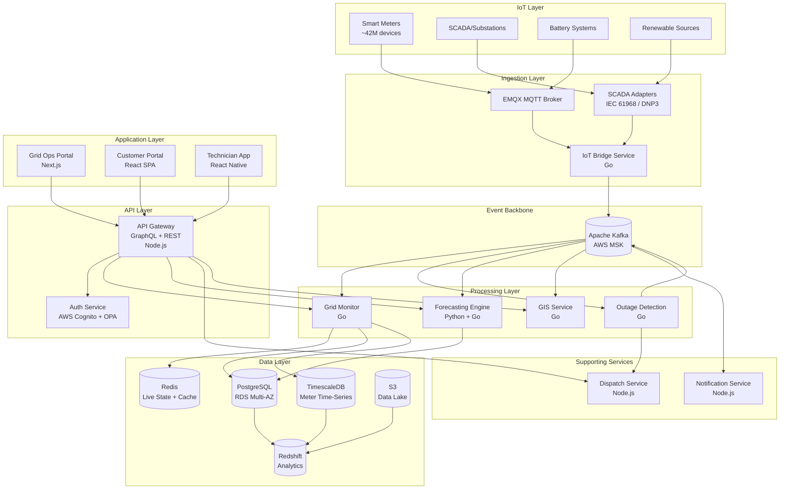

# System Overview — Helios

> **Location:** Confluence → Helios Engineering Space → Architecture → System Overview  
> **Owner:** David Okafor (Principal Engineer) · @david.okafor  
> **Co-authored:** Priya Nair · @priya.nair  
> **Last Updated:** 2024-10-15  
> **Status:** Current — reflects v4.7 architecture  
> **Related:** [High-Level Architecture](/02-architecture/high-level-architecture.md) · [Microservices Overview](/02-architecture/microservices-overview.md) · [Event-Driven Architecture](/02-architecture/event-driven-architecture.md) · [Database Architecture](/02-architecture/database-architecture.md)

---

> *This document is the narrative entry point for the Helios architecture. If you are reading a specific service document and want to understand how it fits into the larger system, this is where you start. The [High-Level Architecture](/02-architecture/high-level-architecture.md) document has the diagrams; this document has the explanation.*

---

## The Core Problem — At Scale

Before describing the architecture, it helps to understand the fundamental engineering challenge Helios solves, because every major architectural decision flows from it.

A large utility company manages hundreds of thousands to millions of assets — smart meters, distribution transformers, substations, feeder lines, battery systems, generation sources. Each of these assets produces telemetry. Smart meters report readings every 15 minutes (more frequently during alert conditions). Substations produce near-continuous SCADA telemetry. Battery systems report state-of-charge at high frequency.

For a mid-sized utility with 3 million smart meters:
- At 15-minute intervals: ~3.3M events every 15 minutes = ~220K events/minute = ~3,700 events/second *at baseline*
- During storm events or demand peaks, meters report at 1-minute intervals: ~50,000 events/second from that one customer

Now multiply across 14 customers. Our current peak is ~380,000 events/second from IoT sources alone.

This data must be:
1. **Ingested reliably** — no events dropped; duplicates handled gracefully
2. **Validated** — malformed, out-of-range, and stale readings must be detected
3. **Processed in near real-time** — faults and anomalies must trigger alerts within 4 seconds
4. **Stored durably** — 7 years minimum, queryable at arbitrary granularity
5. **Available to multiple consumers simultaneously** — grid operations portal, forecasting engine, dispatch system, customer portal, compliance reporting, analytics

No single technology solves all of these requirements optimally. The architecture is a composition of specialized components, each doing what it does well, coordinated by an event streaming backbone.

---

## Architecture Philosophy

### Event Streaming as the Backbone

Helios is an **event-driven architecture** at its core. Apache Kafka (AWS MSK) is the central nervous system. Raw IoT events arrive from meters and SCADA systems, are validated and enriched, and then flow through a series of Kafka topics that feed independent downstream consumers.

This design choice (formalized in [ADR-003](/05-engineering/adrs.md#adr-003)) means that:
- **No service is the "master" of the data.** The Kafka topic is the source of truth.
- **New consumers can be added without changing producers.** When we added the AI forecasting engine in v2.0, it subscribed to existing topics without any changes to the IoT bridge.
- **Reprocessing is possible.** We can replay topic history to rebuild a downstream store, to backfill new analytics, or to recover from a processing bug.

### Polyglot Persistence

Different data access patterns require different storage technologies:

| Data Type | Store | Reason |
|---|---|---|
| Grid events, meter readings, alerts | TimescaleDB (PostgreSQL + TimescaleDB extension) | Time-series optimized; compression; range queries |
| Grid asset metadata (substations, lines, meters) | PostgreSQL (RDS) | Relational; joins with tenant data |
| Geospatial asset data | PostGIS (PostgreSQL extension) | Geospatial queries; nearest-neighbor; polygon intersection |
| Live grid state | Redis | Sub-millisecond reads; pub/sub for real-time portal updates |
| Session data, rate limiting counters | Redis | Ephemeral; high throughput |
| Analytics, historical aggregates | Amazon Redshift | Columnar; OLAP query patterns; BI tool integration |
| Model artifacts, Parquet data lake | Amazon S3 | Object storage; cheap at scale; Spark-compatible |
| Work orders, dispatch records | PostgreSQL (RDS) | Relational; transaction support |
| Customer accounts, billing references | PostgreSQL (RDS) | Multi-tenant; foreign keys to billing system |

### Polyglot Services

Performance-critical, high-throughput services are written in **Go**. Services with complex business logic or third-party integration are written in **Node.js**. AI/ML training and batch processing is in **Python**. Frontends are **TypeScript/React/Next.js**.

This is not cargo-culting. Each language was chosen deliberately:
- **Go** for the grid monitor and IoT bridge because they process hundreds of thousands of events per second with strict latency budgets. Go's goroutine model and efficient GC characteristics are well-suited. See [ADR-001](/05-engineering/adrs.md#adr-001).
- **Node.js** for the API gateway and dispatch service because they orchestrate calls between many services and the async I/O model fits well. The existing team expertise at founding was also a factor.
- **Python** for ML because the ecosystem is unmatched. We do not run Python in the hot path — it is for training and batch inference only.

---

## The Data Journey — End to End

The best way to understand the system is to trace a single event from its origin to every place it ends up.

### Example: A Smart Meter Reports Abnormal Voltage

```
Time T+0ms: 
  Smart meter ID sm-42a9b7 (tenant: CUST-MWG, address: 4421 Maple St, Cedar Rapids)
  reports voltage reading: 138V (normal range: 114–126V)
  via MQTT to IoT Bridge
```

**Step 1: IoT Bridge receives the raw event** (`helios-iot-bridge`, Go service)
- MQTT message arrives at EMQX broker
- IoT Bridge authenticates the device (device certificate check against device registry)
- Decodes the binary payload (AMI meter protocol → internal protobuf format)
- Validates schema (is this a well-formed reading? Are required fields present?)
- Publishes to Kafka topic: `iot.raw.meter.readings.v2`
- Latency from MQTT receive to Kafka publish: < 50ms

**Step 2: Validation & Enrichment** (`helios-grid-monitor`, Go service — Validation Consumer)
- Consumes from `iot.raw.meter.readings.v2`
- Looks up device metadata from device registry cache (Redis): meter ID → substation → feeder → service territory
- Validates business rules: is 138V outside acceptable range? (Yes — threshold is configurable per tenant, stored in Redis hot config)
- Attaches contextual metadata: location coordinates, equipment type, prior readings
- Publishes enriched event to `grid.events.enriched.v2`
- Also publishes to `grid.events.anomalies.v1` because voltage is out of range
- Latency: < 200ms

**Step 3: Grid State Update** (`helios-grid-monitor`, Go service — State Manager)
- Consumes `grid.events.enriched.v2`
- Updates grid state in Redis: the live state object for meter `sm-42a9b7` is updated
- Checks topology: propagates voltage reading up to the feeder and substation level aggregates
- Publishes state change event: `grid.state.updates.v1`
- Also triggers alert evaluation (is this a condition that requires an operator alert?)
- Latency: < 300ms from enrichment

**Step 4: Alert Generation** (`helios-grid-monitor`, Alert Processor)
- Evaluates alert rules for the anomaly event
- Voltage 138V on residential meter → OVERVOLTAGE alert, severity MEDIUM
- Creates alert record in PostgreSQL alerts table
- Publishes alert to Kafka: `grid.alerts.v2`
- Simultaneously writes to Redis pub/sub channel `alerts:{tenant_id}` for real-time portal push

**Step 5: Real-time Portal Update** (API Gateway → WebSocket → Browser)
- API Gateway subscribes to Redis pub/sub channel `alerts:{tenant_id}`
- Pushes alert to connected Grid Operations Portal clients via WebSocket
- Grid operator sees alert notification in their browser
- **Total latency T+0 to operator seeing alert: target ≤ 4 seconds, typical: 2.1–3.7 seconds**

**Step 6: Notification** (`helios-notify`, Node.js service)
- Consumes `grid.alerts.v2`
- Checks notification rules: who should be notified for an OVERVOLTAGE MEDIUM alert?
- For this tenant, MEDIUM alerts go to on-call supervisor via push notification
- Sends notification via configured channel (push, SMS, email)

**Step 7: Forecasting Input** (`helios-forecasting`, Python/Go)
- Consumes `grid.events.enriched.v2` (independent consumer group)
- Anomalous readings are flagged as potential data quality issues for the forecasting model
- Feature store updated: running voltage stats for this feeder updated

**Step 8: Persistent Storage** (Multiple consumers)
- `helios-grid-monitor` TimescaleDB writer: inserts reading into `meter_readings` hypertable (partitioned by day)
- `helios-data-pipeline` S3 writer: batches readings into hourly Parquet files in the data lake (delayed ~5 minutes, not real-time)

**Step 9: Customer Notification** (if this causes a sustained outage)
- If the overvoltage leads to a downstream outage, the Outage Detection Service creates an outage record
- The Customer Portal Notification job sends outage notifications to affected customers

This entire chain — from meter to operator alert — is the core product. Everything else in Helios is either enabling this chain or adding value on top of it.

---

## System Components Summary



---

## Tenancy Model

Every customer (utility company) is a **tenant**. Tenant isolation is enforced at multiple layers:

1. **Kafka:** Each tenant's events are tagged with `tenant_id`. Consumer groups have per-tenant partition assignments for the most sensitive topics (see [Event-Driven Architecture — Tenant Isolation](/02-architecture/event-driven-architecture.md#tenant-isolation)).
2. **Database:** Every table has a `tenant_id` column with a `NOT NULL` constraint. Row-level security (RLS) policies in PostgreSQL enforce that queries from a tenant's service account can only see their own rows.
3. **Redis:** All keys are prefixed with `t:{tenant_id}:`.
4. **API:** JWT tokens contain a `tenant_id` claim. The API gateway validates that the requested resource belongs to the token's tenant before forwarding. See [Authorization](/05-engineering/authorization.md).
5. **S3:** Bucket prefixes: `s3://helios-data-lake/{tenant_id}/`.

See [Security Architecture — Tenant Isolation](/06-operations/security-architecture.md#tenant-isolation) for the full threat model.

---

## External Integrations

Helios integrates with several external systems that are not owned by us:

| External System | Integration Type | Data Flow | Owner |
|---|---|---|---|
| Utility SCADA Systems | IEC 61968, DNP3 pull adapters | SCADA → Helios | IoT & Devices team |
| Utility Billing Systems (Oracle CC&B, SAP IS-U) | REST API (outbound) | Helios reads billing account data | Customer Experience team |
| Weather Data API (Tomorrow.io) | REST API (outbound) | Weather forecasts → Forecasting engine | Data & AI team |
| PagerDuty | REST API + Webhooks | Helios → PagerDuty for on-call alerts | Platform/SRE |
| Twilio | REST API (outbound) | Notification service → SMS | Platform (Notify) |
| SendGrid | REST API (outbound) | Notification service → Email | Platform (Notify) |
| Apple Push / Firebase | SDK | Notification service → Mobile push | Platform (Notify) |
| Regulator Reporting Portals | File upload / SFTP | Helios → Regulators | Compliance team |

---

## Known Architectural Limitations

This section documents real limitations that every engineer should know about. Glossing over them creates false confidence and leads to building features that don't account for them.

### 1. IoT Bridge Is Single-Region
The MQTT bridge currently runs only in `us-east-1`. EMQX is not yet configured for multi-region replication. If `us-east-1` goes down, IoT ingestion stops. This is our single biggest infrastructure risk and the subject of ongoing remediation. See [ADR-009](/05-engineering/adrs.md#adr-009) and [Technical Debt Register — IoT Single Region](/05-engineering/technical-debt-register.md#iot-single-region).

### 2. Grid State Is Eventually Consistent
The live grid state in Redis is populated by the Grid Monitor service processing Kafka events. There is an inherent processing lag (typically 100–500ms, up to 2 seconds under load). This means what the portal shows is the state as of the last processed event, not necessarily the absolute present-moment state of the physical grid. We document this prominently in the portal ("Data as of N seconds ago"). This is a known and accepted trade-off — the alternative (synchronous state updates) would break the scalability model.

### 3. TimescaleDB Partition Growth
The meter readings hypertable creates daily partitions. With 42M meters and 7-year retention, partition count is growing faster than originally projected. Auto-compression and tiering mitigate but don't eliminate this. Full details and remediation plan in [Performance Bottlenecks — TimescaleDB](/05-engineering/performance-bottlenecks.md#timescale-partitions).

### 4. Dispatch Service on Node.js 16
The dispatch service has not been upgraded from Node.js 16 due to a transitive dependency on a deprecated package in the offline-sync protocol library used by the mobile app. This is tracked in [Technical Debt Register](/05-engineering/technical-debt-register.md#dispatch-node16). Do not add new dependencies to this service without checking with @raj.patel first.

### 5. GIS Asset Sync Is Nightly Batch
GIS asset data (the topology of what is connected to what) is synchronized from utility SCADA systems on a nightly batch. This means the GIS layer can be up to 24 hours stale for new or modified assets. For most operations this is fine, but for outage detection that depends on accurate topology data, there is a potential correctness window. This is documented in [GIS Mapping Service — Known Limitations](/03-services/gis-mapping-service.md#known-limitations).

---

## How the Architecture Has Evolved

Helios started in 2020 as a fairly conventional three-tier web application: Next.js frontend, Node.js API, PostgreSQL database. The IoT ingestion and event streaming architecture was added in v2.0 (early 2022) after the v1.x architecture failed to scale past two customers. The TimescaleDB migration happened in v2.1. The Go services were introduced in v3.0 (2023) for the grid monitor and IoT bridge after profiling showed the Node.js-based equivalents were hitting CPU limits under load.

This evolution is documented in detail in [Project Timeline](/supplemental/project-timeline-history.md). Understanding where we came from helps understand why the current architecture is shaped the way it is — some decisions were made under different constraints than we have today.

---

## Things Every New Engineer Should Know

1. **Kafka is the source of truth, not the database.** If there's ever a discrepancy between what's in PostgreSQL and what's in Kafka (after a recovery scenario), the Kafka event is correct and the database should be rebuilt from it.

2. **Never bypass the API gateway.** All client traffic goes through `helios-api-gateway`. Services should not have direct public endpoints. If you think you need a direct endpoint, discuss with the Platform team first.

3. **Tenant isolation is enforced at every layer.** If you are writing a query, an API handler, or a Kafka consumer, you must include `tenant_id` in your logic. The RLS policies catch most mistakes in PostgreSQL, but a bug in Redis key naming or Kafka consumer routing can cause tenant data mixing. These bugs are high-severity.

4. **The grid state in Redis is the hot path.** Anything that reads Redis in the hot path (the portal dashboard, the alert feed) should be measured and profiled. Cache misses that fall through to TimescaleDB at scale create latency spikes.

5. **There are three user surfaces with different engineering contracts.** The Grid Operations Portal needs millisecond-responsive real-time data. The Customer Portal needs good UX but tolerates eventually consistent data. The Mobile App must work offline. These are different engineering problems and the code reflects that.

---

*Document maintained by @david.okafor and @priya.nair*  
*For architecture questions, bring to `#helios-architecture` or the ARB*  
*Next review: Q1 2025 post v4.8 release*  
*See also: [High-Level Architecture](/02-architecture/high-level-architecture.md) · [Microservices Overview](/02-architecture/microservices-overview.md) · [ADRs](/05-engineering/adrs.md)*
