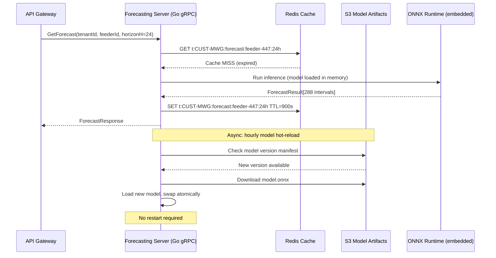

# AI Forecasting Engine — Helios

> **Location:** Confluence → Helios Engineering Space → Services → AI Forecasting Engine  
> **Owner:** Lin Chen (Staff Engineer, Data & AI) · @lin.chen  
> **ML Engineering:** Soren Andersen · @soren.andersen · Emmanuel Obi · @emmanuel.obi  
> **Last Updated:** 2024-10-30  
> **Repo:** `lumina-energy/helios-forecasting` (serving) · `lumina-energy/helios-model-ops` (training)  
> **Status:** 🟢 Healthy  
> **Related:** [Data Pipeline](/supplemental/data-pipeline.md) · [Grid Monitoring Service](/03-services/grid-monitoring-service.md) · [Database Architecture](/02-architecture/database-architecture.md) · [Analytics Platform](/supplemental/analytics-platform.md)

---

## What This Service Does

The AI Forecasting Engine provides two categories of predictions used throughout the platform:

1. **Demand Forecasting** — 72-hour electricity demand forecasts at feeder and substation level, updated every 15 minutes. These drive battery dispatch schedules, demand-response activation recommendations, and load shedding decisions.

2. **Predictive Fault Modeling** *(beta, not yet a shipping product feature)* — Equipment failure probability models for transformers and substations, based on historical outage data, equipment age, load history, and weather correlation.

The forecasting engine is one of the two primary product differentiators for Helios (alongside near-real-time grid monitoring). Forecast accuracy (MAPE) is tracked on the executive dashboard and in every quarterly business review.

---

## Demand Forecasting

### Model Architecture

As of v4.6, the primary demand forecasting model is a **Temporal Fusion Transformer (TFT)** trained per-tenant, per-feeder-cluster. We previously used gradient boosting (LightGBM) from v2.0–v4.4. The migration to TFT is documented below.

**Model hierarchy:**
```
National/Regional Model (LightGBM, fast inference)
└── Used for: cold-start tenants, aggregate reporting
Feeder-Cluster Model (TFT, ~500 feeders per cluster)
└── Used for: primary production forecasts
Feeder-Level Fine-Tuned Model (TFT fine-tuned)
└── Used for: high-value feeders with enough history (> 2 years)
```

**Why TFT over LightGBM?**

LightGBM was our original model from v2.0. It worked well at the regional level and was fast to train and serve. However, it struggled with:
- Multi-step forecasts (we need 72 hours × 15-min intervals = 288 steps)
- Capturing long-term seasonality patterns (holiday effects, summer/winter differences)
- Integrating continuous and categorical inputs elegantly (weather, calendar, meter metadata)

TFT (Lim et al., 2019) addresses all of these. Our evaluation (August 2023) showed TFT reduced MAPE on 24hr feeder forecasts from 4.2% (LightGBM) to 3.1% (TFT) on our held-out test set. This improvement was significant enough to justify the training complexity and longer inference time.

The migration is documented in the model training runbook at `helios-model-ops/docs/model-migration-lightgbm-to-tft.md`.

### Input Features

| Feature Category | Features | Update Frequency |
|---|---|---|
| Historical demand | Feeder load (MW), 15-min intervals, 2 years history | 15 min |
| Weather | Temperature, cloud cover, wind speed, humidity, solar irradiance | 5 min (Tomorrow.io API) |
| Calendar | Hour of day, day of week, week of year, holidays, DST transitions | Static / calendar |
| Grid topology | Feeder capacity (MW), connection type, # downstream transformers | Daily (GIS sync) |
| Customer mix | % residential, % commercial, % industrial on feeder | Daily (CRM sync) |
| Events | Demand response events active, planned outages | Real-time |
| Recent actuals | Last 4 actual readings (15, 30, 45, 60 min ago) | 15 min |

**Weather data:** We use Tomorrow.io's V4 API at 5-minute resolution. Weather is our largest single driver of forecast error at short horizons (< 4 hours) and the primary reason models need to be retrained seasonally. See [Data Pipeline — Weather Feature Engineering](/supplemental/data-pipeline.md#weather-features).

### Training Pipeline

```mermaid
graph LR
    RAW[Raw meter readings\nTimescaleDB] --> FE[Feature Engineering\nhelios-data-pipeline Spark job]
    WEATHER[Weather data\nS3 historical cache] --> FE
    FE --> FS[Feature Store\nS3 Parquet]
    FS --> TRAIN[Model Training\nEMR Spark + PyTorch\nhelios-model-ops]
    TRAIN --> EVAL[Evaluation\nHeld-out validation set\nMAPE, MAE, RMSE]
    EVAL -->|MAPE < threshold| REG[MLflow Model Registry\nstaging → production]
    EVAL -->|MAPE >= threshold| ALERT[Slack alert:\n#helios-model-alerts]
    REG --> EXPORT[ONNX Export\nS3: helios-artifacts/models/]
    EXPORT --> RELOAD[Forecasting Server\nModel hot-reload\n(no restart required)]
```

**Training cadence:**
- Full retraining: monthly (first Sunday of each month, 02:00 UTC, EMR cluster)
- Incremental fine-tuning: weekly (updated on new actuals)
- Emergency retraining: triggered manually when MAPE drift exceeds 15% of baseline (monitored by `helios-model-ops/monitoring/drift_detector.py`)

### Training Job Configuration

```python
# helios-model-ops/training/tft_trainer.py (simplified)
from pytorch_forecasting import TemporalFusionTransformer, TimeSeriesDataSet
import pytorch_lightning as pl
import mlflow

class HeliosTFTTrainer:
    MODEL_VERSION = "tft-v3"
    
    DEFAULT_HYPERPARAMS = {
        "hidden_size": 128,
        "attention_head_size": 4,
        "dropout": 0.1,
        "hidden_continuous_size": 32,
        "lstm_layers": 2,
        "learning_rate": 1e-3,
        "batch_size": 128,
        "max_epochs": 50,
        "gradient_clip_val": 0.1,
    }
    
    def train(self, tenant_id: str, feeder_cluster_id: str, feature_df):
        with mlflow.start_run(run_name=f"tft-{tenant_id}-{feeder_cluster_id}"):
            mlflow.log_params(self.DEFAULT_HYPERPARAMS)
            
            dataset = TimeSeriesDataSet(
                feature_df,
                time_idx="time_idx",
                target="load_mw",
                group_ids=["feeder_id"],
                max_encoder_length=96,   # 24 hours of history (96 × 15min)
                max_prediction_length=288, # 72 hours ahead (288 × 15min)
                time_varying_known_reals=["temperature", "solar_irradiance", "hour_sin", "hour_cos"],
                time_varying_unknown_reals=["load_mw", "humidity", "cloud_cover"],
                static_categoricals=["feeder_cluster", "customer_mix_type"],
                static_reals=["feeder_capacity_mw", "num_transformers"],
            )
            
            model = TemporalFusionTransformer.from_dataset(
                dataset, **self.DEFAULT_HYPERPARAMS
            )
            
            trainer = pl.Trainer(
                max_epochs=self.DEFAULT_HYPERPARAMS["max_epochs"],
                gradient_clip_val=self.DEFAULT_HYPERPARAMS["gradient_clip_val"],
                accelerator="gpu" if torch.cuda.is_available() else "cpu",
            )
            trainer.fit(model, ...)
            
            # Evaluate on validation set
            val_metrics = self.evaluate(model, val_dataset)
            mlflow.log_metrics(val_metrics)
            
            if val_metrics["mape"] < self.MAPE_THRESHOLD:
                # Export to ONNX for efficient serving
                self.export_onnx(model, tenant_id, feeder_cluster_id)
                mlflow.log_artifact(f"models/{tenant_id}/{feeder_cluster_id}/model.onnx")
                
                # Promote to staging in MLflow registry
                mlflow.register_model(
                    f"runs:/{mlflow.active_run().info.run_id}/model",
                    f"helios-tft-{tenant_id}-{feeder_cluster_id}"
                )
```

### Model Serving Architecture



**Model hot-reload:** The forecasting server checks S3 for new model versions every hour. When a new version is found, it downloads and loads the ONNX model into a separate memory slot, then atomically swaps the pointer. In-flight inference requests complete against the old model; new requests use the new model. This allows monthly model updates with zero downtime.

```go
// internal/model/loader.go
type ModelLoader struct {
    mu      sync.RWMutex
    current *ort.Session  // ONNX Runtime session
    version string
}

func (l *ModelLoader) HotReload(ctx context.Context, newModelPath string, newVersion string) error {
    newSession, err := ort.NewSession(newModelPath, ort.WithIntraOpNumThreads(4))
    if err != nil {
        return fmt.Errorf("failed to load new model %s: %w", newVersion, err)
    }
    
    l.mu.Lock()
    old := l.current
    l.current = newSession
    l.version = newVersion
    l.mu.Unlock()
    
    // Close old session after a grace period (allow in-flight requests to complete)
    go func() {
        time.Sleep(30 * time.Second)
        old.Destroy()
    }()
    
    log.Info().Str("version", newVersion).Msg("Model hot-reload complete")
    return nil
}
```

---

## Predictive Fault Modeling (Beta)

> **Status:** In production for transformer failure prediction (CUST-MWG only, beta). Not yet a generally available product feature. See [Product Roadmap — Predictive Asset Analytics](/supplemental/product-roadmap.md).

### What We're Predicting

Equipment failure probability over the next 30, 60, 90 days for:
- Distribution transformers (most impactful — most common source of outages)
- Substation circuit breakers (high priority but harder to predict)

### Model Approach

We use a **gradient-boosted survival model** (XGBoost + survival analysis) rather than a classification model. The reason: equipment failure is a time-to-event problem, not a binary classification problem. We need to answer "when will it fail?" not just "will it fail?"

The feature set includes:
- Equipment age (years since installation)
- Manufacturer and model (strong predictor — some vintages fail much earlier)
- Loading history (average % of rated capacity over trailing 12 months)
- Temperature stress events (hours above 35°C ambient)
- Historical fault count on same equipment
- Substation-level outage history (correlated failures in same substation)

**Current accuracy on CUST-MWG dataset:**
- C-index (concordance, similar to AUC for survival models): 0.74
- 30-day recall (did we flag transformers that failed?): 68%
- 90-day recall: 81%

This is promising but not yet at the 90%+ recall threshold we've set as the GA launch criterion. The model improves with more data — CUST-MWG has 4 years of history, which is enough to start seeing patterns.

---

## Forecast Accuracy Monitoring

Forecast accuracy is monitored continuously. When a forecast is made, the actual readings are collected after the forecast horizon passes and MAPE is computed.

```python
# helios-model-ops/monitoring/accuracy_monitor.py
def compute_mape(forecast_df, actuals_df):
    """
    Compute Mean Absolute Percentage Error for forecasts vs. actuals.
    Excludes intervals where actual load < 10MW (percentage errors unstable at near-zero).
    """
    merged = forecast_df.merge(actuals_df, on=['feeder_id', 'interval_start'])
    mask = merged['actual_mw'] >= 10
    merged = merged[mask]
    
    merged['ape'] = abs(merged['forecast_mw'] - merged['actual_mw']) / merged['actual_mw']
    
    return {
        'mape': merged['ape'].mean() * 100,
        'mae': (merged['forecast_mw'] - merged['actual_mw']).abs().mean(),
        'rmse': ((merged['forecast_mw'] - merged['actual_mw'])**2).mean()**0.5,
        'n': len(merged),
    }
```

**MAPE drift alert:** If rolling 7-day MAPE exceeds 5% (vs. our SLO of 3.5%), an alert fires to `#helios-model-alerts`. This triggers a model retraining review. Common causes:
1. Unusual weather event not captured in training data (major cold snap, hurricane)
2. Major customer behavior change (large industrial customer went offline, new solar installation)
3. Data quality issue in the feature pipeline (e.g., Tomorrow.io API gap)

---

## API Reference

### gRPC (primary)

```protobuf
service ForecastingService {
    rpc GetForecast(GetForecastRequest) returns (ForecastResponse);
    rpc GetBatteryDispatchSchedule(DispatchRequest) returns (DispatchResponse);
    rpc GetModelMetadata(ModelMetadataRequest) returns (ModelMetadataResponse);
    rpc GetFaultProbability(FaultProbabilityRequest) returns (FaultProbabilityResponse);
}

message GetForecastRequest {
    string tenant_id     = 1;
    string feeder_id     = 2;
    int32  horizon_hours = 3;  // 1–72
    string model_type    = 4;  // "TFT" | "LGB" — defaults to TFT
}

message ForecastResponse {
    string   model_id      = 1;
    string   model_version = 2;
    repeated ForecastInterval intervals = 3;
    double   mape_7d_trailing = 4;  // current model accuracy, shown in portal
}

message ForecastInterval {
    int64  interval_start_ms  = 1;
    double forecasted_mw      = 2;
    double confidence_low_mw  = 3;   // 10th percentile
    double confidence_high_mw = 4;   // 90th percentile
}
```

---

## Things Every New Engineer Should Know

1. **The forecasting models are per-tenant, per-feeder-cluster.** There is no single "global" model. If a new tenant is onboarded with less than 6 months of history, they get the regional LightGBM model until they accumulate enough data for TFT training. This is handled automatically by the model selector in the serving layer.

2. **Model versions are immutable.** Once a model version is deployed, it is never overwritten. If a new version performs worse, we roll back by updating the version pointer in S3 (no code deployment required). All model versions are retained in S3 for at least 12 months.

3. **Do not query TimescaleDB directly from the forecasting service in the hot path.** The feature store (S3 Parquet, read by the training job) and the Redis forecast cache are the hot-path data stores. Direct TimescaleDB queries in the serving path would kill our inference latency SLO.

4. **Weather API rate limits are real.** Tomorrow.io's API has rate limits. If you add a new feature that calls the weather API, check the rate limit headroom with @lin.chen first. We have had one incident where a new testing environment consumed production API credits.

5. **MAPE means nothing without context.** A 3.1% MAPE sounds good. But on a feeder serving a hospital, being off by 3.1% during a demand response event has real consequences. Always interpret accuracy metrics in the context of the downstream decisions they drive.

---

*Document maintained by @lin.chen, @soren.andersen, and @emmanuel.obi*  
*Model performance questions → @soren.andersen*  
*Serving infrastructure questions → @lin.chen*  
*Related: [Data Pipeline](/supplemental/data-pipeline.md) · [Grid Monitoring Service](/03-services/grid-monitoring-service.md) · [Analytics Platform](/supplemental/analytics-platform.md)*
