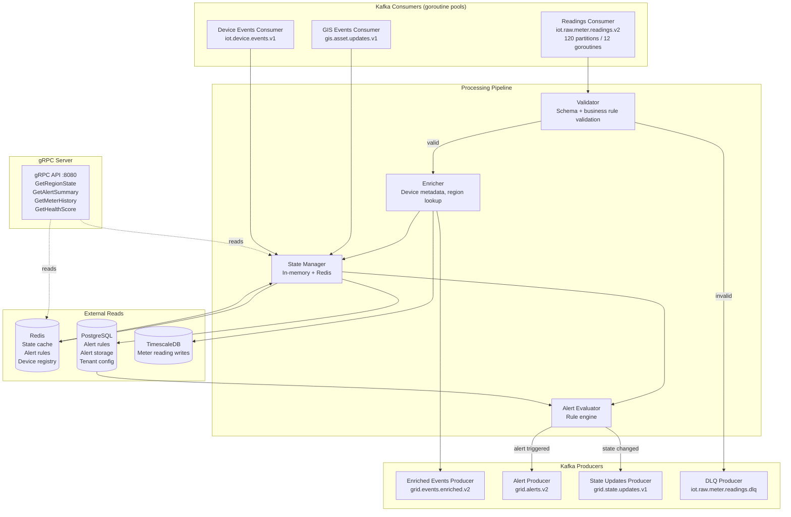
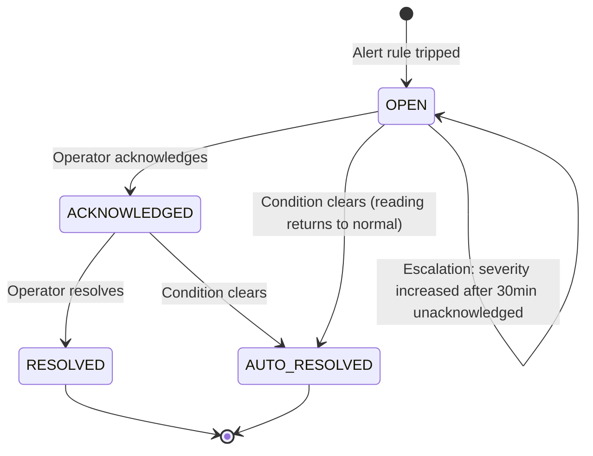

# Grid Monitoring Service — Helios

> **Location:** Confluence → Helios Engineering Space → Services → Grid Monitoring  
> **Owner:** David Okafor (Principal Engineer) · @david.okafor  
> **Secondary Owner:** Rosa Lindqvist · @rosa.lindqvist  
> **Last Updated:** 2024-11-08  
> **Repo:** `lumina-energy/helios-grid-monitor`  
> **Status:** 🟢 Healthy  
> **Related:** [Backend Architecture](/02-architecture/backend-architecture.md) · [Event-Driven Architecture](/02-architecture/event-driven-architecture.md) · [Outage Detection Service](/03-services/outage-detection-service.md) · [Alerting Strategy](/04-platform/alerting-strategy.md)

---

## What This Service Does

`helios-grid-monitor` is the core real-time intelligence service for the platform. It is responsible for:

1. **Consuming raw meter and SCADA telemetry** from Kafka and validating/enriching it
2. **Maintaining the live grid state** — a model of the current electrical state of every asset for every tenant
3. **Evaluating alert rules** against incoming readings in near-real-time
4. **Publishing enriched events and alerts** to downstream services and the portal
5. **Providing gRPC APIs** to the API gateway for grid state queries

It does NOT do outage detection (that is [`helios-outage-detect`](/03-services/outage-detection-service.md)) or demand forecasting (that is [`helios-forecasting`](/03-services/ai-forecasting-engine.md)), though it feeds data to both.

The grid monitor is the service that gives Helios its core "the grid operator sees what's happening" promise. End-to-end alert latency (meter event to operator screen) is measured here and is our primary operational SLO.

---

## SLOs and Current Performance

| Metric | SLO | Current (P95, trailing 7 days) |
|---|---|---|
| Kafka consumer lag (`iot.raw.meter.readings.v2`) | < 500ms P95 | 187ms |
| Alert generation latency (reading → `grid.alerts.v2`) | < 1s P95 | 340ms |
| End-to-end latency (MQTT → portal WebSocket) | < 4s P95 | 3.1s |
| Alert precision (true positive rate) | ≥ 97% | 97.3% |
| Alert recall (no missed critical events) | ≥ 99% | 99.1% |
| Service uptime | 99.99% | 99.97%* |

> \* The 99.97% reflects the MSK replication incident in Q3 2024 (INC-2024-047) which caused 14 minutes of degraded monitoring. Post-mortem and remediation at [INC-2024-047](/06-operations/incident-response-runbook.md#inc-2024-047).

---

## Architecture



---

## Internal Components

### Validator

The validator is the first stage of the processing pipeline. It applies two categories of checks:

**Schema validation:**
- Required fields present (deviceId, tenantId, timestampMs, at least one reading value)
- Field types correct (numeric values are numeric, etc.)
- Timestamp is within acceptable range (not more than 5 minutes in the future, not more than 24 hours in the past — see note below)
- Tenant exists in the tenant registry (checked against Redis cache)

**Business rule validation:**
- Voltage readings are within physically plausible range (0–500V for LV, 0–35kV for MV)
- Frequency readings are within plausible range (45–65 Hz)
- Power factor is between 0 and 1
- Readings do not have implausible step-changes (> 50% change from prior reading triggers SUSPECT quality flag, not rejection)

> **Note on timestamp validation:** Smart meters have unreliable clocks. Some meters drift significantly. A meter reporting with a timestamp 10 hours old is not unusual. The 24-hour window reflects real-world meter behavior. Events older than 24 hours are rejected to the DLQ because they are past the Grid Monitor's ordering guarantees. If you find DLQ messages with `TIMESTAMP_TOO_OLD` error codes, it usually indicates a meter clock drift problem that the customer's AMI head-end needs to correct.

```go
// internal/validator/validator.go (simplified)
func (v *Validator) Validate(reading types.MeterReading) error {
    if reading.DeviceID == "" {
        return ValidationError{Code: "MISSING_DEVICE_ID"}
    }
    if reading.TenantID == "" {
        return ValidationError{Code: "MISSING_TENANT_ID"}
    }
    
    now := time.Now()
    readingTime := time.UnixMilli(reading.TimestampMs)
    
    if readingTime.After(now.Add(5 * time.Minute)) {
        return ValidationError{Code: "TIMESTAMP_FUTURE", Value: readingTime.String()}
    }
    if readingTime.Before(now.Add(-24 * time.Hour)) {
        return ValidationError{Code: "TIMESTAMP_TOO_OLD", Value: readingTime.String()}
    }
    
    if reading.Readings.Voltage != nil {
        v := *reading.Readings.Voltage
        if v < 0 || v > 35000 {
            return ValidationError{Code: "VOLTAGE_OUT_OF_RANGE", Value: fmt.Sprintf("%.2f", v)}
        }
    }
    
    return nil
}
```

### Enricher

The enricher adds context from the device registry to the raw reading:

```go
// internal/enricher/enricher.go (simplified)
func (e *Enricher) Enrich(ctx context.Context, reading types.MeterReading) (types.EnrichedEvent, error) {
    // Device metadata from cache (Redis), fallback to PostgreSQL
    device, err := e.deviceRegistry.Get(ctx, reading.DeviceID)
    if err != nil {
        return types.EnrichedEvent{}, fmt.Errorf("device lookup failed: %w", err)
    }
    
    return types.EnrichedEvent{
        MeterReading:   reading,
        DeviceName:     device.Name,
        DeviceType:     device.Type,
        VendorID:       device.VendorID,
        RegionID:       device.RegionID,
        SubstationID:   device.SubstationID,
        FeederID:       device.FeederID,
        ServiceAddress: device.ServiceAddress,
        Coordinates:    device.Coordinates,
        EnrichedAtMs:   time.Now().UnixMilli(),
    }, nil
}
```

### State Manager

The State Manager is the most complex component. It maintains a hierarchical model of the grid:

```
Tenant
└── Region (e.g., "Cedar Rapids Metropolitan")
    └── Substation (e.g., "Cedar Rapids North 115kV")
        └── Feeder (e.g., "Feeder 14 - Northwest")
            └── Transformer (e.g., "T-447")
                └── Meter (e.g., "SM-42a9b7")
```

Each level has an aggregated state derived from its children. When a meter reading arrives, the State Manager updates the meter state, then propagates aggregates up the hierarchy.

**State object structure (simplified):**
```go
type GridRegionState struct {
    RegionID      string
    TenantID      string
    LastUpdatedAt time.Time
    HealthScore   float64     // 0.0–1.0, computed from alert counts and severity
    ActiveAlerts  int
    Assets        map[string]*AssetState
}

type AssetState struct {
    AssetID       string
    AssetType     string
    Status        string      // HEALTHY | DEGRADED | FAULT | UNKNOWN
    HealthScore   float64
    LastReading   *MeterReading
    ActiveAlerts  []string    // alert IDs
    ChildStatuses map[string]string  // child asset statuses
}
```

**Health score computation:**
```go
func (s *AssetState) ComputeHealthScore() float64 {
    criticalCount := 0
    highCount := 0
    for _, alertID := range s.ActiveAlerts {
        alert := alertStore.Get(alertID)
        switch alert.Severity {
        case "CRITICAL": criticalCount++
        case "HIGH":     highCount++
        }
    }
    
    if criticalCount > 0 { return 0.0 }
    if highCount > 2 {     return 0.2 }
    if highCount > 0 {     return 0.5 }
    return 1.0
}
```

### Alert Evaluator

Alert rules are tenant-configurable. Default rules are provisioned for all tenants at onboarding. Operators can add custom rules via the portal.

```sql
-- public.alert_rules
CREATE TABLE public.alert_rules (
    id              UUID PRIMARY KEY DEFAULT gen_random_uuid(),
    tenant_id       UUID         NOT NULL REFERENCES public.tenants(id),
    name            VARCHAR(255) NOT NULL,
    metric_type     VARCHAR(50)  NOT NULL,
    scope           VARCHAR(50)  NOT NULL DEFAULT 'ALL_ASSETS',  -- ALL_ASSETS | ASSET_TYPE | SPECIFIC_ASSET
    asset_type_filter VARCHAR(50),
    asset_id_filter UUID,
    operator        VARCHAR(20)  NOT NULL,  -- GT | LT | OUTSIDE_RANGE | EQUALS
    threshold       NUMERIC(15,6),
    threshold_lower NUMERIC(15,6),
    threshold_upper NUMERIC(15,6),
    severity        VARCHAR(20)  NOT NULL,
    cooldown_ms     INTEGER      NOT NULL DEFAULT 300000,  -- 5 minute default cooldown
    enabled         BOOLEAN      NOT NULL DEFAULT TRUE,
    created_by      UUID         REFERENCES public.users(id),
    created_at      TIMESTAMPTZ  NOT NULL DEFAULT NOW()
);
```

**Default rules provisioned at tenant onboarding:**

| Rule | Metric | Condition | Severity |
|---|---|---|---|
| Low Voltage | Voltage | < 108V (residential) | HIGH |
| Overvoltage | Voltage | > 132V (residential) | HIGH |
| Extreme Voltage | Voltage | < 100V or > 140V | CRITICAL |
| High Frequency | Frequency | > 50.5 Hz or < 49.5 Hz (EU) / 60.5/59.5 Hz (US) | MEDIUM |
| Low Power Factor | Power factor | < 0.85 | LOW |
| No Reading (meter offline) | Reading age | > 30 minutes since last reading | MEDIUM |
| Substation Load High | Load % | > 90% capacity | HIGH |

---

## gRPC API

The grid monitor exposes a gRPC service on port 8080 consumed by the API gateway.

```protobuf
// proto/gridmonitor/v1/gridmonitor.proto
syntax = "proto3";

package helios.gridmonitor.v1;

service GridMonitorService {
    rpc GetRegionState(GetRegionStateRequest) returns (RegionStateResponse);
    rpc GetAlertSummary(GetAlertSummaryRequest) returns (AlertSummaryResponse);
    rpc GetMeterHistory(GetMeterHistoryRequest) returns (MeterHistoryResponse);
    rpc GetHealthScore(GetHealthScoreRequest) returns (HealthScoreResponse);
    rpc StreamAlerts(StreamAlertsRequest) returns (stream AlertEvent);
}

message GetRegionStateRequest {
    string tenant_id = 1;
    string region_id = 2;
    bool   include_child_assets = 3;
}

message RegionStateResponse {
    string   region_id    = 1;
    double   health_score = 2;
    int32    active_alerts = 3;
    int64    last_updated_at_ms = 4;
    repeated AssetState assets = 5;
}

message GetMeterHistoryRequest {
    string tenant_id   = 1;
    string device_id   = 2;
    int64  from_ms     = 3;
    int64  to_ms       = 4;
    string interval    = 5;  // "1m", "15m", "1h", "1d"
}
```

---

## Alert Lifecycle



**Escalation policy:** MEDIUM alerts that remain OPEN and unacknowledged for 30 minutes are escalated to HIGH. HIGH alerts unacknowledged for 15 minutes are escalated to CRITICAL and trigger PagerDuty.

This escalation behavior was added in v3.1 after an incident where a MEDIUM alert for a feeder approaching overload was not seen by the overnight operator (Tracy Kellerman's team, Midwest Grid Co.) and escalated to a physical overload event. See [Project Timeline — 2023 Q1 Alert Escalation Incident](/supplemental/project-timeline-history.md).

---

## Deployment and Configuration

**Helm chart:** `helios-infra/charts/grid-monitor/`

Key configuration values:

```yaml
# values.prod.yaml
replicaCount: 6
autoscaling:
  enabled: true
  minReplicas: 4
  maxReplicas: 12
  targetKafkaLag: 10000  # scale up when lag exceeds 10,000 messages

resources:
  requests:
    cpu: "2"
    memory: "4Gi"
  limits:
    cpu: "4"
    memory: "8Gi"

kafka:
  consumerGroupId: "grid-monitor-readings"
  batchSize: 500          # messages per poll
  maxWaitMs: 100          # max time to wait for batch to fill
  commitIntervalMs: 1000  # commit offsets every second

alertRuleRefreshIntervalMs: 30000  # 30 seconds
stateWriteThroughIntervalMs: 5000  # write Redis every 5s (not on every reading)
```

**Scaling trigger:** Kafka consumer lag > 10,000 messages on `iot.raw.meter.readings.v2`. The HPA is configured with the Kafka KEDA scaler (see [Kubernetes Guide — KEDA](/04-platform/kubernetes-guide.md#keda)).

---

## Operational Runbook

### High Kafka Consumer Lag

**Symptom:** Grafana alert "grid-monitor-readings consumer lag > 50,000"  
**Likely causes:**
1. Traffic spike (demand event, storm, mass meter provisioning)
2. Grid monitor pods unhealthy/restarting
3. MSK broker degraded

**Steps:**
1. Check pod count: `kubectl get pods -n helios-prod -l app=grid-monitor`
2. Check HPA status: `kubectl get hpa grid-monitor -n helios-prod`
3. Check for pod restarts (OOM, crash): `kubectl describe pods -n helios-prod -l app=grid-monitor`
4. Check MSK broker health in AWS console
5. If pod count is at max and lag is still growing: check for slow consumer (look for long GC pauses in pod logs)
6. Emergency: manually scale above HPA max if needed: `kubectl scale deployment grid-monitor --replicas=20 -n helios-prod`

### Alert Rules Not Updating

**Symptom:** Newly configured alert rules not triggering even when conditions are met  
**Cause:** Alert rule cache refresh cycle is 30 seconds  
**Steps:**
1. Wait up to 30 seconds after saving a new rule in the portal
2. If still not triggering: check rule is enabled in the database
3. Check grid-monitor logs for rule refresh errors: `kubectl logs -n helios-prod -l app=grid-monitor | grep "rule_refresh"`
4. If rule refresh is failing: likely a PostgreSQL connectivity issue — check DB connection pool metrics

### Rolling Deploy Cache Coherence

**Symptom:** Brief period of inconsistent alert counts in the portal during grid-monitor deployment  
**Cause:** In-memory state is per-replica; during rolling deploy, new pods start with empty state and populate from Redis. There is a 30–60 second window where some replicas have full state and new ones have partial state.  
**Mitigation:** The portal displays "Last updated: N seconds ago" on the dashboard header. This is expected behavior and not a bug. Grid operators should be aware of it during planned maintenance windows.

---

## Things Every New Engineer Should Know

1. **This service runs Go goroutines for all concurrent work.** No external workers, no thread pools. A goroutine leak here is immediately visible in the memory metrics. If memory is growing unboundedly, look for goroutine leaks first (`/debug/pprof/goroutine`).

2. **The in-memory state is per-pod.** Two requests to the API gateway may be routed to different grid-monitor pods with slightly different in-memory states. For most use cases, the Redis-backed state provides the consistent view. For the absolute latest state, the gRPC `GetRegionState` call reads from both in-memory and Redis and returns the most recent.

3. **Alert cooldowns are tenant-scoped, not global.** An alert rule with a 5-minute cooldown means that after the alert fires for a given device, that rule will not fire again for that device for 5 minutes. The cooldown does not prevent the same rule from firing on different devices.

4. **Never set `cooldown_ms = 0` in a test.** A rule with zero cooldown in a test environment that uses real data will generate thousands of alerts per minute and degrade the entire alerting pipeline.

5. **The service is the single writer for `grid.events.enriched.v2`.** Nothing else should produce to that topic. If you see unexpected producers in the Kafka metrics, investigate immediately — it means an unauthorized service is writing to the enriched event stream.

---

*Document maintained by @david.okafor and @rosa.lindqvist*  
*Related: [Outage Detection Service](/03-services/outage-detection-service.md) · [Event-Driven Architecture](/02-architecture/event-driven-architecture.md) · [Alerting Strategy](/04-platform/alerting-strategy.md)*
