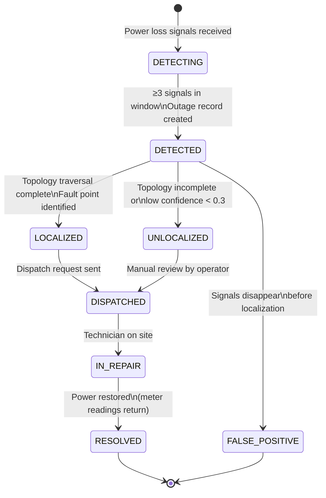

# Outage Detection Service — Helios

> **Location:** Confluence → Helios Engineering Space → Services → Outage Detection  
> **Owner:** Chidi Eze (Senior Engineer, Grid Intelligence) · @chidi.eze  
> **Last Updated:** 2024-10-12  
> **Repo:** `lumina-energy/helios-outage-detect`  
> **Status:** 🟢 Healthy  
> **Related:** [Grid Monitoring Service](/03-services/grid-monitoring-service.md) · [Technician Dispatch System](/03-services/technician-dispatch-system.md) · [GIS Mapping Service](/03-services/gis-mapping-service.md) · [Notification Platform](/03-services/notification-platform.md)

---

## What This Service Does

`helios-outage-detect` is responsible for:

1. **Detecting power outages** from streams of meter readings (power loss signals) and grid alerts
2. **Localizing the fault** by traversing the grid topology graph to identify the likely source (e.g., "Transformer T-447 on Feeder 14")
3. **Estimating the affected population** — how many meters are downstream of the identified fault
4. **Creating outage records** and publishing to `outage.events.v1`
5. **Triggering dispatch requests** by publishing to `dispatch.requests.v1`

The service does NOT:
- Monitor individual meter readings (that is `helios-grid-monitor`)
- Notify customers (that is `helios-notify`)
- Restore power (we do not do direct grid control — see [ADR-010](/05-engineering/adrs.md#adr-010))

---

## Detection Algorithm

Outage detection is inherently a signal interpretation problem. A single meter reporting zero voltage does not mean an outage — it could be a meter malfunction, a customer turning off their main breaker, or a communication error. Detecting a real outage requires aggregating signals across multiple meters and interpreting them in the context of the grid topology.

### Phase 1: Signal Aggregation

The service consumes `grid.events.enriched.v2` and tracks a sliding window of readings per meter. A "power loss signal" is registered for a meter when:

1. Active energy drops to zero (or near-zero, < 0.1 kWh threshold) AND
2. The previous reading was non-zero (to exclude meters that have been zero for multiple intervals) AND
3. The quality flag is `GOOD` or `ESTIMATED` (not `SUSPECT` — sensor malfunction signals are filtered) AND
4. The meter's last successful reading is within the last 30 minutes (not just "gone silent")

Single-meter power loss signals are logged but do not trigger outage creation alone.

### Phase 2: Cluster Detection

Power loss signals are grouped by grid topology. When ≥ 3 meters on the same **feeder segment** report power loss within a 5-minute window, a **Potential Outage Cluster** is created.

The threshold of 3 meters was empirically determined (see `helios-model-ops/analysis/outage_threshold_analysis.ipynb`). At 2 meters, false positive rate was ~15%. At 3 meters, false positive rate drops to ~2.7% while recall remains >99%.

```go
// internal/detector/cluster.go
type PotentialOutageCluster struct {
    TenantID      string
    FeederSegment string
    Signals       []PowerLossSignal
    FirstSignalAt time.Time
    LastSignalAt  time.Time
    AffectedMeters []string
}

func (d *Detector) EvaluateCluster(cluster PotentialOutageCluster) *types.Outage {
    if len(cluster.Signals) < d.config.MinSignalsForOutage {
        return nil  // Not enough signals yet
    }
    
    // Check if signals are within the time window
    window := cluster.LastSignalAt.Sub(cluster.FirstSignalAt)
    if window > d.config.OutageWindowDuration {
        return nil  // Signals too spread out — likely independent events
    }
    
    // Run topology traversal to localize fault
    faultLocation, err := d.localizeFault(cluster)
    if err != nil {
        d.metrics.FaultLocalizationErrors.Inc()
        // Create outage with unknown location rather than drop it
        faultLocation = &types.FaultLocation{Confidence: 0.0, LocationType: "UNKNOWN"}
    }
    
    return d.createOutage(cluster, faultLocation)
}
```

### Phase 3: Fault Localization (Topology Traversal)

Once a cluster is detected, the service traverses the grid topology graph to identify the most upstream failed component. This is the most algorithmically complex part of the service.

The topology graph is maintained by the GIS service and loaded into memory by the outage detector at startup (and refreshed every 15 minutes from `gis.asset.updates.v1`).

```
Example topology:
  Substation Cedar-North-115kV
  └── Feeder 14 NW
      ├── Transformer T-444 (3 downstream meters: all HEALTHY)
      ├── Transformer T-446 (2 downstream meters: all HEALTHY)
      └── Transformer T-447 (4 downstream meters: ALL REPORTING POWER LOSS ← fault here)
```

The algorithm performs a depth-first search from the affected meters upward through the topology tree. The "fault point" is the highest node in the tree where ALL downstream meters are reporting power loss AND at least one upstream-neighbor's meters are HEALTHY.

```go
// internal/topology/traversal.go
func (t *TopologyTraverser) LocalizeFault(
    affectedMeters []string,
    topology *types.GridTopology,
) (*types.FaultLocation, error) {
    
    // Build set of affected nodes
    affected := t.buildAffectedSet(affectedMeters)
    
    // Find the highest node where:
    // - ALL downstream meters are affected
    // - The parent node has at least one unaffected downstream branch
    candidate := t.traverseUpward(affected, topology)
    
    if candidate == nil {
        return &types.FaultLocation{
            LocationType: "UNKNOWN",
            Confidence:   0.0,
        }, nil
    }
    
    confidence := t.computeConfidence(candidate, affected, topology)
    
    return &types.FaultLocation{
        AssetID:      candidate.AssetID,
        AssetType:    candidate.AssetType,
        AssetName:    candidate.Name,
        LocationType: candidate.AssetType,
        Confidence:   confidence,
        Coordinates:  candidate.Coordinates,
    }, nil
}
```

**Confidence scoring:** The confidence score for a fault localization is between 0.0 and 1.0:
- 1.0: All downstream meters are reporting power loss, topology is complete and verified
- 0.7–0.9: Most downstream meters reporting power loss (some meters may be offline/not reporting)
- 0.3–0.6: Partial signals, topology incomplete (e.g., new asset not yet in GIS), result is an estimate
- < 0.3: Low confidence — flagged as "UNLOCALIZED" in the outage record and portal

### Phase 4: Outage Record Creation

```go
type Outage struct {
    ID               string
    TenantID         string
    Status           string     // DETECTED | LOCALIZED | DISPATCHED | RESOLVED
    FaultLocation    FaultLocation
    AffectedMeters   []string
    EstimatedCustomers int
    DetectedAt       time.Time
    LocalizedAt      time.Time
    DispatchedAt     *time.Time
    ResolvedAt       *time.Time
    OutageDurationMs *int64     // nil until resolved
    Cause            string     // TRANSFORMER | FEEDER | SUBSTATION | UNKNOWN
    Severity         string     // CRITICAL (> 1000 customers) | HIGH (> 100) | MEDIUM (> 10) | LOW
}
```

The outage is written to PostgreSQL and published to `outage.events.v1`. The dispatch request is conditionally published to `dispatch.requests.v1` based on the outage severity and the tenant's dispatch rules (some tenants have manual dispatch review for LOW severity; most have automatic dispatch for MEDIUM and above).

---

## Dispatch Integration

When an outage is created, the outage detection service publishes a dispatch request:

```go
// internal/dispatch/requester.go
func (r *DispatchRequester) RequestDispatch(ctx context.Context, outage types.Outage) error {
    req := types.DispatchRequest{
        TenantID:       outage.TenantID,
        Priority:       outage.Severity,  // maps to work order priority
        WorkType:       "OUTAGE_RESTORE",
        SourceIncident: outage.ID,
        Location: types.Location{
            Lat: outage.FaultLocation.Coordinates.Lat,
            Lng: outage.FaultLocation.Coordinates.Lng,
        },
        AssetID:        outage.FaultLocation.AssetID,
        Description:    r.buildDescription(outage),
        SLAHours:       r.getSLAHours(outage),
    }
    
    return r.kafkaProducer.Produce(ctx, "dispatch.requests.v1", req)
}

func (r *DispatchRequester) getSLAHours(outage types.Outage) float64 {
    switch outage.Severity {
    case "CRITICAL": return 1.0    // 1 hour SLA
    case "HIGH":     return 4.0    // 4 hour SLA
    case "MEDIUM":   return 8.0    // 8 hour SLA
    default:         return 24.0   // 24 hour SLA
    }
}
```

---

## Outage Lifecycle



**Auto-resolution detection:** The service monitors meters in an active outage. When ≥ 80% of the affected meters return to non-zero readings, the outage is marked RESOLVED. This auto-resolution handles cases where power is restored before the technician arrives (e.g., a temporary fault that cleared itself, or an upstream switch operation by the utility).

---

## Known Issues and Limitations

### Topology Staleness

The grid topology used for fault localization is synced from GIS nightly. Newly installed transformers or recently reconfigured feeders may not appear in the topology for up to 24 hours. This causes `UNLOCALIZED` outage records for faults on new equipment.

**Workaround:** Grid operators can manually set the fault location in the portal for unlocalized outages. This is tracked in [Known Issues](/05-engineering/known-issues.md#topology-staleness).

**Remediation plan:** Real-time topology sync is a Q3 2025 roadmap item. See [Product Roadmap](/supplemental/product-roadmap.md).

### Single-Meter Outages

The current algorithm requires ≥ 3 meters to confirm an outage. This means single-customer outages (where only one meter is affected) are not automatically detected. These show up as a LOW-severity alert from the grid monitor ("meter offline > 30 minutes") but not as a formal outage record with automatic dispatch.

This is a known product gap. The challenge is that single-meter power loss is 40× more likely to be a meter malfunction or customer-side issue than a real outage. The signal is too noisy to dispatch automatically. We are exploring customer self-reporting integration (customer calls or reports via the app → creates a single-meter outage record) for Q2 2025.

### Replica Count Limitation

As documented in [Microservices Overview](/02-architecture/microservices-overview.md#helios-outage-detect), the service is limited to 3 replicas due to the topology lock contention. This is adequate for current load but will need to be re-evaluated as the customer base grows.

---

## Performance Characteristics

- **Detection latency (signal → outage record):** Typically 45–90 seconds. The 5-minute window for cluster aggregation is the main driver. We are evaluating reducing this to 3 minutes for CRITICAL severity outages.
- **Fault localization latency:** Typically < 500ms after detection. The topology traversal is in-memory — it's fast.
- **False positive rate:** ~2.7% of detected outage clusters turn out to be false positives (marked FALSE_POSITIVE when signals disappear before localization completes).
- **Recall (missed real outages):** 99.1% — meaning we miss approximately 0.9% of real outages at the current threshold.

---

## Monitoring

Key Grafana panels (`https://grafana.internal.luminaenergy.com/d/outage-detect`):
- Outages detected per hour (per tenant)
- False positive rate (7-day rolling)
- Fault localization confidence distribution
- Detection latency P95
- Topology traversal errors

**Alerts (see [Alerting Strategy](/04-platform/alerting-strategy.md#outage-detection)):**
- `OutageDetectorKafkaLag` — consumer lag > 5s on enriched events
- `OutageLocalizationErrorRate` — topology traversal errors > 1%
- `TopologyStale` — topology graph not refreshed in > 30 minutes

---

## Things Every New Engineer Should Know

1. **This service intentionally has false positives.** A missed real outage is worse than a false positive. The algorithm is tuned to favor recall over precision. Do not change the detection thresholds without running the full evaluation on historical data (`helios-outage-detect/analysis/threshold_analysis.py`).

2. **The topology graph is read-only in this service.** The outage detector does not write to the GIS database. All topology data flows from `helios-gis` via Kafka. If you need to add topology-based features, coordinate with @alejandro.reyes.

3. **Replica count matters.** The distributed lock for topology traversal is in Redis. 3 replicas is the empirically tested maximum before lock contention adds > 200ms to localization time. If you need to scale this service, redesign the locking strategy first — do not just add replicas.

4. **Test with realistic topology data.** The outage detection algorithm has subtle bugs that only appear with realistic, complex topologies (radial feeders with many levels, meshed subtransmission networks). Always use the production-scale topology fixtures in the integration tests, not the simplified test topologies.

5. **"UNLOCALIZED" outages are not failures.** About 8% of real outages result in UNLOCALIZED records (incomplete topology or low signal quality). These still create dispatch requests with an estimated location. The field technician is expected to do their own localization on-site.

---

*Document maintained by @chidi.eze*  
*Algorithm questions → @chidi.eze and @david.okafor*  
*Related: [Grid Monitoring Service](/03-services/grid-monitoring-service.md) · [Technician Dispatch System](/03-services/technician-dispatch-system.md) · [GIS Mapping Service](/03-services/gis-mapping-service.md)*
