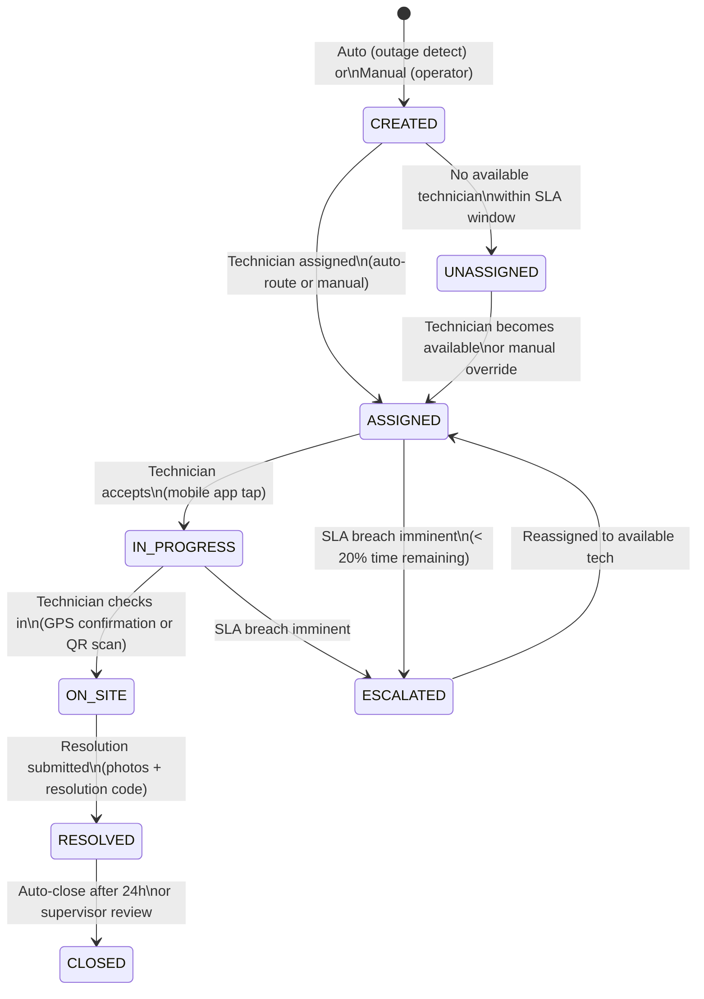

# Technician Dispatch System — Helios

> **Location:** Confluence → Helios Engineering Space → Services → Technician Dispatch  
> **Owner:** Raj Patel (Eng Manager, Field Ops) · @raj.patel  
> **Tech Lead:** James Osei · @james.osei  
> **Mobile App:** Connor Walsh · @connor.walsh  
> **Last Updated:** 2024-11-03  
> **Repos:** `lumina-energy/helios-dispatch` (API) · `lumina-energy/helios-tech-mobile` (React Native)  
> **Status:** 🟡 Degraded ⚠️ (Node.js 16 — see [Technical Debt](/05-engineering/technical-debt-register.md#dispatch-node16))  
> **Related:** [Outage Detection Service](/03-services/outage-detection-service.md) · [GIS Mapping Service](/03-services/gis-mapping-service.md) · [Notification Platform](/03-services/notification-platform.md) · [Field Ops Team](/01-company/engineering-directory.md#field-operations-team)

---

## What This System Does

The Technician Dispatch System manages the end-to-end workflow for getting a field technician to a problem and getting the problem resolved. It covers:

1. **Work order creation** — automatic (from outage detection) or manual (from operator)
2. **Technician assignment** — algorithm-based routing using location, skills, and availability
3. **Mobile app sync** — delivering work orders to field technicians' phones, including offline-first sync
4. **Work order lifecycle** — status tracking from CREATED through RESOLVED
5. **Field documentation** — photos, notes, and resolution codes captured on-site
6. **SLA monitoring** — alerting when work orders approach or breach their SLA window

The system does NOT handle:
- Payroll or time tracking (handled by the utility company's HR system)
- Parts inventory (handled by the utility company's ERP)
- Customer communication about outages (handled by `helios-notify`)

---

## Work Order Lifecycle



### Status Definitions

| Status | Description | Triggers |
|---|---|---|
| `CREATED` | Work order exists, not yet assigned | Outage detected or operator creates manually |
| `ASSIGNED` | Technician assigned, not yet accepted | Auto-router or manual assignment |
| `UNASSIGNED` | No suitable technician found | Assignment timeout (15 min), or no coverage |
| `IN_PROGRESS` | Technician en route or working | Technician taps "Accept" in mobile app |
| `ON_SITE` | Technician at location | GPS within 50m of asset OR QR code scan |
| `RESOLVED` | Work complete, notes submitted | Technician submits resolution in mobile app |
| `CLOSED` | Administrative closure | Auto after 24h or supervisor sign-off |
| `ESCALATED` | SLA breach risk | System, when < 20% of SLA window remains |
| `CANCELLED` | Cancelled before resolution | Operator cancels (e.g., false positive outage) |

---

## Auto-Assignment Algorithm

When a work order is created, the auto-router selects the best available technician. "Best" is scored across four dimensions:

```go
// internal/routing/scorer.go

type TechnicianScore struct {
    TechnicianID    string
    DistanceScore   float64  // 0–1: closer is higher (normalized against max 50km)
    SkillScore      float64  // 0 or 1: does tech have required certifications?
    LoadScore       float64  // 0–1: fewer active WOs is higher
    AvailabilityScore float64 // 0 or 1: is tech in current shift and not on break?
    Total           float64
}

var ScoringWeights = struct {
    Distance     float64
    Skill        float64
    Load         float64
    Availability float64
}{
    Distance:     0.40,  // Proximity is the primary factor
    Skill:        0.30,  // Must have the right certifications
    Load:         0.20,  // Balance workload across team
    Availability: 0.10,  // Prefer techs actively on shift
}

func (r *Router) ScoreTechnician(tech Technician, wo WorkOrder) TechnicianScore {
    distance := r.gis.GetDistance(tech.CurrentLocation, wo.Location)
    distanceScore := math.Max(0, 1.0 - (distance / 50000.0)) // normalize to 50km max

    skillScore := 0.0
    if r.hasRequiredSkills(tech, wo.RequiredCertifications) {
        skillScore = 1.0
    }

    activeWOs := r.countActiveWorkOrders(tech.ID)
    loadScore := math.Max(0, 1.0 - float64(activeWOs) / 5.0)

    availScore := 0.0
    if r.isOnShift(tech) && !r.isOnBreak(tech) {
        availScore = 1.0
    }

    total := (distanceScore * ScoringWeights.Distance) +
             (skillScore * ScoringWeights.Skill) +
             (loadScore * ScoringWeights.Load) +
             (availScore * ScoringWeights.Availability)

    return TechnicianScore{
        TechnicianID:      tech.ID,
        DistanceScore:     distanceScore,
        SkillScore:        skillScore,
        LoadScore:         loadScore,
        AvailabilityScore: availScore,
        Total:             total,
    }
}
```

**Fallback behavior:** If no technician scores above the minimum threshold (0.3), the work order is placed in `UNASSIGNED` status and the dispatch supervisor is notified. After 15 minutes unassigned, an escalation alert fires.

**Manual override:** Grid operators can always manually assign a work order to any technician, overriding the auto-router. Manual assignments are logged with the operator's user ID for audit purposes.

---

## Mobile App (`helios-tech-mobile`)

### Technology Stack

```
React Native 0.73
TypeScript
Expo SDK 50 (managed workflow)
WatermelonDB (local SQLite — offline-first)
React Navigation 6
React Query (server state, online mode)
Expo Location (GPS)
Expo Camera (photos)
Expo Notifications (push)
```

### Offline-First Architecture

Field technicians frequently work in areas with poor cellular coverage — substations in rural areas, underground vaults, and during severe weather events. The mobile app must function fully offline.

**How it works:**

```
Online:                 Offline:
API → WatermelonDB      WatermelonDB only
       ↓                       ↓
     React UI         React UI (same)
```

WatermelonDB (SQLite-based) is the local data store. When the device is online, the app syncs with the API every 2 minutes (and on explicit pull-to-refresh). When offline, the app reads from and writes to the local DB. When connectivity is restored, all local changes are pushed to the server and the server's latest state is pulled.

**Sync protocol:**
```typescript
// src/sync/syncEngine.ts
import { synchronize } from '@nozbe/watermelondb/sync';
import { api } from '../api/client';

export async function sync() {
  await synchronize({
    database,
    pullChanges: async ({ lastPulledAt }) => {
      // Fetch all server changes since last pull
      const { changes, timestamp } = await api.get('/api/v1/sync/pull', {
        params: { lastPulledAt, technicianId: auth.technicianId }
      });
      return { changes, timestamp };
    },
    pushChanges: async ({ changes }) => {
      // Push all local changes to server
      await api.post('/api/v1/sync/push', { changes });
    },
    sendCreatedAsUpdated: true,
    migrationsEnabledAtVersion: 1,
  });
}
```

**Conflict resolution:** The server wins on conflicts (last-write-wins with server timestamp). The one exception is resolution notes — if a technician submits resolution notes offline and the server also has a change to the same work order, the technician's notes are merged rather than overwritten. This was added in v4.2 after a field technician lost 20 minutes of diagnostic notes due to a sync conflict.

### Offline Capabilities

| Feature | Online | Offline |
|---|---|---|
| View assigned work orders | ✅ | ✅ |
| View work order details | ✅ | ✅ (cached) |
| Navigate to job site (maps) | ✅ | ✅ (pre-cached tiles) |
| View asset details and history | ✅ | ✅ (cached) |
| Accept / start work order | ✅ | ✅ (queued) |
| Submit resolution | ✅ | ✅ (queued) |
| Capture and attach photos | ✅ | ✅ (queued) |
| View other technicians' locations | ✅ | ❌ |
| Receive new work orders | ✅ | ❌ (push disabled) |
| Chat with control room | ✅ | ❌ |

### Map Tile Caching

Navigation in low-connectivity areas requires pre-cached map tiles. The app pre-downloads tiles for the technician's assigned service territory when connected to WiFi.

```typescript
// src/maps/tileCache.ts
const TILE_CACHE_RADIUS_KM = 50; // Pre-cache 50km radius around home base
const ZOOM_LEVELS = [10, 11, 12, 13, 14, 15]; // Street-level to building-level

export async function prefetchTilesForTerritory(territory: ServiceTerritory) {
  const bounds = computeBounds(territory.center, TILE_CACHE_RADIUS_KM);
  
  for (const zoom of ZOOM_LEVELS) {
    const tiles = getTileCoordinatesForBounds(bounds, zoom);
    await Promise.all(
      tiles.map(tile => 
        FileSystem.downloadAsync(
          `${TILE_SERVER_URL}/${zoom}/${tile.x}/${tile.y}.png`,
          `${FileSystem.cacheDirectory}tiles/${zoom}_${tile.x}_${tile.y}.png`
        )
      )
    );
  }
}
```

---

## API Reference (`helios-dispatch`)

### Work Order Endpoints

```
GET    /api/v1/work-orders                    List work orders (tenant-scoped, filterable)
GET    /api/v1/work-orders/:id                Get work order detail
POST   /api/v1/work-orders                    Create work order manually
PATCH  /api/v1/work-orders/:id/status         Transition status
POST   /api/v1/work-orders/:id/assign         Assign technician
POST   /api/v1/work-orders/:id/resolve        Submit resolution + photos
GET    /api/v1/work-orders/:id/history        Full audit trail of transitions
```

### Sync Endpoints (mobile app)

```
GET    /api/v1/sync/pull?lastPulledAt=&technicianId=    Incremental pull
POST   /api/v1/sync/push                                 Push local changes
GET    /api/v1/sync/initial?technicianId=                Full initial sync
```

### Work Order Resolution Payload

```typescript
interface WorkOrderResolutionPayload {
  workOrderId: string;
  resolutionCode: ResolutionCode;   // see enum below
  description: string;              // required, min 20 chars
  photos: PhotoUpload[];            // min 1 photo for OUTAGE_RESTORE
  partsUsed?: PartEntry[];
  followUpRequired: boolean;
  followUpNotes?: string;
  resolvedAt: string;               // ISO 8601 — technician's local timestamp
}

enum ResolutionCode {
  TRANSFORMER_REPLACED   = 'TRANSFORMER_REPLACED',
  FUSE_REPLACED          = 'FUSE_REPLACED',
  BREAKER_RESET          = 'BREAKER_RESET',
  LINE_REPAIRED          = 'LINE_REPAIRED',
  TREE_CLEARED           = 'TREE_CLEARED',
  EQUIPMENT_FAILURE      = 'EQUIPMENT_FAILURE',
  NO_FAULT_FOUND         = 'NO_FAULT_FOUND',
  CUSTOMER_SIDE_ISSUE    = 'CUSTOMER_SIDE_ISSUE',
  REFERRED_TO_SUPERVISOR = 'REFERRED_TO_SUPERVISOR',
}
```

---

## SLA Configuration

SLA windows are configured per-tenant per-priority in the tenant configuration:

```json
// Tenant config: tenants.config -> dispatch.sla
{
  "dispatch": {
    "sla": {
      "EMERGENCY": { "hoursToRespond": 0.5, "hoursToResolve": 2 },
      "HIGH":      { "hoursToRespond": 1,   "hoursToResolve": 4 },
      "NORMAL":    { "hoursToRespond": 4,   "hoursToResolve": 8 },
      "LOW":       { "hoursToRespond": 24,  "hoursToResolve": 72 }
    },
    "autoDispatch": {
      "EMERGENCY": true,
      "HIGH": true,
      "NORMAL": true,
      "LOW": false  // LOW priority goes to manual review queue
    },
    "escalationThresholdPct": 20  // escalate when < 20% of SLA window remains
  }
}
```

---

## Database Schema (Key Tables)

```sql
-- dispatch.technicians
CREATE TABLE dispatch.technicians (
    id              UUID PRIMARY KEY DEFAULT gen_random_uuid(),
    tenant_id       UUID         NOT NULL REFERENCES public.tenants(id),
    user_id         UUID         REFERENCES public.users(id),
    employee_id     VARCHAR(100),
    name            VARCHAR(255) NOT NULL,
    status          VARCHAR(30)  NOT NULL DEFAULT 'ACTIVE', -- ACTIVE | ON_LEAVE | INACTIVE
    availability    VARCHAR(30)  NOT NULL DEFAULT 'AVAILABLE', -- AVAILABLE | BUSY | OFF_DUTY | BREAK
    certifications  JSONB        NOT NULL DEFAULT '[]',     -- array of cert codes
    home_base_lat   NUMERIC(10,7),
    home_base_lng   NUMERIC(10,7),
    current_lat     NUMERIC(10,7),  -- updated by mobile app every 5 min when on-duty
    current_lng     NUMERIC(10,7),
    last_location_at TIMESTAMPTZ,
    created_at      TIMESTAMPTZ  NOT NULL DEFAULT NOW()
);

-- dispatch.work_order_events (audit trail)
CREATE TABLE dispatch.work_order_events (
    id              UUID PRIMARY KEY DEFAULT gen_random_uuid(),
    work_order_id   UUID         NOT NULL REFERENCES dispatch.work_orders(id),
    from_status     VARCHAR(30),
    to_status       VARCHAR(30)  NOT NULL,
    changed_by      UUID         REFERENCES public.users(id),
    technician_id   UUID         REFERENCES dispatch.technicians(id),
    timestamp       TIMESTAMPTZ  NOT NULL DEFAULT NOW(),
    source          VARCHAR(30)  NOT NULL DEFAULT 'SYSTEM',  -- SYSTEM | OPERATOR | TECHNICIAN
    metadata        JSONB
);
```

---

## Monitoring and Alerts

Grafana dashboard: `https://grafana.internal.luminaenergy.com/d/dispatch`

Key metrics:
- Work orders created / resolved per hour (per tenant)
- Work orders by status (gauge — UNASSIGNED is the key watch metric)
- Average time in each status
- SLA breach count (per tenant, per priority)
- Technician utilization (active WOs / available technicians)
- Mobile sync failures per hour

**PagerDuty alerts:**
- `DispatchUnassignedCritical` — CRITICAL work order unassigned > 15 minutes
- `DispatchSLABreachImminent` — > 5 work orders entering escalated state simultaneously
- `DispatchSyncFailureRate` — mobile sync failure rate > 5%

---

## Known Issues and Technical Debt

### Node.js 16 (High Priority)

The dispatch service runs on Node.js 16 (EOL October 2023). The upgrade to Node.js 20 is blocked by the `offline-sync-protocol` package used by the mobile sync endpoint, which has a native dependency (`better-sqlite3`) that fails to compile on Node.js 18+ with the current build toolchain. Remediation plan: replace `offline-sync-protocol` with a custom WatermelonDB-compatible sync endpoint. Estimated effort: 3 weeks. Target: Q1 2025 Sprint 91. See [Technical Debt Register](/05-engineering/technical-debt-register.md#dispatch-node16).

### Technician Location Accuracy

The mobile app updates technician GPS location every 5 minutes when on duty. This means the auto-routing algorithm works with potentially stale location data. A technician who drove to a job in the 5 minutes since their last location update might be assigned a new job based on their old location. The routing algorithm adds a 5km buffer to account for this. A real-time location update would require the app to keep GPS running continuously, which drains battery. This is an accepted trade-off.

### Photo Upload Size

Photos submitted with resolution reports are uploaded at full camera resolution (up to 12MB per photo). On poor cellular connections, this blocks the resolution submission. We have a known backlog item to compress photos client-side before upload. Currently, field technicians are instructed to connect to WiFi when submitting resolution photos, which is often not possible. Tracked in [Known Issues](/05-engineering/known-issues.md#photo-upload-size).

---

## Things Every New Engineer Should Know

1. **The mobile app and the API service are independently deployed.** The mobile app is distributed via the App Store and Google Play. Changes to the sync API must be backward-compatible for at least 2 major app versions. Never remove or change a sync endpoint response field without a deprecation plan.

2. **Offline-first means the server must handle conflict resolution.** Any API endpoint that the mobile app calls offline (status transitions, resolution submissions) will be called in a batch when the device reconnects. The server must be idempotent for all these operations — the same work order status transition called twice must not error on the second call.

3. **The auto-router skips technicians with `INACTIVE` or `ON_LEAVE` status.** If a technician is being tested in staging but their status is not set to `INACTIVE`, the router will assign them real work orders. Always set test technicians to `INACTIVE`.

4. **SLA configuration is per-tenant and comes from the tenant config JSON.** There is no database table for SLA configs. Changing an SLA requires updating the tenant config JSON in the database, not code changes. See the Tenant Configuration guide in `helios-dispatch/docs/tenant-config.md`.

5. **Work order numbers are human-readable (`WO-2024-108732`).** These are used by customers and supervisors to reference jobs. They are generated from a sequence, not from UUIDs. Do not expose the UUID to end users — always display the work order number.

---

*Document maintained by @raj.patel and @james.osei*  
*Mobile app sections: @connor.walsh*  
*Related: [Outage Detection Service](/03-services/outage-detection-service.md) · [GIS Mapping Service](/03-services/gis-mapping-service.md) · [Notification Platform](/03-services/notification-platform.md)*
