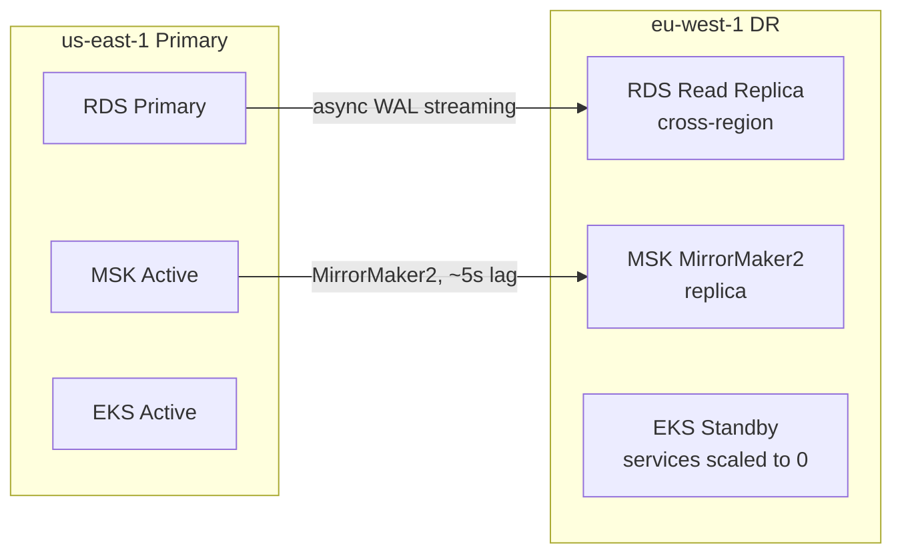

# AWS Architecture — Helios

> **Location:** Confluence → Helios Engineering Space → Platform → AWS Architecture  
> **Owner:** Tom Reeves (Senior Engineer, Platform Infra) · @tom.reeves  
> **Last Updated:** 2024-10-30  
> **Status:** Current — reflects v4.7 AWS footprint  
> **Related:** [Infrastructure Overview](/04-platform/infrastructure-overview.md) · [Kubernetes Guide](/04-platform/kubernetes-guide.md) · [Security Architecture](/06-operations/security-architecture.md) · [Disaster Recovery Plan](/06-operations/disaster-recovery-plan.md)

---

## Account Structure

Helios uses a multi-account AWS Organization structure:

```
Lumina Energy AWS Organization
├── Management Account (billing, SCPs, org policies)
├── helios-prod       (141592653589)  — Production workloads
├── helios-staging    (314159265358)  — Staging + integration tests
├── helios-dev        (271828182845)  — Developer environments + APAC prod
├── helios-sandbox    (161803398874)  — Experiments, POCs
└── helios-security   (718281828459)  — Security tooling (GuardDuty, Security Hub)
```

**Why separate accounts?**
- Blast radius containment: a misconfiguration in dev cannot affect prod
- Cost allocation: each account has a separate billing view
- Security posture: SCPs (Service Control Policies) at the org level enforce guardrails (e.g., blocking creation of public S3 buckets in prod accounts)
- Compliance: NERC CIP requires separation of production and non-production systems

Account access is managed via AWS SSO (Identity Center). Engineers access accounts using their Okta credentials — no long-lived IAM access keys.

---

## Primary Region: us-east-1

### EKS — `helios-prod-eks`

The EKS cluster is the heart of the production platform. Key specs:

```hcl
# terraform/environments/prod/eks.tf (simplified)
resource "aws_eks_cluster" "helios_prod" {
  name     = "helios-prod-eks"
  version  = "1.29"
  role_arn = aws_iam_role.eks_cluster.arn

  vpc_config {
    subnet_ids              = module.vpc.private_app_subnet_ids
    endpoint_private_access = true
    endpoint_public_access  = false  # Cluster API only accessible within VPC
    security_group_ids      = [aws_security_group.eks_cluster.id]
  }

  encryption_config {
    provider { key_arn = aws_kms_key.eks_secrets.arn }
    resources = ["secrets"]
  }

  enabled_cluster_log_types = ["api", "audit", "authenticator", "controllerManager", "scheduler"]
}
```

**EKS add-ons managed by Terraform:**
- `vpc-cni` (latest) — pod networking
- `coredns` (latest) — internal DNS
- `kube-proxy` (latest)
- `aws-ebs-csi-driver` — persistent volumes
- `aws-efs-csi-driver` — shared file storage (used by Vault Raft)

**IRSA (IAM Roles for Service Accounts):** Every Kubernetes service account that needs AWS access (S3, MSK, Secrets Manager) has a dedicated IAM role attached via IRSA. This eliminates node-level IAM roles that give overly broad permissions.

```hcl
# Example: grid-monitor service account IAM role
resource "aws_iam_role" "grid_monitor_sa" {
  name = "helios-prod-grid-monitor-sa"
  assume_role_policy = data.aws_iam_policy_document.grid_monitor_sa_assume.json
}

data "aws_iam_policy_document" "grid_monitor_sa_assume" {
  statement {
    actions = ["sts:AssumeRoleWithWebIdentity"]
    principals {
      type        = "Federated"
      identifiers = [aws_iam_openid_connect_provider.eks.arn]
    }
    condition {
      test     = "StringEquals"
      variable = "${aws_iam_openid_connect_provider.eks.url}:sub"
      values   = ["system:serviceaccount:helios-prod:grid-monitor"]
    }
  }
}

# grid-monitor only needs: MSK (produce/consume), TimescaleDB (via VPC), CloudWatch metrics
resource "aws_iam_role_policy" "grid_monitor_permissions" {
  role = aws_iam_role.grid_monitor_sa.name
  policy = jsonencode({
    Statement = [
      {
        Effect   = "Allow"
        Action   = ["kafka-cluster:Connect", "kafka-cluster:DescribeCluster",
                    "kafka-cluster:ReadData", "kafka-cluster:WriteData",
                    "kafka-cluster:DescribeTopic", "kafka-cluster:CreateTopic"]
        Resource = "${aws_msk_cluster.helios.arn}/*"
      },
      {
        Effect   = "Allow"
        Action   = ["cloudwatch:PutMetricData"]
        Resource = "*"
      }
    ]
  })
}
```

---

### RDS — PostgreSQL Clusters

**Main cluster (`helios-main-rds`):**
```hcl
resource "aws_db_instance" "helios_main_primary" {
  identifier        = "helios-main-primary"
  engine            = "postgres"
  engine_version    = "15.4"
  instance_class    = "db.r6g.4xlarge"
  allocated_storage = 2000
  storage_type      = "gp3"
  iops              = 12000

  multi_az               = true
  deletion_protection    = true
  backup_retention_period = 35
  backup_window          = "03:00-04:00"
  maintenance_window     = "sun:04:00-sun:05:00"

  performance_insights_enabled = true
  monitoring_interval          = 60   # Enhanced Monitoring, 60s

  # Parameter group tuning
  parameter_group_name = aws_db_parameter_group.postgres15_helios.name
  
  tags = {
    Environment = "prod"
    Team        = "platform"
    CostCenter  = "infrastructure"
  }
}

# Two read replicas in different AZs
resource "aws_db_instance" "helios_main_replica" {
  count                = 2
  identifier           = "helios-main-replica-${count.index}"
  replicate_source_db  = aws_db_instance.helios_main_primary.id
  instance_class       = "db.r6g.2xlarge"
  publicly_accessible  = false
}
```

**Key PostgreSQL parameter tuning:**
```hcl
resource "aws_db_parameter_group" "postgres15_helios" {
  name   = "helios-postgres15"
  family = "postgres15"

  parameter {
    name  = "max_connections"
    value = "500"    # pgBouncer handles connection pooling, so this can be lower
  }
  parameter {
    name  = "shared_buffers"
    value = "{DBInstanceClassMemory/4}"   # 25% of RAM
  }
  parameter {
    name  = "effective_cache_size"
    value = "{DBInstanceClassMemory*3/4}" # 75% of RAM
  }
  parameter {
    name  = "wal_level"
    value = "logical"  # Required for logical replication to DR
  }
  parameter {
    name  = "log_min_duration_statement"
    value = "1000"    # Log queries > 1s (slow query log)
  }
}
```

---

### MSK — Kafka Cluster

```hcl
resource "aws_msk_cluster" "helios" {
  cluster_name           = "helios-msk-prod"
  kafka_version          = "3.5.1"
  number_of_broker_nodes = 12

  broker_node_group_info {
    instance_type   = "kafka.m5.4xlarge"
    client_subnets  = module.vpc.private_data_subnet_ids  # 3 subnets = 4 brokers/AZ
    storage_info {
      ebs_storage_info {
        volume_size = 4000  # 4TB per broker
        provisioned_throughput {
          enabled           = true
          volume_throughput = 500  # MB/s
        }
      }
    }
    security_groups = [aws_security_group.msk.id]
  }

  client_authentication {
    sasl { iam = true }   # IAM authentication for all clients
    tls {}                # TLS encryption in transit
  }

  encryption_info {
    encryption_in_transit {
      client_broker = "TLS"
      in_cluster    = true
    }
    encryption_at_rest { data_volume_kms_key_id = aws_kms_key.msk.arn }
  }

  # MSK Tiered Storage — offload old segments to S3
  storage_mode = "TIERED"

  # Enable MirrorMaker2 for DR replication
  open_monitoring {
    prometheus {
      jmx_exporter  { enabled_in_broker = true }
      node_exporter { enabled_in_broker = true }
    }
  }
}
```

**MSK Tiered Storage:** Kafka segments older than 7 days are automatically offloaded to S3 (`s3://helios-msk-tiered-storage/`). This reduces broker disk usage by ~70% while maintaining the full retention period for replay. The trade-off: reading very old segments has higher latency (seconds vs. milliseconds) because they must be fetched from S3. Acceptable for the replay use case; not acceptable for real-time consumers.

---

### ElastiCache Redis

```hcl
resource "aws_elasticache_replication_group" "helios" {
  replication_group_id = "helios-prod-redis"
  description          = "Helios production Redis cluster"

  # Cluster mode: 3 shards × (1 primary + 1 replica) = 6 nodes
  num_node_groups         = 3
  replicas_per_node_group = 1

  node_type            = "cache.r6g.xlarge"
  engine_version       = "7.0"
  port                 = 6379
  parameter_group_name = aws_elasticache_parameter_group.helios_redis7.name

  at_rest_encryption_enabled  = true
  transit_encryption_enabled  = true
  auth_token                  = var.redis_auth_token  # from Secrets Manager

  subnet_group_name    = aws_elasticache_subnet_group.helios.name
  security_group_ids   = [aws_security_group.redis.id]

  automatic_failover_enabled  = true
  multi_az_enabled            = true

  snapshot_retention_limit = 0  # No snapshots — Redis is a cache, not durable storage
}
```

---

### S3 Bucket Configuration

Critical S3 buckets and their configurations:

| Bucket | Purpose | Versioning | Encryption | Lifecycle |
|---|---|---|---|---|
| `helios-data-lake` | IoT event Parquet, grid events | Enabled | SSE-KMS | Intelligent-Tiering after 30d, Glacier after 2yr |
| `helios-artifacts` | ML model artifacts, build artifacts | Enabled | SSE-KMS | Delete old model versions after 12 months |
| `helios-audit-logs` | Immutable audit trail | Enabled + MFA delete | SSE-KMS | No delete (NERC CIP: 7yr retention) |
| `helios-msk-tiered` | MSK tiered storage offload | Disabled | SSE-S3 | Delete after 7 days (Kafka retention managed by MSK) |
| `helios-backups` | RDS snapshot exports, Terraform state | Enabled | SSE-KMS | Delete after 7yr |
| `helios-portal-assets` | Static portal assets (CDN origin) | Disabled | SSE-S3 | No lifecycle |

**Block Public Access:** All buckets have "Block all public access" enabled at the account level via SCP. The portal assets bucket is served via CloudFront (OAC), not directly.

---

### CloudFront Distribution

```hcl
resource "aws_cloudfront_distribution" "helios_portal" {
  enabled             = true
  is_ipv6_enabled     = true
  default_root_object = "index.html"
  aliases             = ["portal.luminaenergy.com", "*.helios-portal.luminaenergy.com"]

  origin {
    domain_name              = aws_s3_bucket.portal_assets.bucket_regional_domain_name
    origin_id                = "S3-portal-assets"
    origin_access_control_id = aws_cloudfront_origin_access_control.portal.id
  }

  # API Gateway origin for server-side requests
  origin {
    domain_name = aws_lb.helios_api.dns_name
    origin_id   = "ALB-api-gateway"
    custom_origin_config {
      http_port              = 80
      https_port             = 443
      origin_protocol_policy = "https-only"
      origin_ssl_protocols   = ["TLSv1.2"]
    }
  }

  default_cache_behavior {
    allowed_methods        = ["GET", "HEAD", "OPTIONS"]
    cached_methods         = ["GET", "HEAD"]
    target_origin_id       = "S3-portal-assets"
    viewer_protocol_policy = "redirect-to-https"
    compress               = true
    cache_policy_id        = data.aws_cloudfront_cache_policy.managed_caching_optimized.id
  }

  ordered_cache_behavior {
    path_pattern           = "/graphql*"
    allowed_methods        = ["DELETE", "GET", "HEAD", "OPTIONS", "PATCH", "POST", "PUT"]
    target_origin_id       = "ALB-api-gateway"
    viewer_protocol_policy = "https-only"
    cache_policy_id        = data.aws_cloudfront_cache_policy.managed_caching_disabled.id
    origin_request_policy_id = data.aws_cloudfront_origin_request_policy.all_viewer.id
  }

  web_acl_id = aws_wafv2_web_acl.helios_portal.arn

  restrictions {
    geo_restriction { restriction_type = "none" }
  }

  viewer_certificate {
    acm_certificate_arn      = aws_acm_certificate.portal.arn
    ssl_support_method       = "sni-only"
    minimum_protocol_version = "TLSv1.2_2021"
  }
}
```

---

### WAF Configuration

The WAF protects both the portal CloudFront distribution and the API Gateway ALB:

```hcl
resource "aws_wafv2_web_acl" "helios_portal" {
  name  = "helios-portal-waf"
  scope = "CLOUDFRONT"

  default_action { allow {} }

  # AWS Managed Rules
  rule {
    name     = "AWSManagedRulesCommonRuleSet"
    priority = 10
    override_action { none {} }
    statement {
      managed_rule_group_statement {
        name        = "AWSManagedRulesCommonRuleSet"
        vendor_name = "AWS"
      }
    }
    visibility_config { sampled_requests_enabled = true; cloudwatch_metrics_enabled = true; metric_name = "CommonRuleSet" }
  }

  # Rate limiting: 2000 requests per 5 minutes per IP
  rule {
    name     = "RateLimitPerIP"
    priority = 20
    action { block {} }
    statement {
      rate_based_statement {
        limit              = 2000
        aggregate_key_type = "IP"
      }
    }
    visibility_config { sampled_requests_enabled = true; cloudwatch_metrics_enabled = true; metric_name = "RateLimit" }
  }
}
```

---

## DR Region: eu-west-1

The EU DR region runs a warm standby configuration. It is not actively serving traffic but is pre-configured to take over if `us-east-1` becomes unavailable.



**Failover procedure:** Documented in [Disaster Recovery Plan — Regional Failover](/06-operations/disaster-recovery-plan.md#regional-failover). Estimated RTO: 25–35 minutes (manual steps required). Automated failover is planned for Q2 2025.

**Important GDPR note:** EU customer data (tenants Oresund Grid, and any future EU customers) must NOT be stored in `us-east-1`. Currently there is a compliance gap where analytics pipeline data for EU tenants flows through the US-East Redshift cluster. This is tracked as a P1 item in [Technical Debt Register — GDPR Data Residency](/05-engineering/technical-debt-register.md#gdpr-data-residency).

---

## APAC Cluster: ap-southeast-2

The APAC cluster serves TasNetworks (Australia). It runs in the same `helios-dev` AWS account (separate from production — a technical debt item; APAC should be in its own dedicated account). Services running in APAC:

| Service | Status |
|---|---|
| API Gateway | ✅ Active |
| Grid Monitor | ✅ Active |
| IoT Bridge | ✅ Active (regional EMQX cluster) |
| Outage Detection | ✅ Active |
| Dispatch | ✅ Active |
| Notify | ✅ Active |
| GIS | ✅ Active |
| Forecasting | ✅ Active |
| Data Pipeline (Spark/EMR) | ❌ Not deployed — batch jobs run in us-east-1 |
| Redshift Analytics | ❌ Not deployed — TasNetworks cannot use analytics dashboard |
| Compliance Reporting | ⚠️ Partial — AEMO reporting only |

The missing analytics pipeline for APAC is a known product gap and a blocker for expanding to additional APAC customers.

---

## Cost Breakdown (October 2024)

| Category | Monthly Cost |
|---|---|
| EKS compute (Spot + On-Demand) | $18,400 |
| RDS instances (all clusters) | $12,100 |
| MSK (Kafka brokers + storage) | $9,200 |
| ElastiCache (Redis) | $1,800 |
| EMQX EC2 instances | $2,100 |
| S3 storage + requests | $3,400 |
| Redshift | $4,600 |
| CloudFront + WAF | $1,200 |
| Data transfer | $3,800 |
| Other (Lambda, ACM, Route 53, etc.) | $2,600 |
| **Total** | **~$59,200** |

> Note: DR region (`eu-west-1`) adds ~$12,000/month in standby infrastructure costs. APAC adds ~$8,000/month.

---

## Things Every New Engineer Should Know

1. **Production AWS access requires SSO + MFA. No exceptions.** Long-lived IAM access keys do not exist for production. If you find one, report it to @yasmin.osei immediately.

2. **Terraform state is in S3 with DynamoDB locking.** Never run `terraform apply` concurrently with another team member. The DynamoDB lock prevents state corruption, but two simultaneous plans can still cause confusion. Always check the lock table first.

3. **EKS API server is private.** You cannot `kubectl` to production from your laptop without the VPN. If `kubectl` commands are hanging rather than failing, check your VPN connection first.

4. **MSK uses IAM authentication.** There are no Kafka username/password credentials. Authentication is via the service account's IAM role (IRSA). If you're getting Kafka auth errors in a new service, check that the IRSA role has the correct MSK IAM permissions.

5. **S3 bucket names in code use the env-prefixed form.** The actual bucket names include the environment suffix: `helios-data-lake-prod`, `helios-data-lake-staging`. In code, this is resolved from the environment config, not hardcoded.

---

*Document maintained by @tom.reeves*  
*FinOps questions → @tom.reeves*  
*Security architecture → @yasmin.osei*  
*Related: [Infrastructure Overview](/04-platform/infrastructure-overview.md) · [Kubernetes Guide](/04-platform/kubernetes-guide.md) · [Disaster Recovery Plan](/06-operations/disaster-recovery-plan.md)*
