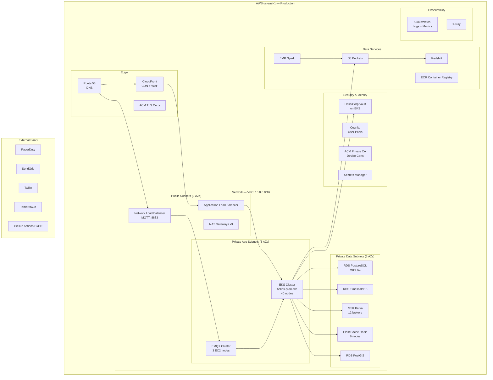

# Infrastructure Overview — Helios

> **Location:** Confluence → Helios Engineering Space → Platform → Infrastructure Overview  
> **Owner:** Tom Reeves (Senior Engineer, Platform Infra) · @tom.reeves  
> **Co-authored:** Marcus Webb (SRE Lead) · @marcus.webb  
> **Last Updated:** 2024-11-01  
> **Status:** Current — reflects v4.7 infrastructure state  
> **Related:** [AWS Architecture](/04-platform/aws-architecture.md) · [Kubernetes Guide](/04-platform/kubernetes-guide.md) · [CI/CD Pipeline](/04-platform/ci-cd-pipeline.md) · [Monitoring & Observability](/04-platform/monitoring-observability.md)

---

## Infrastructure Philosophy

Helios infrastructure follows three core principles established during the v3.0 architecture overhaul:

1. **Infrastructure as Code, always.** Every AWS resource is declared in Terraform (`helios-infra/terraform/`). Manual console changes are forbidden except during active incidents (and must be codified within 48 hours). The Terraform state is stored in S3 with DynamoDB locking.

2. **GitOps for Kubernetes.** All Kubernetes manifests and Helm values are managed via Flux v2 (`helios-infra/k8s/`). Changes to production Kubernetes configuration happen through PRs to the `helios-infra` repo, not `kubectl apply`. This gives us a full audit trail and automatic reconciliation.

3. **Defense in depth for network isolation.** Services should only be able to communicate with what they need to. Security groups, NACLs, and Kubernetes NetworkPolicies are all active and enforced. If a service doesn't have an explicit allow rule, it can't connect.

---

## Environment Topology

| Environment | AWS Account | Region | Purpose | Access |
|---|---|---|---|---|
| `helios-prod` | `141592653589` | us-east-1 | Production — 14 live tenants | Engineers via SSO, break-glass only |
| `helios-prod-dr` | `141592653589` | eu-west-1 | Disaster recovery (warm standby) | SRE only |
| `helios-prod-apac` | `271828182845` | ap-southeast-2 | APAC tenants (TasNetworks) | Engineers via SSO |
| `helios-staging` | `314159265358` | us-east-1 | Pre-production testing, customer demos | All engineers |
| `helios-dev` | `271828182845` | us-east-1 | Development, feature branches | All engineers |
| `helios-sandbox` | `161803398874` | us-east-1 | Isolated experiments, POCs | All engineers |

> **Production access policy:** Direct production access requires MFA + SSO approval. For SSH or `kubectl exec` into prod pods, you must open a Jira `SEC` ticket for audit. Emergency break-glass access (role `helios-prod-break-glass`) is logged to CloudTrail and reviewed weekly by @yasmin.osei.

---

## High-Level Infrastructure Topology



---

## Compute — EKS

**Cluster:** `helios-prod-eks`  
**Kubernetes version:** 1.29 (upgrade to 1.30 planned Q1 2025)  
**Node groups:**

| Node Group | Instance Type | Min/Max Nodes | Purpose |
|---|---|---|---|
| `general-compute` | `m6i.2xlarge` | 10/30 | API gateway, notify, dispatch, GIS |
| `high-mem` | `r6i.2xlarge` | 4/12 | Grid monitor (in-memory state), forecasting server |
| `io-intensive` | `c6i.4xlarge` | 2/8 | IoT bridge, Kafka consumers |
| `monitoring` | `m6i.xlarge` | 2/2 | Prometheus, Grafana, Loki (fixed — no autoscaling) |

All node groups use Spot Instances for cost efficiency, with On-Demand fallback configured at 20%. The monitoring node group uses On-Demand only (we do not want Prometheus evicted mid-incident).

**Cluster autoscaler:** Karpenter v0.35 provisions and decommissions nodes based on pending pod demand. Average time from pending pod to schedulable node: ~90 seconds.

---

## Networking

### VPC Design

```
VPC: 10.0.0.0/16

Public subnets (ALB, NAT GWs):
  10.0.0.0/24   us-east-1a
  10.0.1.0/24   us-east-1b
  10.0.2.0/24   us-east-1c

Private app subnets (EKS nodes, EMQX):
  10.0.16.0/20  us-east-1a
  10.0.32.0/20  us-east-1b
  10.0.48.0/20  us-east-1c

Private data subnets (RDS, MSK, ElastiCache):
  10.0.64.0/22  us-east-1a
  10.0.68.0/22  us-east-1b
  10.0.72.0/22  us-east-1c

IoT isolated subnet (EMQX only):
  10.0.100.0/24 us-east-1a
  10.0.101.0/24 us-east-1b
  10.0.102.0/24 us-east-1c
```

**Key security group rules:**
- `sg-eks-nodes` → `sg-rds`: PostgreSQL 5432 only
- `sg-eks-nodes` → `sg-msk`: Kafka 9096 (IAM auth TLS) only
- `sg-eks-nodes` → `sg-elasticache`: Redis 6379 only
- `sg-emqx` → `sg-eks-nodes`: gRPC 9090 only (ExHook)
- Internet → `sg-alb`: 443 only
- Internet → `sg-nlb`: 8883 only (MQTT/TLS)
- `sg-eks-nodes` → Internet: via NAT GW (outbound only for external API calls)

### DNS

All internal service discovery uses Kubernetes CoreDNS. Service names follow the pattern:
`{service-name}.{namespace}.svc.cluster.local`

External DNS is managed by Route 53. ExternalDNS runs in the cluster and automatically creates Route 53 records for Kubernetes Services with the `external-dns.alpha.kubernetes.io/hostname` annotation.

---

## Storage

| Service | AWS Service | Config | Cost Tier |
|---|---|---|---|
| PostgreSQL main | RDS `db.r6g.4xlarge` + 2 read replicas | Multi-AZ, 2TB gp3 | ~$4,200/month |
| TimescaleDB | RDS `db.r6g.8xlarge` | Multi-AZ, 8TB gp3, IOPS 16000 | ~$6,800/month |
| PostGIS | RDS `db.r6g.2xlarge` | Single-AZ (GIS data is rebuildable) | ~$1,100/month |
| Redis | ElastiCache `cache.r6g.xlarge` ×6 | Cluster mode, 3 shards | ~$1,800/month |
| Kafka | MSK `kafka.m5.4xlarge` ×12 | 3 AZs, 4TB storage per broker | ~$9,200/month |
| S3 | S3 Standard + Intelligent-Tiering | ~150TB total | ~$3,400/month |
| Redshift | `ra3.4xlarge` ×2 | Managed storage, ~50TB | ~$4,600/month |

> Total estimated infrastructure cost: ~$95,000/month. This includes compute, networking, and storage. Excludes external SaaS (SendGrid, Twilio, PagerDuty, Tomorrow.io). Budget tracked by @tom.reeves in the monthly FinOps review.

---

## Secrets Management

All secrets are managed by **HashiCorp Vault** running on the EKS cluster (HA mode, 3 pods, Raft storage backend backed by EBS). Services retrieve secrets via:

1. **Vault Agent Injector** — sidecar injector that writes secrets to files mounted in pod filesystem at `/vault/secrets/`
2. **Vault CSI driver** — mounts secrets as Kubernetes `Secret` objects for services that need env vars
3. **Vault PKI** — issues TLS certificates for gRPC mTLS (auto-renewed before expiry)

```yaml
# Example: pod annotation for Vault secret injection
annotations:
  vault.hashicorp.com/agent-inject: "true"
  vault.hashicorp.com/role: "helios-grid-monitor"
  vault.hashicorp.com/agent-inject-secret-config: "secret/helios/prod/grid-monitor"
  vault.hashicorp.com/agent-inject-template-config: |
    {{- with secret "secret/helios/prod/grid-monitor" -}}
    DB_PASSWORD={{ .Data.data.db_password }}
    KAFKA_API_KEY={{ .Data.data.kafka_api_key }}
    {{- end }}
```

**Vault access control:** Each service has a dedicated Vault role bound to its Kubernetes service account. The grid monitor can only read `secret/helios/prod/grid-monitor/*`. It cannot read any other service's secrets.

---

## Infrastructure as Code

All infrastructure is in `lumina-energy/helios-infra`:

```
helios-infra/
├── terraform/
│   ├── environments/
│   │   ├── prod/          # Production — requires PR + infra-team review
│   │   ├── staging/       # Staging — requires PR
│   │   └── dev/           # Dev — self-service
│   ├── modules/
│   │   ├── eks/
│   │   ├── rds/
│   │   ├── msk/
│   │   ├── vpc/
│   │   └── emqx/
│   └── shared/            # Cross-environment resources (ECR, Route 53 zones)
├── k8s/
│   ├── base/              # Kustomize base configs
│   ├── overlays/
│   │   ├── prod/
│   │   ├── staging/
│   │   └── dev/
│   └── flux/              # Flux GitOps configuration
└── charts/                # Helm charts for Helios services
    ├── api-gateway/
    ├── grid-monitor/
    ├── outage-detect/
    └── ...
```

**Terraform workflow:**
```bash
# For staging changes
cd terraform/environments/staging
terraform plan -out=tfplan
# Submit PR — reviewed by @tom.reeves or @kenji.watanabe
# After merge, CI runs: terraform apply tfplan

# For production changes
cd terraform/environments/prod
# NEVER run terraform apply locally against prod
# All prod applies happen via GitHub Actions after PR approval by 2 infra team members
```

---

## Cost Optimisation Measures in Place

- **Spot Instances** for EKS node groups (save ~60% vs. On-Demand)
- **S3 Intelligent-Tiering** on data lake objects > 30 days old (saves ~40% on cold data)
- **TimescaleDB compression** reduces storage by ~10x vs. raw data
- **MSK tiered storage** offloads old Kafka segments to S3 at lower cost
- **EMR auto-termination** — Spark clusters terminate after batch job completion (not running 24/7)
- **Redshift auto-pause** — Redshift pauses during nights/weekends when no BI queries are running
- **ECR lifecycle policies** — container images older than 90 days are deleted from the registry

---

## Things Every New Engineer Should Know

1. **Never make manual changes in the AWS console for production.** Terraform drift causes incidents. If you need to make a change urgently during an incident, make the console change first, then file a Jira `PLAT` ticket immediately to codify it in Terraform.

2. **Staging is a close mirror of production but not identical.** The biggest differences: staging uses smaller RDS instances, has fewer EKS nodes, and uses On-Demand instances only. Do not assume staging behaviour is identical to production for performance-sensitive operations.

3. **VPN is required for all internal AWS resources.** The RDS clusters, MSK brokers, and Vault UI are not reachable from the public internet. Connect via the AWS Client VPN (`helios-engineering` VPN profile) or use `kubectl port-forward` for Kubernetes services.

4. **The APAC cluster is architecturally simpler than production.** It does not run Redshift, EMR, or the full analytics pipeline. APAC tenants have access to the core platform but not the analytics dashboards. This is a known gap documented in [AWS Architecture — APAC Cluster](/04-platform/aws-architecture.md#apac-cluster).

5. **Karpenter replaces the Cluster Autoscaler.** We migrated in v4.5. If you're reading old runbooks that mention `cluster-autoscaler`, they're outdated. Node provisioning is now Karpenter. Key difference: Karpenter provisions nodes based on pod resource requests, not node-level metrics.

---

*Document maintained by @tom.reeves*  
*FinOps and cost questions → @tom.reeves and @tanvir.rahman*  
*Related: [AWS Architecture](/04-platform/aws-architecture.md) · [Kubernetes Guide](/04-platform/kubernetes-guide.md) · [Security Architecture](/06-operations/security-architecture.md)*
