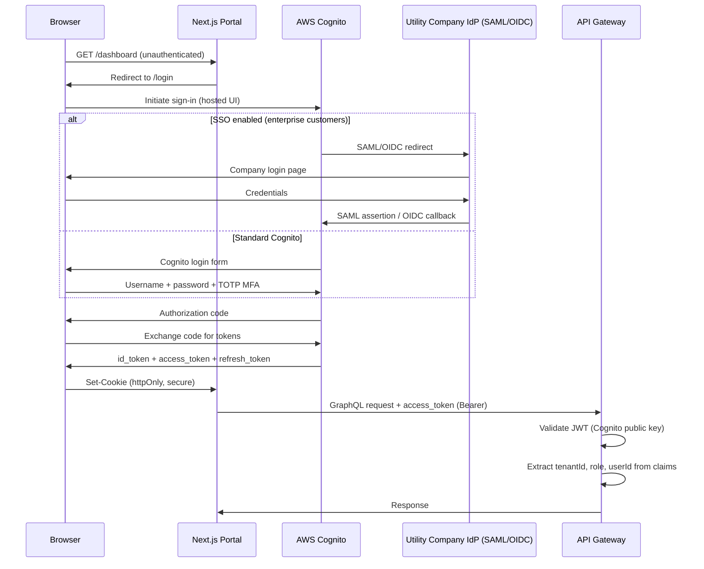

# Authentication — Helios

> **Location:** Confluence → Helios Engineering Space → Engineering → Authentication  
> **Owner:** Rosa Lindqvist (Senior Engineer, Platform) · @rosa.lindqvist  
> **Security Review:** Yasmin Osei · @yasmin.osei  
> **Last Updated:** 2024-10-15  
> **Status:** Active  
> **Related:** [Authorization](/05-engineering/authorization.md) · [User Roles & Permissions](/05-engineering/user-roles-permissions.md) · [Security Architecture](/06-operations/security-architecture.md) · [API Standards](/05-engineering/api-standards.md)

---

## Authentication Overview

Helios has **three distinct authentication contexts**, each with different requirements:

| Context | User Type | Mechanism | Token Lifetime |
|---|---|---|---|
| Grid Operations Portal | Grid operators, admins | Cognito + SAML/OIDC SSO | 15 min access / 1 day refresh |
| Customer Portal | Residential/commercial customers | Cognito (separate User Pool) | 15 min access / 7 day refresh |
| Internal Service-to-Service | Services (machine identity) | Vault-issued JWT or IAM IRSA | 24 hour / role-bound |

---

## Grid Operator Authentication

### Flow



### Cognito Configuration

**Operator User Pool:** `helios-operators-{env}`

- MFA: Required (TOTP or SMS)
- Password policy: minimum 12 chars, complexity required
- Token expiry: access token 15 min, refresh token 1 day
- SSO: Cognito Federation with customer's SAML 2.0 or OIDC IdP (per tenant)
- Custom claims in the JWT via Cognito Lambda triggers:
  - `custom:tenantId` — the operator's assigned tenant
  - `custom:role` — the operator's role (`GRID_OPERATOR`, `GRID_SUPERVISOR`, `TENANT_ADMIN`)
  - `custom:region` — assigned grid region(s) (comma-separated)

### JWT Structure (Operator)

```json
{
  "sub": "usr-a1b2c3d4-e5f6-7890-abcd-ef1234567890",
  "iss": "https://cognito-idp.us-east-1.amazonaws.com/us-east-1_POOLID",
  "aud": "helios-portal-client-id",
  "token_use": "access",
  "auth_time": 1699456000,
  "exp": 1699456900,
  "iat": 1699456000,
  "email": "tracy.kellerman@midwestgridco.com",
  "email_verified": true,
  "custom:tenantId": "CUST-MWG",
  "custom:role": "GRID_OPERATOR",
  "custom:region": "cedar-rapids,iowa-city",
  "cognito:groups": ["helios-operators"]
}
```

### Token Refresh

next-auth handles transparent token refresh in the Grid Operations Portal. The `refreshAccessToken` function is called when the access token is within 2 minutes of expiry:

```typescript
// lib/auth/authOptions.ts (helios-portal)
import NextAuth from 'next-auth';
import CognitoProvider from 'next-auth/providers/cognito';

export const authOptions = {
  providers: [
    CognitoProvider({
      clientId: process.env.COGNITO_CLIENT_ID!,
      clientSecret: process.env.COGNITO_CLIENT_SECRET!,
      issuer: process.env.COGNITO_ISSUER!,
    }),
  ],
  callbacks: {
    async jwt({ token, account }) {
      // Persist the OAuth access_token to the token right after signin
      if (account) {
        token.accessToken = account.access_token;
        token.refreshToken = account.refresh_token;
        token.accessTokenExpires = account.expires_at! * 1000;
        token.tenantId = account.id_token 
          ? extractClaim(account.id_token, 'custom:tenantId') 
          : null;
        token.role = account.id_token
          ? extractClaim(account.id_token, 'custom:role')
          : null;
      }

      // Return previous token if not expired
      if (Date.now() < (token.accessTokenExpires as number) - 120_000) {
        return token;
      }

      // Access token has expired — refresh it
      return refreshAccessToken(token);
    },
    async session({ session, token }) {
      session.accessToken = token.accessToken as string;
      session.tenantId = token.tenantId as string;
      session.role = token.role as string;
      session.error = token.error as string | undefined;
      return session;
    },
  },
};
```

---

## Customer Portal Authentication

### Separate Cognito User Pool

The Customer Portal uses a **separate** Cognito User Pool from operators: `helios-customers-{env}`. This separation is important:
- Customer accounts cannot access operator APIs (different audience claim)
- Customers are created by the utility company's onboarding process (bulk import or self-registration)
- MFA is optional for customers (operators always require MFA)
- Customers can only see their own account data (enforced at the BFF layer)

**Customer JWT claims:**
```json
{
  "custom:tenantId": "CUST-MWG",
  "custom:role": "CUSTOMER",
  "custom:externalAccountId": "MWG-ACC-4421-MAPLE",
  "custom:meterId": "sm-42a9b7"
}
```

The `externalAccountId` links the customer to their billing system account for billing API calls.

---

## Internal Service Authentication

Services within the Kubernetes cluster authenticate to each other using:

### 1. Kafka (MSK) — IAM IRSA

Kafka producers and consumers authenticate via the service account's IAM role (IRSA). No passwords, no API keys.

```go
// internal/kafka/producer.go
saslCfg := aws.NewConfig()
// IRSA automatically provides credentials via the token file at IRSA_TOKEN_FILE
producer, err := sarama.NewSyncProducer(brokers, &sarama.Config{
    Net: sarama.NetConfig{
        SASL: sarama.SASL{
            Enable:    true,
            Mechanism: sarama.SASLTypeOAuth,
            TokenProvider: msk.NewIAMTokenProvider(saslCfg),
        },
        TLS: sarama.TLSConfig{Enable: true},
    },
})
```

### 2. gRPC Service-to-Service — Vault PKI + mTLS

gRPC calls between services use mutual TLS (mTLS) with certificates issued by the Vault PKI engine. Certificates are automatically renewed before expiry via the Vault Agent sidecar.

```go
// internal/grpc/client.go
func NewGridMonitorClient(addr string) (GridMonitorServiceClient, error) {
    certPool, _ := x509.SystemCertPool()
    
    // Load mTLS cert from Vault-injected files
    cert, _ := tls.LoadX509KeyPair(
        "/vault/secrets/grpc-cert.pem",
        "/vault/secrets/grpc-key.pem",
    )
    
    tlsConfig := &tls.Config{
        RootCAs:      certPool,
        Certificates: []tls.Certificate{cert},
        ServerName:   "grid-monitor.helios-prod.svc.cluster.local",
    }
    
    conn, err := grpc.NewClient(
        addr,
        grpc.WithTransportCredentials(credentials.NewTLS(tlsConfig)),
    )
    return NewGridMonitorServiceClient(conn), err
}
```

### 3. HTTP Service-to-Service — Internal JWT

For REST calls between Node.js services, a shared internal JWT signed by a Vault-managed symmetric key:

```typescript
// lib/auth/internalToken.ts
import { SignJWT } from 'jose';

const INTERNAL_KEY = process.env.INTERNAL_JWT_KEY!;  // From /vault/secrets/

export async function createInternalToken(serviceId: string): Promise<string> {
  return new SignJWT({ serviceId, type: 'INTERNAL' })
    .setProtectedHeader({ alg: 'HS256' })
    .setIssuedAt()
    .setExpirationTime('24h')
    .setIssuer('helios-auth-internal')
    .sign(new TextEncoder().encode(INTERNAL_KEY));
}

// Validation in API gateway middleware
export function validateInternalToken(token: string): boolean {
  try {
    const { payload } = await jwtVerify(token, new TextEncoder().encode(INTERNAL_KEY));
    return payload.type === 'INTERNAL';
  } catch {
    return false;
  }
}
```

---

## API Key Authentication (Third-Party Integrations)

External systems (utility company integration middleware, third-party applications) authenticate using **API keys** for REST API access. API keys:

- Are generated per-tenant, per-integration
- Are scoped to specific operations (read-only, work-order-create, etc.)
- Are stored as hashed values in PostgreSQL (plaintext is shown only at creation time)
- Can be revoked at any time by the tenant admin

```
Authorization: ApiKey key_live_a1b2c3d4e5f6g7h8i9j0
```

API key validation in the gateway:

```typescript
// src/auth/apiKeyAuth.ts
export async function validateApiKey(key: string): Promise<ApiKeyContext | null> {
  const prefix = key.split('_')[1];  // 'live' or 'test'
  const hash = sha256(key);
  
  const result = await db.apiKeys.findUnique({
    where: { keyHash: hash, environment: prefix, revokedAt: null },
    include: { tenant: true, scopes: true }
  });
  
  if (!result) return null;
  
  // Update last-used timestamp (async, non-blocking)
  db.apiKeys.update({ where: { id: result.id }, data: { lastUsedAt: new Date() } });
  
  return {
    tenantId: result.tenantId,
    keyId: result.id,
    scopes: result.scopes.map(s => s.scope),
    type: 'API_KEY',
  };
}
```

---

## Security Notes

- **Token storage:** The Grid Ops Portal stores the session in an httpOnly, Secure cookie managed by next-auth. The Customer Portal stores the access token in memory (not localStorage). Never store tokens in localStorage — XSS vulnerability.
- **PKCE:** The Customer Portal uses OAuth2 PKCE flow for the authorization code exchange, preventing authorization code interception attacks.
- **Token revocation:** Revoking a user's access in Cognito invalidates all their active tokens. For immediate revocation (e.g., account compromise), update the user's Cognito attribute and the token is invalid within 15 minutes (access token lifetime).
- **MFA bypass:** There is no MFA bypass for operators. Not for demos, not for testing. If you need to test an MFA-authenticated flow, use a test account with TOTP configured in your authenticator app.

---

*Document maintained by @rosa.lindqvist*  
*Security review: @yasmin.osei*  
*Cognito configuration: @rosa.lindqvist and @tom.reeves (infra)*  
*Related: [Authorization](/05-engineering/authorization.md) · [Security Architecture](/06-operations/security-architecture.md) · [User Roles & Permissions](/05-engineering/user-roles-permissions.md)*
